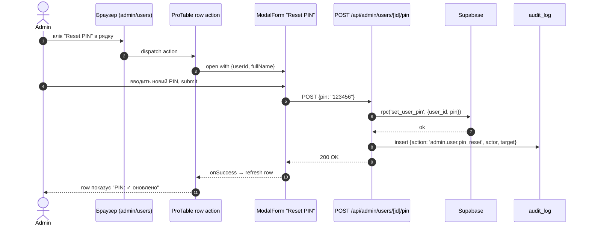

# Адмін-панель: редизайн у стилі Ant Design Pro

> **Статус:** пропозиція до обговорення. Жодного коду ще не написано — цей документ описує
> архітектуру, навігацію, layout і план поетапного впровадження.
> Після схвалення йдемо в реалізацію (окремими PR-ами).
>
> **Принцип:** бекенд-логіка адмінки **не змінюється** (ті самі ендпоінти, та сама БД,
> ті самі ролі/PIN). Змінюється тільки **frontend-shell**: layout, навігація, компоненти,
> візуальна мова. Це означає, що кожен крок міграції оборотний — старі сторінки лишаються
> в репо до моменту, поки не доведено еквівалентність нових.

---

## 1. TL;DR

| Що | Як |
|---|---|
| **Layout** | `ProLayout` (sider + header + content + footer) — як у `ant-design-pro/v6` |
| **Sidebar** | Згрупований колапсуючий sider з 7 розділами (Огляд / Фідбек / Аналітика / Магазини & Товари / Користувачі / Журнал / Інструменти) |
| **Сторінки** | `PageContainer` з заголовком, breadcrumbs, табами, extra-кнопками — обгортка для всього вмісту |
| **Таблиці** | `ProTable` — сторінки `Стрічка`, `Користувачі`, `Журнал` повністю на ньому |
| **Форми** | `ModalForm` / `DrawerForm` для дій (reset PIN, ban, edit user) |
| **Деталь сутності** | `ProDescriptions` (drawer / page) для одного фідбеку, юзера, події журналу |
| **Дашборд** | `StatisticCard` + `Tiny Charts` (sparklines) на головній сторінці адмінки |
| **Тема** | antd 5 `ConfigProvider` з token-mapping на наявну палітру FeedbackGB (теплий пастельний brand) |
| **Локалізація** | `uk_UA` + ручні переклади для лейблів, що відсутні в antd |
| **Routing** | Next.js App Router, route group `(admin)/admin/*`. Mini App (`/login`, `/`, `/feedback/*`) **не торкаємо** |
| **Стек-залежності** | `antd@5`, `@ant-design/pro-components`, `@ant-design/icons`, `@ant-design/cssinjs`, `@ant-design/nextjs-registry` |

---

## 2. Що зараз є (аудит /admin)

Поточний `/admin` — це звичайний Tailwind-mobile flow, обмежений шириною `max-w-md` (448px),
як решта Mini App. Це створює два болючі моменти:

1. **На десктопі весь UI стиснутий у вузький стовпчик** — таблиці фідбеків і журналу
   нечитабельні; ось так зараз виглядає `/admin/audit` на 27" моніторі: 80% екрану — біле
   поле, 15% — стрічка карток одна-під-одною.
2. **Немає глобальної навігації** — переходи між сторінками тільки через посилання `← Назад`
   у заголовку. Користувач не знає, які ще розділи існують.

| Маршрут | Файли | Що робить |
|---|---|---|
| `/admin` | <ref_file file="/home/ubuntu/feedbackGB/src/app/admin/page.tsx" />, <ref_file file="/home/ubuntu/feedbackGB/src/app/admin/admin-client.tsx" /> | Hero з 5 action-картками (звіт, дзеркало, користувачі, журнал, експорт) + стрічка фідбеку (200 останніх рядків з `feedback_feed`) з фільтрами період / магазин / категорія / пошук |
| `/admin/users` | <ref_file file="/home/ubuntu/feedbackGB/src/app/admin/users/page.tsx" />, <ref_file file="/home/ubuntu/feedbackGB/src/app/admin/users/users-client.tsx" /> | Список користувачів з кнопками «Reset PIN» (Modal з підтвердженням) і «Розблокувати». Дані з `users + v_stores` |
| `/admin/audit` | <ref_file file="/home/ubuntu/feedbackGB/src/app/admin/audit/page.tsx" />, <ref_file file="/home/ubuntu/feedbackGB/src/app/admin/audit/audit-client.tsx" /> | Останні 500 подій з `v_audit_log`, секційний фільтр (auth / feedback / admin) + per-actor фільтр |

**Існуючі API ендпоінти** (всі лишаються as-is):

```
GET  /api/admin/users                  → список користувачів
POST /api/admin/users/{id}/pin         → reset PIN
POST /api/admin/users/{id}/unlock      → clear lockout
POST /api/admin/send-report-now        → manual daily report
POST /api/admin/mirror-to-drive-now    → manual Drive mirror
GET  /api/feedback?format=json|csv     → експорт стрічки
GET  /api/stores                       → довідник магазинів
GET  /api/products?store_id=&q=        → пошук товарів
GET  /api/products/categories          → 8 категорій
```

**Auth** — session cookie (`fb_session`), middleware <ref_file file="/home/ubuntu/feedbackGB/src/middleware.ts" /> блокує все, що під `/admin/*` і `/api/admin/*` без cookie з role=admin.

---

## 3. Що ми беремо з Ant Design Pro

Ant Design Pro — це не одна бібліотека, а **сукупність патернів**. Беремо тільки те, що
закриває реальні болі FeedbackGB; решту ігноруємо.

### 3.1 ProLayout (`@ant-design/pro-layout`)

Дає одразу:
- Колапсуючий **sider** (з підтримкою груп, іконок, бейджів, активного маршруту).
- **Header** з логотипом, breadcrumbs, права-частина-slot (юзер-аватар + меню, перемикач теми, language).
- **Footer** — версія додатка, copyright.
- **Mobile responsive** — на маленьких екранах sider стає drawer-ом, hamburger у хедері.
- **Dark mode** з коробки.

### 3.2 PageContainer (`@ant-design/pro-components`)

Кожна сторінка обгортається в `<PageContainer />`. Дає безкоштовно:
- Заголовок + tagline + breadcrumbs (з `route` — від ProLayout).
- `extra` — права кнопка(-и) (наприклад «+ Новий запис», «Експорт»).
- `tabs` — горизонтальні таби, перемикають частини сторінки без full-page navigation
  (ідеально для `/admin/audit` з фільтрами секцій).
- `footerToolbar` — sticky-bar внизу для bulk-операцій («Видалити вибрані 12»).

### 3.3 ProTable (`@ant-design/pro-table`)

Замінює всі ручні `<ul>{items.map(...)}</ul>` на справжню таблицю з:
- Колонками-конфігами (з `valueType`: `dateTime`, `select`, `tag`, `option` — рендеряться автоматично).
- Toolbar: пошук, density toggle, columns settings, fullscreen, refresh, export to CSV.
- Per-column filter / sort / search.
- Pagination з `pageSize` / `total` (легко мапиться на range-запити Supabase).
- `request: async (params) => fetch(...)` — асинхронне завантаження з server-side фільтрацією.
- Row selection + batch actions (наприклад «Розблокувати 5 користувачів одразу»).
- Expandable rows / Detail-drawer.

### 3.4 ProForm (`@ant-design/pro-form`)

Варіанти `ModalForm`, `DrawerForm`, `StepsForm`, `LoginForm`. Беремо `ModalForm` для:
- Reset PIN (один input + confirm).
- Створення нового користувача (full_name + role + store + initial PIN).
- Редагування магазину.

### 3.5 ProDescriptions (`@ant-design/pro-descriptions`)

Структурований read-only/editable view сутності — для drawer-а деталі фідбеку
(всі поля з `feedback_feed` плюс preview фото, плюс посилання на автора, магазин, товар).

### 3.6 ProCard / StatisticCard

Дашборд-картки з KPI (загальна кількість, нові за тиждень, дельта vs минулий тиждень,
sparkline). Замінюють поточні «action-картки» на інформативніші «KPI cards».

### Що **не беремо** (зайве для нашого розміру)

- `umi` як фреймворк (ми вже на Next.js).
- `dva` / `valtio` як state — Next.js Server Components + URL searchParams вистачає.
- Multi-tenant / RBAC matrix (у нас 2 ролі — seller / admin, без матриці).
- Workflow-діаграми, BPMN, Kanban — нема релевантних use-cases.

---

## 4. Стек і залежності

### Рекомендований варіант: antd + pro-components

```json
"dependencies": {
  "antd": "^5.20.0",
  "@ant-design/icons": "^5.5.0",
  "@ant-design/cssinjs": "^1.21.0",
  "@ant-design/nextjs-registry": "^1.0.0",
  "@ant-design/pro-components": "^2.7.0",
  "dayjs": "^1.11.0"
}
```

**Bundle impact** (`/admin` chunk, gzipped):
- antd core: ~120 KB
- pro-components (tree-shaken до того, що реально юзаємо): ~180 KB
- icons (lazy): ~10 KB
- разом приблизно **+310 KB gzipped** до бандлу `/admin/*` маршрутів.

Mini App-маршрути (`/`, `/login`, `/feedback/*`) **не імпортують antd** — їх код-чанки
залишаються поточного розміру (Tailwind only). Цього досягаємо двома способами:
1. Route group `(admin)` має власний `layout.tsx` з `AntdRegistry` і `ConfigProvider`.
2. Імпорти antd-компонентів — тільки всередині цього route group.

### Альтернатива (якщо хочете без нових залежностей)

Імітувати ant-pro-look на чистому Tailwind + headless-компонентах
(`@tanstack/react-table` для таблиць, `react-aria-components` або `radix-ui` для
forms / dialogs).

**За:** нуль нових KB у бандлі, повний контроль над стилями.
**Проти:** треба **самостійно реалізувати** ProTable toolbar (search/density/columns/export),
ModalForm-валідацію, breadcrumbs-логіку і ще ~15 патернів. Реалістично — **+3-4 тижні роботи**
порівняно з готовим pro-components.

**Моя рекомендація:** беремо antd. Vercel-білд адмінки в 600 KB — це мізер для
внутрішнього інструменту, який відкривають 2-3 особи з робочого ноута. Vs. 30 годин
своєї роботи на reinvent — економія очевидна.

### Що з Tailwind?

**Залишаємо.** Tailwind продовжує жити для:
- Mini App (sellers / `/feedback/*` маршрути).
- Auth-сторінки (`/login`).
- Маркетингових сторінок (якщо колись з'являться).

Усередині `/admin/*` теж можна користуватись Tailwind-утилітами (наприклад, для швидкого
відступу `.mb-4`, `.flex` тощо) — antd і Tailwind добре уживаються. Конфлікт стилів
вирішується через `@ant-design/cssinjs` (CSS-in-JS, ізольовано від глобальних класів).

---

## 5. Routing і layout

### 5.1 Структура файлів

```
src/app/
├─ (mini)/                          ← Mini App route group (Tailwind, як зараз)
│  ├─ layout.tsx                    ← поточний RootLayout з max-w-md і Telegram script
│  ├─ page.tsx                      ← landing
│  ├─ login/
│  ├─ feedback/[category]/
│  └─ ...
├─ (admin)/                         ← НОВИЙ route group для адмінки
│  ├─ layout.tsx                    ← AntdRegistry + ConfigProvider + ProLayout shell
│  ├─ admin/
│  │  ├─ page.tsx                   ← Огляд (Dashboard)
│  │  ├─ feedback/
│  │  │  ├─ page.tsx                ← Стрічка
│  │  │  └─ [id]/page.tsx           ← Деталь фідбеку (або drawer over list)
│  │  ├─ analytics/
│  │  │  ├─ heatmap/page.tsx
│  │  │  ├─ signals/page.tsx
│  │  │  └─ trends/page.tsx
│  │  ├─ stores/
│  │  │  ├─ page.tsx                ← Магазини
│  │  │  └─ products/page.tsx       ← Товари
│  │  ├─ users/page.tsx             ← переписаний з ProTable
│  │  ├─ audit/page.tsx             ← переписаний з ProTable + tabs
│  │  ├─ tools/
│  │  │  ├─ report/page.tsx         ← Звіт зараз + історія викликів
│  │  │  ├─ mirror/page.tsx         ← Дзеркалити фото + queue status
│  │  │  └─ export/page.tsx         ← CSV/JSON експорт
│  │  └─ settings/
│  │     ├─ profile/page.tsx
│  │     └─ integrations/page.tsx
└─ api/                              ← без змін
```

### 5.2 (admin)/layout.tsx — каркас

```tsx
// src/app/(admin)/layout.tsx
import { AntdRegistry } from '@ant-design/nextjs-registry';
import { ConfigProvider } from 'antd';
import ukUA from 'antd/locale/uk_UA';
import { themeTokens } from '@/lib/admin/theme';
import { AdminShell } from '@/components/admin/AdminShell';

export default function AdminGroupLayout({ children }: { children: React.ReactNode }) {
  return (
    <html lang="uk">
      <body>
        <AntdRegistry>
          <ConfigProvider locale={ukUA} theme={themeTokens}>
            <AdminShell>{children}</AdminShell>
          </ConfigProvider>
        </AntdRegistry>
      </body>
    </html>
  );
}
```

`AdminShell` — клієнтський компонент з `<ProLayout>`, який тримає sider + header + breadcrumbs.

---

## 6. Sidebar / навігація

### 6.1 Дерево меню (v1)

```mermaid
graph TD
  Root["💖 Галя слухає · Адмін"] --> Overview["📊 Огляд"]
  Root --> Feedback["🗒 Фідбек"]
  Feedback --> FeedAll["Стрічка"]
  Feedback --> FeedByCat["За категоріями"]
  Feedback --> FeedPhotos["Фото галерея"]
  Root --> Analytics["📈 Аналітика"]
  Analytics --> Heatmap["Heatmap день × категорія"]
  Analytics --> Signals["Сигнали (повтори, дублі, застряглі)"]
  Analytics --> Trends["Тренди тижневі"]
  Root --> Stores["🏪 Магазини & товари"]
  Stores --> StoresList["Магазини"]
  Stores --> Products["Товари"]
  Stores --> Categories["Категорії"]
  Root --> Users["👥 Користувачі"]
  Users --> UsersList["Список"]
  Users --> Locked["Заблоковані"]
  Root --> Audit["🔍 Журнал"]
  Audit --> AuditAll["Усі події"]
  Audit --> AuditAuth["Авторизації"]
  Audit --> AuditAdmin["Адмін-дії"]
  Root --> Tools["🛠 Інструменти"]
  Tools --> ReportNow["Надіслати звіт"]
  Tools --> MirrorNow["Дзеркалити фото"]
  Tools --> Export["Експорт"]
  Root --> Settings["⚙️ Налаштування"]
  Settings --> Profile["Профіль"]
  Settings --> Integrations["Інтеграції"]
  Settings --> Help["Допомога / Docs"]
```



### 6.2 Згруповане меню (config)

```ts
// src/lib/admin/menu.ts
import {
  DashboardOutlined,
  FormOutlined,
  AreaChartOutlined,
  ShopOutlined,
  TeamOutlined,
  AuditOutlined,
  ToolOutlined,
  SettingOutlined,
} from '@ant-design/icons';

export const adminMenu = {
  route: {
    path: '/admin',
    routes: [
      { path: '/admin', name: 'Огляд', icon: <DashboardOutlined /> },
      {
        path: '/admin/feedback',
        name: 'Фідбек',
        icon: <FormOutlined />,
        routes: [
          { path: '/admin/feedback', name: 'Стрічка' },
          { path: '/admin/feedback/by-category', name: 'За категоріями' },
          { path: '/admin/feedback/photos', name: 'Фото галерея' },
        ],
      },
      {
        path: '/admin/analytics',
        name: 'Аналітика',
        icon: <AreaChartOutlined />,
        routes: [
          { path: '/admin/analytics/heatmap', name: 'Heatmap' },
          { path: '/admin/analytics/signals', name: 'Сигнали' },
          { path: '/admin/analytics/trends', name: 'Тренди' },
        ],
      },
      {
        path: '/admin/stores',
        name: 'Магазини & товари',
        icon: <ShopOutlined />,
        routes: [
          { path: '/admin/stores', name: 'Магазини' },
          { path: '/admin/stores/products', name: 'Товари' },
          { path: '/admin/stores/categories', name: 'Категорії' },
        ],
      },
      {
        path: '/admin/users',
        name: 'Користувачі',
        icon: <TeamOutlined />,
      },
      {
        path: '/admin/audit',
        name: 'Журнал',
        icon: <AuditOutlined />,
      },
      {
        path: '/admin/tools',
        name: 'Інструменти',
        icon: <ToolOutlined />,
        routes: [
          { path: '/admin/tools/report', name: 'Надіслати звіт' },
          { path: '/admin/tools/mirror', name: 'Дзеркалити фото' },
          { path: '/admin/tools/export', name: 'Експорт' },
        ],
      },
      {
        path: '/admin/settings',
        name: 'Налаштування',
        icon: <SettingOutlined />,
        routes: [
          { path: '/admin/settings/profile', name: 'Профіль' },
          { path: '/admin/settings/integrations', name: 'Інтеграції' },
        ],
      },
    ],
  },
};
```

### 6.3 Топ-бар (header)

| Зона | Що | Як зроблено |
|---|---|---|
| Лівий край | Logo + назва ("💖 Галя слухає") | `ProLayout.logo` + `title` |
| Центр | Breadcrumbs (з autoBreadcrumb по route) | вбудовано в ProLayout |
| Правий край | 🔍 пошук → 🌗 тема → 🔔 нотифікації → 👤 user dropdown | `ProLayout.rightContentRender` |
| User dropdown | Профіль / Сесії / Logout | `Dropdown menu` |

Пошук у хедері — глобальний (`Command-K`-стиль), шукає по фідбеках/користувачах/товарах.
В v1 — placeholder, реальна реалізація пізніше.

---

## 7. Сторінки (page-by-page)

### 7.1 `/admin` — Огляд (Dashboard)

```
┌────────────────────────────────────────────────────────────────────┐
│  Огляд                                       [+ Звіт зараз] [···]  │
│  ─────                                                             │
│  Останні 7 днів                                                    │
│                                                                    │
│  ┌──────────┐ ┌──────────┐ ┌──────────┐ ┌──────────┐               │
│  │ 142      │ │ 18       │ │ 5        │ │ 91%      │               │
│  │ Фідбеки  │ │ Брак     │ │ Дублі    │ │ З фото   │               │
│  │ +12% ▲   │ │ +3 ▲     │ │ -1 ▼     │ │ +2% ▲    │               │
│  │ ▁▃▅▇▆▄▃ │ │ ▁▂▃▂▁▂▁ │ │ ▁▁▂▁▁▂▁ │ │ ▆▇▇▆▇▇▆ │               │
│  └──────────┘ └──────────┘ └──────────┘ └──────────┘               │
│                                                                    │
│  ┌─── Heatmap день × категорія ──────────────────────────────────┐ │
│  │             Mon Tue Wed Thu Fri Sat Sun                      │ │
│  │  Defect      ░  ▒  ▓  █  ▓  ▒  ░                             │ │
│  │  Missing     ░  ▒  ▓  ▒  ░  ░  ░                             │ │
│  │  Voice       █  █  ▓  ▒  ░  ░  ░                             │ │
│  │  ...                                                         │ │
│  └──────────────────────────────────────────────────────────────┘ │
│                                                                    │
│  ┌─── Останні 5 фідбеків ──────────────────────────────────────┐  │
│  │ [📷] Defect · Шкільна 5 · Пельмені     · 5 хв тому          │  │
│  │      Малятко 250г, тісто розривається… → перейти            │  │
│  ├──────────────────────────────────────────────────────────────┤  │
│  │ [  ] Voice  · Михайлівська · —          · 12 хв тому        │  │
│  │      "Дякую за швидкість, дівчата!" → перейти               │  │
│  └─────────────────────────────────────────────────────────────┘  │
│                                                                    │
│  ┌─── Сигнали ──────────────────────────────────────────────────┐ │
│  │ ⚠ 3 повторювані браки (Малятко 250г, 2 магазини)             │ │
│  │ ⚠ 5 дублів за останні 24 год                                 │ │
│  │ ⚠ 2 застряглі (>7 днів без статусу)                          │ │
│  └──────────────────────────────────────────────────────────────┘ │
└────────────────────────────────────────────────────────────────────┘
```

**Компоненти:** `StatisticCard.Group` (KPI), кастомний `Heatmap` (з `@ant-design/charts` або
просто HTML grid + tailwind кольори з палітри cat-*), `ProList.compact` (останні 5),
`Alert.banner` (сигнали).

**Дані:**
- KPI: новий ендпоінт `GET /api/admin/stats?range=7d` (агрегує `feedback_feed` count by created_at).
- Heatmap: те саме, тільки groupBy `(weekday, category)`.
- Останні 5: `feedback_feed` LIMIT 5.
- Сигнали: переюзаємо логіку з <ref_file file="/home/ubuntu/feedbackGB/src/lib/dailyReport.ts" /> — там вже є `findRepeats`, `findDuplicates`, `findStale`. Виносимо в окремий модуль `src/lib/admin/signals.ts` і зовемо з API.

---

### 7.2 `/admin/feedback` — Стрічка

```
┌────────────────────────────────────────────────────────────────────┐
│  Фідбек / Стрічка                            [🔍 Пошук] [Експорт ▾]│
│  ─────                                                             │
│  Tabs:  Усі | Брак (18) | Голос (24) | Ідеї (12) | Тех (3) | …    │
│                                                                    │
│  ┌──────────────────────────────────────────────────────────────┐ │
│  │  📅 Період▾  🏪 Магазин▾  🏷 Категорія▾  👤 Автор▾  Скинути   │ │
│  │  ─────────────────────────────────────────────  Density▾ ⚙   │ │
│  ├──────────────────────────────────────────────────────────────┤ │
│  │ 📷 │ Дата       │ Категорія │ Магазин   │ Автор   │ Резюме   │ │
│  │────┼────────────┼───────────┼───────────┼─────────┼──────────│ │
│  │ ✓  │ 01.05 14:23│ 💔 Defect │ Шкільна 5 │ Олена П.│ Малятко… │ │
│  │ ·  │ 01.05 14:11│ 🗣 Voice  │ Михайл.   │ Іра Н.  │ "Дякую…" │ │
│  │ ✓  │ 01.05 13:50│ 💡 Idea   │ Берестейс.│ Юля С.  │ Поставит…│ │
│  │ ...                                                          │ │
│  ├──────────────────────────────────────────────────────────────┤ │
│  │  Сторінка 1 з 12 · 142 рядки           [< 1 2 3 … 12 >]      │ │
│  └──────────────────────────────────────────────────────────────┘ │
│                                                                    │
│  При кліку на рядок → відкривається <Drawer> з ProDescriptions:    │
│  ┌─────────────────────────────────────────────┐                   │
│  │  💔 Defect · Шкільна 5                  [×] │                   │
│  │  ─────                                      │                   │
│  │  ID:        9a3c-…uuid                      │                   │
│  │  Дата:      01.05.2026 14:23 (Київ)         │                   │
│  │  Автор:     Олена П. (продавчиня)           │                   │
│  │  Магазин:   Шкільна 5                       │                   │
│  │  Товар:     Пельмені Малятко 250г           │                   │
│  │  Опис:      "Тісто розривається при варінні"│                   │
│  │  Фото:      [thumbnail] [→ повне]           │                   │
│  │  Статус:    new                             │                   │
│  │  Audit:     created → audited (admin@…)     │                   │
│  └─────────────────────────────────────────────┘                   │
└────────────────────────────────────────────────────────────────────┘
```

**Компоненти:**
- `PageContainer` з `tabs` (per-категорія + "Усі").
- `ProTable` з:
  - `request: async ({ pageSize, current, ...filters }) => await fetch('/api/feedback?...')`
  - `valueType: 'dateTime'` для колонки дати.
  - `valueEnum` для категорії (з кольоровим тегом).
  - column-filters (магазин/категорія/автор) з `valueEnum` що тягнеться з API.
  - `toolBarRender` з кнопкою «Експорт» (CSV/JSON).
  - `expandable.expandedRowRender` — повний summary без Drawer-а (опціонально).
- `Drawer` + `ProDescriptions` для деталі.

**API:**
- Існуючий `GET /api/feedback?format=json` потребує невеликого розширення:
  - параметри `page`, `pageSize`, `category`, `store`, `author`, `q`.
  - response: `{ data: [...], total: 142, success: true }` (формат, який чекає ProTable).
- Новий ендпоінт **не потрібен** — лише розширення поточного.

---

### 7.3 `/admin/users` — Користувачі (ProTable)

```
┌────────────────────────────────────────────────────────────────────┐
│  Користувачі                          [+ Новий користувач]         │
│  ─────                                                             │
│  Tabs:  Усі (24) | Активні (22) | Заблоковані (2) | Адміни (3)    │
│                                                                    │
│  ┌──────────────────────────────────────────────────────────────┐ │
│  │ ☐ │ Ім'я        │ Роль   │ Магазин   │ PIN  │ Останній вхід │ │
│  │───┼─────────────┼────────┼───────────┼──────┼───────────────│ │
│  │ ☐ │ Олена П.    │ seller │ Шкільна 5 │  ✓   │ 2 хв тому     │ │
│  │ ☐ │ Іра Н.      │ seller │ Михайл.   │  ✓   │ 12 год тому   │ │
│  │ ☐ │ Юля С. 🔒   │ seller │ Берестей. │  ✓   │ 3 дні тому    │ │
│  │ ☐ │ admin@…     │ admin  │ —         │  ✓   │ зараз         │ │
│  │ ...                                                          │ │
│  ├──────────────────────────────────────────────────────────────┤ │
│  │  3 обрано: [🔓 Розблокувати] [🔄 Reset PIN] [✕ Деактивувати]  │ │
│  └──────────────────────────────────────────────────────────────┘ │
│                                                                    │
│  Per-row дії (option column):  [✏️ Edit] [🔄 Reset PIN] [🔓 Unlock] │
│  Edit → DrawerForm з полями: full_name / role / store / is_active  │
│  Reset PIN → ModalForm з підтвердженням (генерує новий PIN)        │
│  Unlock → Popconfirm → POST /api/admin/users/{id}/unlock          │
└────────────────────────────────────────────────────────────────────┘
```

**API без змін** — використовуємо ті самі ендпоінти. У v1 не додаємо «Новий користувач»
(якщо рівень бекенду не готовий — це має бути окремий ендпоінт `POST /api/admin/users`,
який наразі немає).

---

### 7.4 `/admin/audit` — Журнал

```
┌────────────────────────────────────────────────────────────────────┐
│  Журнал                                  [Експорт CSV] [Очистити]  │
│  ─────                                                             │
│  Tabs:  Усі (487) | Авторизації | Фідбеки | Адмін-дії              │
│                                                                    │
│  ProTable з колонками:                                             │
│  Час | Дія (з кольоровим тегом) | Хто (актор) | Об'єкт | IP | UA   │
│                                                                    │
│  Filter: range picker, action dropdown, actor dropdown.            │
│                                                                    │
│  Expandable row: повний JSON `meta` поля (для дебагу).             │
└────────────────────────────────────────────────────────────────────┘
```

Дані — `v_audit_log` (як зараз). API — той самий, що годує поточний `/admin/audit`,
тільки додаємо параметри page/pageSize/from/to.

---

### 7.5 `/admin/analytics/*` — Аналітика

| Підсторінка | Що | Дані |
|---|---|---|
| `heatmap` | повноекранний heatmap день × категорія за обраний період (7d / 30d / quarter) | новий API `GET /api/admin/stats/heatmap?range=` |
| `signals` | таблиця активних сигналів: повтори, дублі, застряглі, щоденні delta | `src/lib/dailyReport.ts` уже все рахує — виносимо логіку в `src/lib/admin/signals.ts` і тиснемо ендпоінт `GET /api/admin/signals` |
| `trends` | line chart фідбеків per day по категоріях, з anomaly highlights | `GET /api/admin/stats/trends?range=` |

В v1 робимо `signals` (швидко, бо логіка є). `heatmap` і `trends` — v2.

---

### 7.6 `/admin/stores/*` — Магазини & товари

| Підсторінка | Що | API |
|---|---|---|
| `stores` | ProTable магазинів з можливістю редагувати назву, активність | новий `GET /api/admin/stores` (CRUD). Зараз тільки `GET /api/stores` |
| `products` | ProTable товарів з пошуком, popularity score (з `v_popular_products`) | `GET /api/products?store_id=&q=` (extend) |
| `categories` | read-only список 8 категорій з кольорами/емодзі/правилами | hard-coded з <ref_file file="/home/ubuntu/feedbackGB/src/lib/categories.ts" /> |

В v1 — тільки read-only `stores` і `categories`. Editing — v2.

---

### 7.7 `/admin/tools/*` — Інструменти

| Підсторінка | Що | API |
|---|---|---|
| `report` | Кнопка «Надіслати зараз» + історія останніх 30 викликів (з `audit_log` де `action='admin.report.manual'`) | POST /api/admin/send-report-now (як є) |
| `mirror` | Кнопка «Запустити дзеркало» + queue size + останні N міррорних подій | POST /api/admin/mirror-to-drive-now (як є) + новий `GET /api/admin/mirror/status` |
| `export` | Форма: який формат, який період, які категорії → завантажити | GET /api/feedback?format=…&from=…&to=… |

---

### 7.8 `/admin/settings/*` — Налаштування

| Підсторінка | Що |
|---|---|
| `profile` | Форма: full_name (read-only), смініти власний PIN (через `set_user_pin` RPC) |
| `integrations` | Read-only картки: Telegram bot status, Google Drive folder, Supabase project URL, версія додатку, посилання на `/docs` |

---

## 8. Зв'язок з Supabase

### 8.1 Поточна схема даних

| Таблиця/View | Хто читає | Хто пише |
|---|---|---|
| `users` | api/admin/users (admin), api/auth/me (self) | api/admin/users/[id]/pin (admin), api/admin/users/[id]/unlock (admin), auth login |
| `feedback` | feedback_feed view | api/feedback POST |
| `feedback_feed` | api/feedback GET, /admin (поточний) | (view, read-only) |
| `v_feedback_*` | per-категорійні tabs | (view) |
| `v_login_users` | api/auth/users | (view) |
| `v_stores` | api/stores, /admin/users | (view) |
| `v_products` | api/products, products page | (view) |
| `v_popular_products` | products page | (view) |
| `v_audit_log` | api/admin/audit (поточний неявно) | (view) |
| `audit_log` | (внутр.) | api/feedback, api/auth, api/admin/* |
| `photo_mirror` | mirror cron, /api/r/photo redirect | mirror cron |

**Висновок:** редизайн не вимагає змін у схемі. Усі нові сторінки **читають через існуючі
view-и**. Вся бізнес-логіка адмін-дій (PIN reset, unlock, send-report, mirror) уже виставлена
як API-ендпоінти — фронт просто їх викликає.

### 8.2 Нові API-ендпоінти (для нових сторінок)

| Ендпоінт | Метод | Призначення | Коли |
|---|---|---|---|
| `/api/admin/stats?range=` | GET | KPI для дашборду (count, delta) | v1 |
| `/api/admin/stats/heatmap?range=` | GET | Heatmap day × category | v2 |
| `/api/admin/stats/trends?range=` | GET | Time-series для line charts | v2 |
| `/api/admin/signals` | GET | Сигнали (repeats / duplicates / stale) | v1 |
| `/api/admin/mirror/status` | GET | Queue size + last mirror events | v1 |
| `/api/admin/stores` | GET / PATCH | Список + редагування магазинів | v2 |
| `/api/admin/users` | POST | Створити нового користувача | v2 |

### 8.3 Auth + middleware

Без змін. `middleware.ts` вже захищає `/admin/*` і `/api/admin/*`. ConfigProvider в адмін-layout-і
читає cookie `fb_session` (через `cookies()` server-side) і прокидає `currentUser` у `ProLayout`
для аватара/dropdown-у.

### 8.4 Sequence: користувач робить reset PIN (без змін в логіці)



Усе, що написано — вже існує на бекенді. Frontend просто новий.

---

## 9. Тема (design tokens)

Ant Design 5 використовує `theme.tokens` — JSON-конфіг кольорів/радіусів/шрифтів, який
ConfigProvider передає всім компонентам. Мапимо поточну палітру FeedbackGB:

```ts
// src/lib/admin/theme.ts
import type { ThemeConfig } from 'antd';

export const themeTokens: ThemeConfig = {
  token: {
    // Brand → теплий рожево-помаранчевий FeedbackGB
    colorPrimary: '#E07A5F',          // brand-500 з палітри
    colorSuccess: '#7FB069',
    colorWarning: '#F2CC8F',
    colorError: '#D62246',
    colorInfo: '#81B29A',

    // Поверхні
    colorBgBase: '#FDF8F3',           // bg
    colorBgContainer: '#FFFFFF',      // elev
    colorBgLayout: '#F7EFE4',         // elev2
    colorBorder: '#E8DBC5',
    colorBorderSecondary: '#F0E5D2',

    // Типографіка
    fontFamily: 'var(--font-sans), system-ui, -apple-system, sans-serif',
    fontSize: 14,

    // Радіуси (поточний дизайн любить великі)
    borderRadius: 12,
    borderRadiusLG: 16,
    borderRadiusSM: 8,

    // Текст
    colorText: '#2B1B1B',             // ink-900
    colorTextSecondary: '#5C4D4D',    // ink-700
    colorTextTertiary: '#8B7B7B',     // ink-500
  },
  components: {
    Layout: {
      siderBg: '#FFFFFF',
      headerBg: '#FDF8F3',
      bodyBg: '#F7EFE4',
    },
    Menu: {
      itemHoverBg: '#F7EFE4',
      itemSelectedBg: '#FFE8D6',
      itemSelectedColor: '#E07A5F',
    },
    Table: {
      headerBg: '#F7EFE4',
      headerSplitColor: '#E8DBC5',
      rowHoverBg: '#FDF8F3',
    },
  },
};
```

Це дає **айдентичність FeedbackGB** (теплі пастельні кольори), а не дефолтну
яскраво-синю antd-айдентичність. Sidebar/Table/Menu виглядають як «продовження
основного бренду», а не як прибита окремою бібліотекою «панель управління».

Dark theme — antd підтримує `theme.algorithm: theme.darkAlgorithm`, токени
автоматично інвертуються; пізніше додамо toggle у хедері.

---

## 10. Локалізація

```ts
// src/app/(admin)/layout.tsx
import ukUA from 'antd/locale/uk_UA';
import dayjs from 'dayjs';
import 'dayjs/locale/uk';
dayjs.locale('uk');

<ConfigProvider locale={ukUA} theme={themeTokens}>
  ...
</ConfigProvider>
```

`antd/locale/uk_UA` покриває ~95% лейблів (Pagination, Modal buttons, Empty state).
Те, що залишається англійським — переклад вручну через ProTable's `intl` prop або
override через i18n-словник.

---

## 11. Поетапний план

| Етап | Що | PR | Тривалість оцінки | Acceptance |
|---|---|---|---|---|
| **0** | Схвалення цього документа | (немає) | — | OK від dmytro_tov |
| **1** | Додати залежності + ProLayout shell + порожні маршрути `(admin)/admin/*` (без вмісту, лише skeleton) | PR-1 | 1 день | `/admin` рендериться з sider-ом, навігація працює, всі сторінки показують `<Empty />` |
| **2** | Перенесення `/admin/users` на ProTable + ModalForm Reset PIN + Popconfirm Unlock | PR-2 | 1 день | паритет фічей зі старою сторінкою + columns/density toggle |
| **3** | Перенесення `/admin/audit` на ProTable + tabs (auth/feedback/admin) | PR-3 | 1 день | паритет + експорт CSV з кнопки toolbar |
| **4** | `/admin` → Огляд (KPI cards + Heatmap + Last 5 + Signals). Стрічка фідбеку переїжджає на `/admin/feedback` | PR-4 | 2 дні | Dashboard з 4 KPI, ProTable стрічки з пошуком/фільтрами, Drawer з ProDescriptions |
| **5** | `/admin/tools/*` — manual report, mirror, export | PR-5 | 1 день | усі 3 кнопки працюють, історія викликів видна (через audit_log) |
| **6** | Видалення старих файлів `admin-client.tsx`, `users-client.tsx`, `audit-client.tsx`, `Header.tsx` (для адмін-частини) | PR-6 | 0.5 дня | dead code прибрано, build pass |
| **v2** | analytics/*, stores/*, settings/*, новий ендпоінт `POST /api/admin/users` | окремі PR | за потребою | — |

Кожен PR — самодостатній, мерджиться окремо, нічого не ламає (старий `/admin/*` живе паралельно, поки PR-6 не прибере). У будь-який момент можна **відкатитись** одним revert-ом.

---

## 12. Ризики та відкриті питання

| Ризик | Mitigation |
|---|---|
| **Bundle size +310 KB на /admin** | Lazy-import pro-components per page; обмежити antd-imports тільки в `(admin)` route group; перевірити після кожного PR через `next build --analyze` |
| **CSS-конфлікт antd vs Tailwind** | `@ant-design/cssinjs` ізолює стилі; Tailwind `corePlugins.preflight: false` для `(admin)` (опційно — якщо бачимо reset-конфлікти) |
| **i18n: deep antd-лейбли англійською** | `antd/locale/uk_UA` + `ProTable.intl` + словник власних перекладів |
| **Наявні Tailwind-класи в адмін-сторінках** | Tailwind продовжує працювати всередині antd-компонентів; для нових компонентів — пишемо без Tailwind (style/cssinjs) для консистентності |
| **`document is not defined` SSR помилка** | використовуємо `@ant-design/nextjs-registry` (вже стандартний підхід для Next 14 App Router) |
| **2 теми (Tailwind на Mini App + antd на /admin)** | OK — це навмисний розподіл; user-experience сторонами не змішується (Mini App відкривають з Telegram, /admin — з браузера на ноуті) |
| **Auth у адмін-layout** | server-component `layout.tsx` робить `cookies().get('fb_session')` і передає `currentUser` через React Context; ProLayout використовує його |

### Питання, на які потрібна ваша відповідь

1. **Чи ОК `antd@5` + `@ant-design/pro-components`** як нові залежності? (~310 KB gzipped на `/admin`-чанк, 0 KB на Mini App)?

2. **Маршрут `/admin` → потрібен новий dashboard (Огляд)** з KPI-картками + heatmap?
   Чи лишаємо як зараз — стартова сторінка це сама стрічка фідбеку?

3. **Mini App залишається на Tailwind** (моя рекомендація — так, бо це зовсім інший контекст: Telegram WebView, мобайл-онлі). Підтверджуєте?

4. **Темізація** — теплий FeedbackGB-brand (помаранчево-рожевий) як `colorPrimary`,
   а не дефолтний antd-синій? (Я б брав теплий — інакше адмінка візуально від'єднається від решти продукту.)

5. **Порядок PR-ів** — той, що описаний в розділі 11, чи хочете інший пріоритет?
   (Я б почав з users + audit, бо це найгірший mobile-only досвід; dashboard — пізніше, бо потребує нового API.)

6. **Hosting** — ці зміни деплояться на той самий Vercel, що й Mini App? Чи розглядаєте окремий Vercel-проєкт для адмінки? (Технічно можна те й те. Я б лишив один проєкт — адмінка під cookie-auth, ні з ким не конфліктує.)

---

## 13. Підсумок

- **Нічого з бекенд-логіки не змінюється.** Усі ендпоінти, БД-таблиці, RPC, RLS — як були.
- Frontend-shell `/admin/*` повністю переписується на antd 5 + ProComponents.
- Mini App (`/`, `/login`, `/feedback/*`) — без змін.
- Дизайн відповідає Ant Design Pro з кастомізованими токенами під FeedbackGB-палітру.
- Поетапна міграція 6 PR, кожний — самостійний, ~6-8 днів роботи разом.
- Жодних деструктивних змін до моменту фінального cleanup-PR (PR-6).

Чекаю на відповіді в розділі 12 — і починаємо PR-1 (skeleton + ProLayout).
