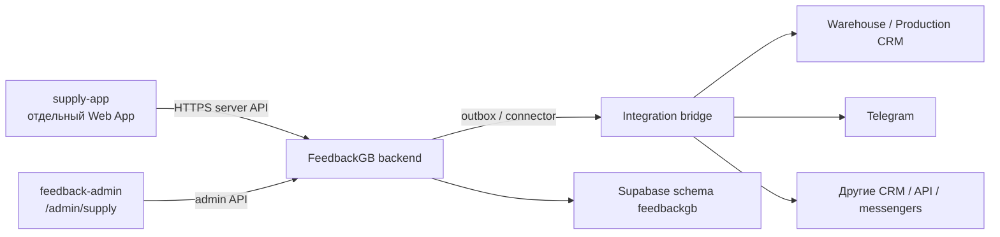

# План: Supply App для цехов и складов

## 1. Цель и границы

Создать в монорепозитории отдельное веб-приложение `supply-app` для 25–30 сотрудников цехов и складов. Оно деплоится отдельно от `feedback-app` и `feedback-admin`.

**Обязательная структура:** новое приложение находится строго в самостоятельной корневой папке `D:\feedback_gb\feedbackGB\supply-app\`. Его нельзя размещать внутри `feedback-app`, `feedback-admin`, `shared` или другой существующей папки приложения.

```text
feedbackGB/
├── feedback-app/       # приложение продавцов
├── feedback-admin/     # админ-панель
├── supply-app/         # новое отдельное приложение цехов и складов
├── shared/             # только общие типы, validation и контракты
└── docs/
```

Для `supply-app` создаётся самостоятельный Vercel project с Root Directory `supply-app`, собственными environment variables, доменом и deployment pipeline.

Первый экран приложения: **«Сировина для цеху»**.

Доступные действия:

1. **Замовлення сировини**.
2. **Брак сировини**.
3. **Прихідні накладні**.

В `feedback-admin` добавить отдельный раздел sidebar: **«Постачання»** (`/admin/supply`) с независимыми списками, фильтрами, статусами, аудитом и журналом интеграций.

**Доступ к `feedback-admin` запрещён всем пользователям, кроме ролей `admin` и `super_admin`.** Сотрудники цехов и складов, включая `supply_worker`, `supply_manager`, `receiver` и `quality_controller`, работают только в `supply-app` и не получают маршруты, cookie-сессию или API-доступ админки.

### Не входит в первую поставку

- дублирование остатков или себестоимости из CRM в FeedbackGB;
- автоматическое проведение приходной накладной без отдельного бизнес-подтверждения;
- прямой доступ браузера к CRM, её API-ключам или базе;
- изменение существующей логики заявок продавцов.

## 2. Что уже есть в FeedbackGB

- Единый PIN-вход через `feedbackgb.verify_pin_global`.
- Отдельные PIN, блокировка неудачных попыток и rate limit.
- Подписанная `httpOnly` session cookie.
- Роли: `seller`, `admin`, `super_admin`.
- У пользователя есть только `store_id`; этого недостаточно для цехов и складов.
- Есть защищённые API админки, audit log, уведомления и управление PIN.
- Расходники продавцов уже передаются server-to-server в Warehouse CRM через RPC. FeedbackGB хранит свой журнал и связь с CRM.

### Вывод

Не использовать таблицу `feedback` и категорию `consumables_request` как основу нового контура. Это журнал обратной связи продавцов, а не полноценный документооборот сырья. Для сырья нужны отдельные документы, статусы, права, связи с CRM и аудит.

## 3. Рекомендуемая архитектура



### Владение данными

| Контур | Источник истины |
|---|---|
| Пользователи, PIN, доступы, документы, аудит, интеграционные события | FeedbackGB |
| Каталог сырья, реальные остатки, движения, проведение прихода и списание | Целевая Warehouse/Production CRM |
| Уведомления | Производные события; не источник истины |

### Почему нужен integration bridge

`supply-app` не должен вызывать CRM напрямую. Все изменения идут через сервер FeedbackGB и outbox-очередь. Это даёт идемпотентность, повтор доставки, журнал ошибок и возможность подключать новые CRM/мессенджеры без переделки пользовательского приложения.

## 4. Модель доступа

### 4.1. Локации

Создать `feedbackgb.facilities`:

- `id`;
- `name`;
- `kind`: `production | warehouse`;
- `crm_system`;
- `crm_location_id`;
- `is_active`.

### 4.2. Привязка сотрудника

Создать `feedbackgb.user_facility_memberships`:

- `user_id`;
- `facility_id`;
- `role`: `supply_worker | supply_manager | receiver | quality_controller`;
- `is_active`;
- уникальность `(user_id, facility_id)`.

Верхние роли `admin` и `super_admin` сохраняются. Операционный доступ определяется membership, а не ролью `seller`.

### 4.3. Доступ к приложениям

Добавить явный доступ пользователя к приложениям: `seller_app`, `supply_app`. Один сотрудник может иметь доступ к обоим приложениям только при явном назначении.

### 4.4. Сессия

Для нового приложения использовать другую cookie: `supply_session`. Нельзя переиспользовать `fbgb_session` без проверки audience: иначе сессия продавца может быть принята supply-приложением.

## 5. Модель документов

### 5.1. Заказ сырья

`supply_requests`:

- UUID, номер, facility, автор, статус;
- desired date, комментарий;
- `client_submission_id` для идемпотентности;
- CRM-ссылка и версия записи.

`supply_request_items`:

- request ID, raw material ID, название-снимок, единица, количество.

Статусы: `draft -> submitted -> accepted -> processing -> fulfilled | rejected | cancelled`.

### 5.2. Брак сырья

`raw_material_defects`, `raw_material_defect_items`:

- facility, автор, сырьё, количество, причина, комментарий;
- вложения, если они нужны бизнес-процессу;
- связь с CRM-документом списания.

Статусы: `draft -> submitted -> checking -> approved | rejected -> posted_to_crm`.

### 5.3. Приходные накладные

`incoming_documents`, `incoming_document_items`:

- facility, поставщик, номер и дата накладной;
- строки сырья, единицы и количество;
- private-вложения;
- результат проверки и CRM-ссылка.

Статусы: `draft -> submitted -> checking -> accepted | rejected -> posted_to_crm`.

### 5.4. Общие таблицы

- `supply_attachments` — только private storage и metadata файлов.
- `supply_status_history` — неизменяемая история переходов.
- `external_links` — `source_system`, тип объекта, локальный и внешний ID.
- `integration_outbox` — события, ожидающие внешней доставки.
- `integration_attempts` — попытки, ошибки, response metadata.
- `webhook_inbox` — входящие webhook до асинхронной обработки.

## 6. Supply App: пользовательские сценарии

### 6.1. Вход

1. Пользователь вводит индивидуальный PIN.
2. Сервер проверяет PIN, активность пользователя, доступ `supply_app` и active membership.
3. При успехе выдаётся `supply_session`.
4. На каждом чувствительном API-вызове сервер повторно проверяет scope facility и права.

### 6.2. Стартовый экран

Раздел **«Сировина для цеху»** содержит три кнопки:

- `Замовлення сировини`;
- `Брак сировини`;
- `Прихідні накладні`.

Дополнительно: `Мої документи`, профиль и выход.

### 6.3. Заказ сырья

- Показать только каталог, разрешённый для facility сотрудника.
- Выбор позиций, количества, единицы, комментарий, желаемая дата.
- Не показывать цены, маржу, чужие остатки или чужие документы без отдельного права.
- После отправки показать локальный номер и статус.

### 6.4. Брак сырья

- Сырьё, количество, причина из справочника, комментарий.
- Отправка создаёт документ, но не проводит списание автоматически.
- Проведение в CRM разрешено только после подтверждения уполномоченной ролью.

### 6.5. Приходные накладные

- Поставщик, номер/дата, facility, позиции, единицы, количества.
- Файл накладной — private attachment.
- Документ проходит проверку до интеграции в CRM.

## 7. API нового приложения

Все API серверные. Клиент не передаёт доверенные `facility_id`, роль, автора, CRM ID, цену, финальный статус или право проведения.

| Endpoint | Назначение |
|---|---|
| `POST /api/auth/login` | PIN-вход, выдача `supply_session` |
| `POST /api/auth/logout` | Завершение сессии |
| `GET /api/me` | Профиль, memberships, разрешения |
| `GET /api/catalog/raw-materials` | Разрешённый каталог сырья |
| `POST /api/supply/orders` | Создание заказа сырья |
| `GET /api/supply/orders` | Собственные заказы |
| `GET /api/supply/orders/:id` | Деталь собственного заказа |
| `POST /api/supply/defects` | Создание документа брака |
| `GET /api/supply/defects` | Собственный брак |
| `POST /api/supply/incoming-documents` | Создание приходной накладной |
| `GET /api/supply/incoming-documents` | Собственные накладные |
| `POST /api/uploads/*` | Контролируемая загрузка вложений |

## 8. Админка: «Постачання»

Добавить sidebar route `/admin/supply` и три вкладки:

1. `Замовлення сировини`.
2. `Брак сировини`.
3. `Прихідні накладні`.

Общие возможности:

- фильтры по периоду, facility, автору, статусу, состоянию CRM;
- карточка документа с history, вложениями, external links и журналом попыток интеграции;
- назначение ответственного;
- подтверждение, отклонение, возврат на доработку и повтор интеграции только по праву;
- отдельная вкладка/экран `Інтеграції` для очереди и DLQ.

### API админки

| Endpoint | Назначение |
|---|---|
| `GET /api/admin/supply/orders` | Список заказов |
| `GET/PATCH /api/admin/supply/orders/:id` | Деталь и допустимые изменения |
| `GET/PATCH /api/admin/supply/defects/:id` | Деталь брака и решение |
| `GET/PATCH /api/admin/supply/incoming-documents/:id` | Деталь накладной и решение |
| `POST /api/admin/supply/:type/:id/approve` | Подтверждение |
| `POST /api/admin/supply/:type/:id/reject` | Отклонение |
| `POST /api/admin/supply/:type/:id/retry-integration` | Повтор внешней доставки |
| `GET /api/admin/supply/integrations` | Очередь, ошибки, DLQ |

Каждый mutation endpoint обязан создавать audit event.

## 9. Интеграции и мосты

### 9.1. Исходящий поток

1. Транзакция создаёт локальный документ и событие в `integration_outbox`.
2. Worker/cron получает событие.
3. Вызывает нужный adapter: Warehouse CRM, Production CRM, Telegram или другой сервис.
4. Записывает попытку в `integration_attempts`.
5. При успехе сохраняет `external_links` и обновляет локальный статус.
6. При временной ошибке использует exponential backoff.
7. После лимита попыток переносит событие в DLQ и создаёт admin notification.

### 9.2. Идемпотентность

Каждое внешнее действие использует ключ:

```text
source_system + document_id + event_type
```

Повторная отправка не должна создать второй заказ, второе списание или второй приход в CRM.

### 9.3. Входящие webhook

Webhook принимается только после проверки:

- подписи;
- timestamp;
- replay key;
- разрешённого источника.

Затем событие сохраняется в `webhook_inbox` и обрабатывается асинхронно. Webhook не меняет данные напрямую в HTTP request.

## 10. Строгие правила безопасности

- Отдельная `supply_session`, `HttpOnly`, `Secure`, `SameSite=Lax` или строже.
- Короткая сессия: 8–12 часов; не переносить текущие 14 дней без отдельного решения.
- Рекомендация для нового контура: случайные уникальные 8-значные PIN. Если остаётся 6 цифр, усилить rate-limit и ротацию.
- Ограничение входа по IP + account + device; нейтральные сообщения об ошибке.
- RBAC и facility scope проверяются сервером и на уровне RLS, а не только в UI.
- Сервисные ключи только в server runtime; отдельные секреты FeedbackGB и каждой CRM.
- Новые таблицы: RLS включён; `anon`/`authenticated` не получают прямой доступ к служебным RPC и таблицам.
- Вложения: private bucket, MIME allowlist, лимит размера, signed URLs с коротким TTL, malware scan до выдачи.
- CSRF-защита cookie mutation-запросов, CSP, security headers, CORS deny-by-default.
- Защита IDOR: доступ к документу проверяется через author/facility/permission.
- Audit immutable: actor, действие, before/after, IP, user-agent, correlation ID.
- Секреты и чувствительные payload не логируются и не выводятся в UI.
- Перед production: SAST, dependency audit, gitleaks, security review.

## 11. Пошаговая реализация и проверки

### Шаг 1. Зафиксировать бизнес-контракт

Определить:

- список facility и их CRM ID;
- 25–30 сотрудников, назначения и права;
- владельца каждого статуса;
- кто подтверждает и проводит заказ, брак и приход;
- какие поля обязательны для каждого документа.

Проверка: утверждённая матрица `роль × действие × facility × статус` без неясных переходов.

### Шаг 2. Read-only аудит production

Проверить live-контуры:

- FeedbackGB: `users`, PIN RPC, RLS, audit, storage, актуальные миграции;
- Warehouse/Production CRM: каталог сырья, единицы, facility/склады, поставщики, приход, списание брака, доступные RPC/API;
- контракт идемпотентности CRM.

Проверка: таблица `потребность -> источник истины -> таблица/API/RPC -> владелец`.

Если CRM не поддерживает нужное действие, это отдельная доработка CRM. Нельзя имитировать проведённое движение только записью в FeedbackGB.

### Шаг 3. SQL-миграции и RLS

- Создать новые таблицы, FK, unique constraints, индексы, status history, outbox.
- Добавить roles/app access/memberships.
- Создать RLS policies и service-only RPC.

Проверки:

- миграция на чистой staging DB;
- миграция на копии production schema;
- FK/unique/index checks;
- negative RLS tests: чужой facility, неактивный user, отсутствующее permission;
- rollback plan.

### Шаг 4. Shared-контракты

В `shared/` вынести:

- типы документов и статусов;
- transition rules;
- facility scope;
- DTO и серверную validation.

Проверки: unit tests для каждого перехода статуса, количества, единиц, facility scope и idempotency key.

### Шаг 5. Создать `supply-app`

- отдельные `package.json`, `README`, `.env.example`, Vercel project;
- отдельная session cookie;
- PIN UI, home, три document-flow и «Мої документи».

Проверки:

- нет сессии -> `401`;
- inactive user -> отказ;
- нет `supply_app` -> отказ;
- нет membership -> отказ;
- истёкшая сессия -> отказ;
- повторная отправка -> один локальный документ.

### Шаг 6. Реализовать server API и вложения

- schema validation;
- correlation ID;
- server-side facility resolution;
- controlled upload.

Проверки:

- malformed JSON и лишние поля;
- подмена facility/author/status/CRM ID;
- попытка доступа к чужому UUID;
- oversized file и запрещённый MIME;
- параллельные повторные отправки.

### Шаг 7. Реализовать `/admin/supply`

- списки, фильтры, карточка, статусы, назначение, история, audit, retry;
- UI скрывает недоступные действия, API запрещает их независимо от UI.

Проверки:

- `admin` не может выполнить действие только `super_admin`;
- сотрудник/админ без scope не видит чужой facility;
- каждое изменение создаёт audit record;
- повтор интеграции не создаёт дубликат CRM-документа.

### Шаг 8. Подключить CRM через outbox

Сначала подключить staging CRM с тестовой facility и тестовой номенклатурой.

Проверки:

- success;
- timeout;
- CRM `500`;
- duplicate delivery;
- CRM приняла запрос, но ответ потерялся;
- retry после ошибки;
- попадание в DLQ;
- ручной retry из админки.

### Шаг 9. Уведомления и внешние каналы

Подключать после устойчивого CRM-контура.

Проверки:

- отсутствие Telegram config не ломает основной документ;
- retry не создаёт duplicate message;
- webhook с неправильной подписью/replay отклоняется;
- уведомление не изменяет бизнес-статус само по себе.

### Шаг 10. UAT-пилот

Запуск на 2–3 facility и 5–7 сотрудниках.

Сценарии:

- заказ сырья;
- отмена и отклонение;
- частичный отказ;
- брак с фото;
- накладная с ошибкой;
- повтор после нестабильной сети;
- деактивация сотрудника во время активной сессии;
- ошибка CRM и ручной повтор.

Критерий: нет P0/P1, каждый документ имеет трассу до CRM либо DLQ, audit заполнен.

### Шаг 11. Production rollout

1. Backup и проверка миграций/RLS.
2. Feature flag для `/admin/supply`.
3. Pilot users.
4. Расширение до 25–30 пользователей.
5. Мониторинг: login failures, API errors, outbox lag, DLQ, CRM mismatch, duplicate rate.

## 12. Решения, необходимые до реализации

1. Какая CRM является источником истины для заказа сырья, брака и приходных накладных.
2. Совпадает ли цех с локацией/складом CRM и какие у них реальные ID.
3. Кто подтверждает и проводит каждый тип документа.
4. Нужен Telegram Mini App или обычный мобильный web app.
5. Используется 6-значный PIN как в текущем FeedbackGB или новый 8-значный PIN.
6. Какие поля и вложения обязательны для накладной и брака.
7. Нужны ли уведомления в Telegram сразу в MVP или после стабилизации CRM-контура.

## 13. Критерий готовности MVP

- Сотрудник с индивидуальным PIN может создать каждый из трёх типов документов только в разрешённой facility.
- Администратор обрабатывает документы в `/admin/supply` с полным аудитом.
- CRM получает документ один раз даже при повторе запроса.
- Сбой CRM не теряет документ: он виден в очереди/DLQ и может быть повторён.
- Чужой сотрудник, facility или неавторизованный пользователь не могут прочитать, изменить или провести документ.
- Секреты CRM не доступны браузеру, логам и админскому UI.

## 14. Обязательная документация и архитектурные стандарты

**Строгое правило: любое решение, изменение схемы, endpoint, интеграция, статусный переход, право доступа и эксплуатационная процедура должны быть зафиксированы в документации проекта одновременно с кодом. Изменение без обновлённой документации не считается готовым.**

### Mermaid

Поддерживать актуальные Mermaid-диаграммы для:

- контекста систем и границ ответственности;
- модулей `supply-app`, `feedback-admin`, FeedbackGB backend и CRM adapters;
- потоков заказа сырья, брака и приходной накладной;
- переходов статусов;
- outbox, retry, DLQ и входящих webhook;
- модели доступа `user -> membership -> facility -> permission`.

### Swagger / OpenAPI

- Все публичные и внутренние HTTP endpoints описываются в versioned OpenAPI 3.x specification.
- Для каждого endpoint обязательны: auth, роли, facility scope, request/response schema, коды ошибок, idempotency, pagination, примеры и audit effect.
- OpenAPI-спецификация является контрактом между `supply-app`, `feedback-admin`, интеграционным bridge и внешними потребителями.
- Изменение endpoint без обновления OpenAPI и contract tests запрещено.

### Clean Architecture

Разделить код по слоям:

1. **Domain** — сущности документов, статусы, бизнес-правила, permissions; без Next.js, Supabase и HTTP.
2. **Application** — use cases: создать заказ, подтвердить брак, принять накладную, поставить событие в outbox.
3. **Ports** — интерфейсы репозиториев, CRM adapters, файлового storage, notification bus.
4. **Infrastructure** — Supabase/Postgres, CRM clients, Telegram, storage, worker/cron.
5. **Interfaces** — Next.js routes, server actions и UI.

Зависимости направлены только внутрь: UI и infrastructure зависят от application/domain; domain не зависит от фреймворков, базы данных или CRM.

### Минимальный комплект документов

- `docs/supply-app/ARCHITECTURE.md` — границы систем, Mermaid и Clean Architecture modules.
- `docs/supply-app/DATA_MODEL.md` — таблицы, связи, RLS и ownership.
- `docs/supply-app/WORKFLOWS.md` — статусы и Mermaid sequence/state diagrams.
- `docs/supply-app/API.openapi.yaml` — versioned Swagger/OpenAPI contract.
- `docs/supply-app/INTEGRATIONS.md` — CRM adapters, события, webhook, retry, DLQ.
- `docs/supply-app/SECURITY.md` — threat model, roles, access scope, secrets, audit, incident procedure.
- `docs/supply-app/RUNBOOK.md` — deployment, мониторинг, error recovery и rollback.
- `docs/supply-app/ADR/` — архитектурные решения с причиной, альтернативами и последствиями.

### Проверки документации

- Mermaid-диаграммы рендерятся без ошибок.
- OpenAPI валидируется в CI и совпадает с integration/contract tests.
- Каждая SQL-миграция имеет ссылку на изменение `DATA_MODEL.md` и RLS-политику.
- Каждый новый endpoint имеет OpenAPI-описание и тест авторизации/roles/scope.
- Каждый новый adapter имеет запись в `INTEGRATIONS.md`, идемпотентность и сценарии retry/DLQ.
- Pull request не принимается без обновлённой документации, если он меняет контракт, архитектуру, схему или эксплуатацию.
