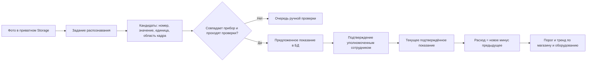

# Распознавание показаний счётчиков: проект следующего этапа

**Статус 08.10.2026:** проект, не реализация. Пользователь подтвердил, что пришлёт типичные фото самих счётчиков. Примеров, реестра приборов и проверенной точности OCR пока нет. Действующий раздел «Надати показники» хранит фото; числовые показания в БД не извлекает.

## Цель и границы

Из 1–3 фото подачи по воде, электричеству, отоплению или другой услуге извлечь номер прибора, значение, единицу и время съёмки, связать с конкретным прибором и магазином. Затем вычислять изменение между подтверждёнными показаниями и отмечать необычный расход. Это даёт контроль потребления; состояние конкретного оборудования можно оценивать только при наличии связи «прибор → оборудование» и правил для этого оборудования.

Одна фотография может содержать несколько цифр: серийный номер, тарифные регистры T1/T2, общий итог, дробную часть, дату, пломбу. Поэтому просто найти самую крупную цифру и записать её как показание нельзя.

## Маршрут данных

Поданное фото сохраняется независимо от OCR. Ошибка распознавания не отменяет подачу и не задерживает Telegram-доставку. Повторная подача создаёт новую версию фото и новый результат распознавания; старый результат остаётся в истории.

## Предлагаемая модель Supabase

| Объект | Ключевые поля | Правило |
|---|---|---|
| `utility_meters` | `id`, `store_id`, `category`, `serial_number`, `unit`, `equipment_id?`, `display_scale?`, `rollover_modulus?`, `active_from/to` | Реестр физических приборов; номер и принадлежность подтверждаются человеком. Один магазин может иметь несколько приборов одной услуги. |
| `utility_ocr_jobs` | `id`, `photo_id`, `state`, `attempts`, `model_version`, `started_at`, `finished_at`, `error_code` | Асинхронная обработка; повтор запуска идемпотентен для пары фото + версии алгоритма. |
| `utility_reading_candidates` | `job_id`, `meter_id?`, `raw_value_text`, `parsed_value`, `unit`, `serial_candidate`, `confidence`, `bounding_box`, `reason_codes` | Автоматический результат. Может быть несколько кандидатов с одного фото; это ещё не подтверждённое показание. |
| `utility_meter_readings` | `meter_id`, `period_id`, `submission_id`, `photo_id`, `value`, `observed_at`, `status`, `confirmed_by/at`, `supersedes_id` | Версии показаний; подтверждение только с аудитом, автором и ссылкой на исходное фото. |
| Представление расхода | два последовательных подтверждённых значения одного `meter_id` | Разность считается только при одинаковой единице и шкале; rollover/сброс требуют отдельного правила. |

Это **проект схемы**, миграция не подготовлена и в production не применялась. Таблицы OCR не должны смешиваться с `utility_submissions`: фотоотчёт и числовое показание имеют разные статусы достоверности.

## Проверки перед подтверждением

1. Прибор сопоставлен с магазином и категорией по номеру/реестру, а не только по выбранной пользователем карточке.
2. Показание читается на самом счётчике; цифры серийного номера, даты и тарифного индекса исключены. Для T1/T2 хранить отдельные регистры.
3. Подтверждена единица (`м³`, `кВт·ч`, `Гкал` и т. п.) и расположение десятичного разделителя. Не округлять без правила прибора.
4. Значение не меньше предыдущего, кроме документированного обнуления, замены прибора или переполнения шкалы.
5. Разница и расход за дни между фото в разумном диапазоне для конкретного магазина/оборудования; аномалия не стирает фото, а требует проверки.
6. Нечёткое фото, блики, закрытый дисплей, неизвестный прибор или конфликт нескольких кандидатов всегда уходят человеку.
7. Изменение вручную сохраняет старое и новое значения, автора, время, причину и ссылку на фото.

На первом этапе OCR автоматически записывает **кандидата** в Supabase, а администратор утверждает показание. Автоматическое утверждение возможно только после измерения ошибок на реальных фото и отдельного согласования порогов. Уверенность модели сама по себе не является доказательством правильного значения: [Microsoft описывает влияние качества снимка и необходимость калибровки confidence с ручной проверкой](https://learn.microsoft.com/en-us/azure/ai-foundry/responsible-ai/computer-vision/ocr-characteristics-and-limitations); [AWS возвращает текст, область изображения и confidence отдельно](https://docs.aws.amazon.com/rekognition/latest/dg/text-detecting-text-procedure.html).

## Этапы проверки качества

1. Получить 3–5 типичных фото каждой доступной категории, включая сложные случаи; удалить или закрыть лишние личные данные.
2. Сверить, сохраняется ли читаемость мелких цифр после текущего сжатия приложения до 1600 px и 650 KiB. Если нет, отдельно хранить качественный кадр прибора в приватном Storage в пределах согласованного лимита.
3. Собрать проверенный набор «фото → прибор → правильное значение/регистр/единица» с независимой ручной разметкой. Не использовать сам результат OCR как эталон.
4. Сравнить локальное OCR и облачный распознаватель по точности **полного значения**, ошибкам серийного номера, доле случаев ручной проверки, задержке и стоимости. Выбор провайдера сейчас не сделан.
5. Сначала включить только подсказку админу и запись кандидата. После приёмки — контроль расхода и оповещения. Отдельно согласовать автоматическое утверждение, если оно действительно нужно.

## Что пока неизвестно

- Виды приборов, количество регистров, шкалы, серийные номера и их связь с оборудованием.
- Есть ли исходные качественные фото: текущий поток передаёт сжатые изображения.
- Кто утверждает числовые показания и какие пороги расхода считать аномалией.
- Допустимо ли передавать фото внешнему OCR-провайдеру; без этого нельзя выбрать облачный сервис.
- Фактическая точность и стоимость на ваших снимках.
