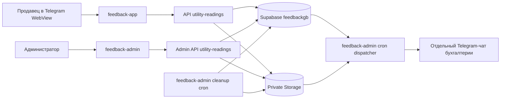
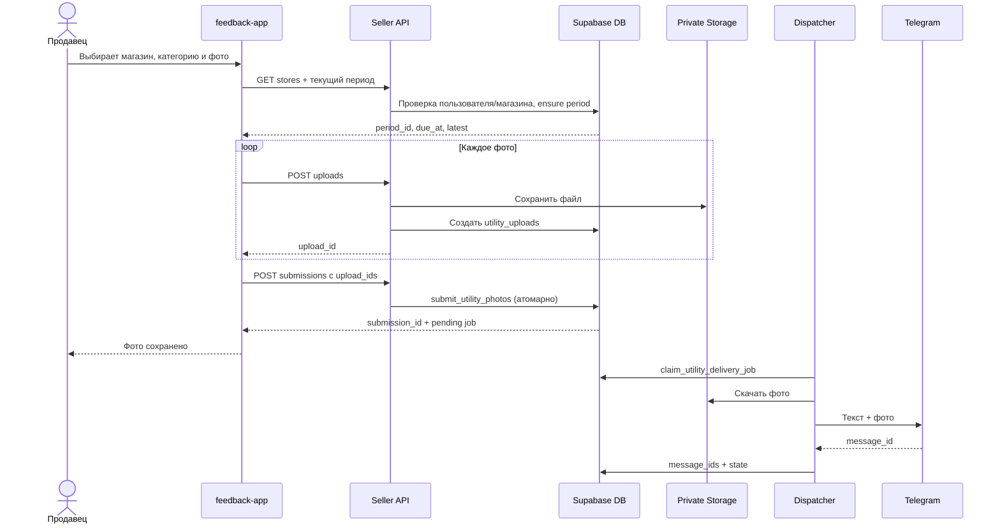
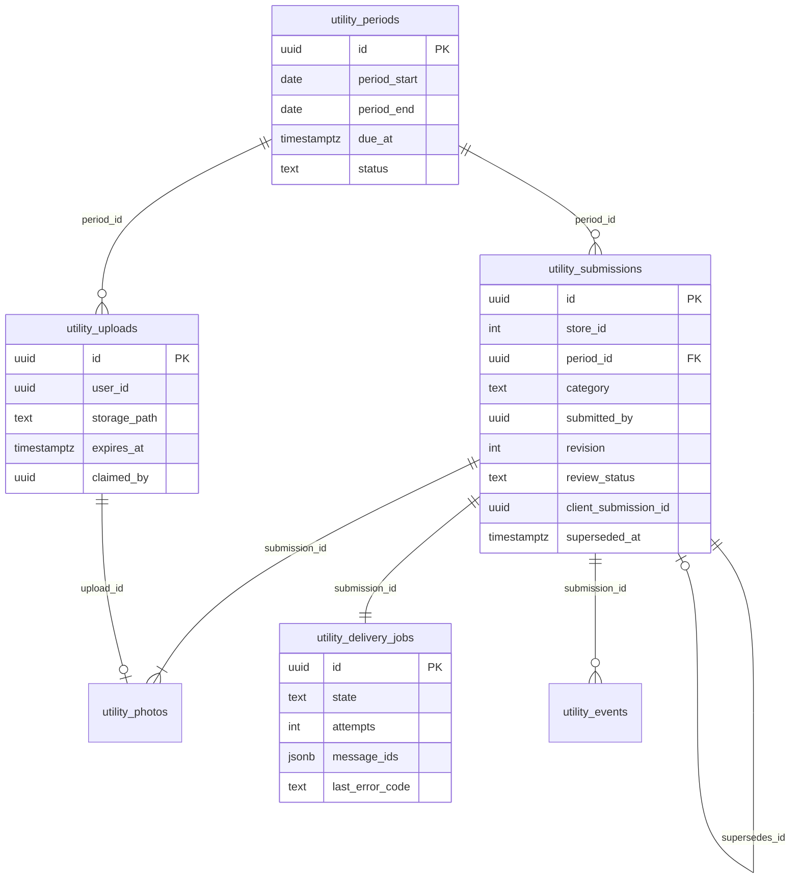
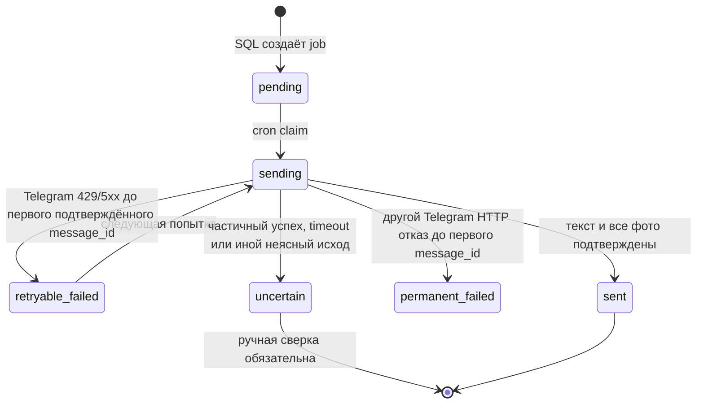

# «Надати показники» — бизнес-процесс и технический контракт

**Дата сверки с исходным кодом:** 07.10.2026. **Ветка:** `codex/utility-photo-report`.

**Статус:** код приложения, админки, SQL-миграция и план созданы в репозитории. Миграция не применена ни в staging, ни в production; сквозной запуск с Supabase и Telegram не подтверждён. Все миграции выполняет только владелец проекта. После его сообщения можно проверить результат запросами только для чтения.

Этот документ описывает **текущее поведение кода**. Требования, которые ещё не реализованы или не проверены, помечены **«Требуется»**. План запуска и макеты: [UTILITY_PHOTO_REPORT_PLAN_2026-10-07.md](UTILITY_PHOTO_REPORT_PLAN_2026-10-07.md), [utility-photo-report-mockups.svg](utility-photo-report-mockups.svg).

## 1. Назначение и границы

Продавец передаёт бухгалтерии фотографии по одной из четырёх услуг: `electricity` («Електроенергія»), `water` («Вода»), `heating` («Опалення»), `other` («Інші послуги»). Путь в приложении: главная карточка «Надати показники» → карточка услуги → камера или галерея → просмотр фото → отправка. По устройству ввода это аналог «Фото звіту», но хранение, таблицы, статус проверки и Telegram-адресат отдельные.

- Ввод числа показания, тарифа, суммы, номера счётчика и OCR **отсутствует**. Название раздела не означает, что система распознала показание на фото.
- В одном подании 1–15 фото и необязательный комментарий до 1000 символов. У обычного «Фото звіту» минимум 6 фото; это правило здесь не действует.
- Четыре категории показываются каждому доступному магазину. Обязательность конкретной категории для конкретного магазина не задана. Статус «немає фото» не равен нарушению.
- Месяц нужен для группировки и истории, продавец его не выбирает. В текущем UI админки также показан текущий месяц, хотя API config получает до 24 периодов.
- Срок подачи — последний календарный день месяца до `23:59:59.999` по `Europe/Kyiv`. Число автоматически получается 28, 29, 30 или 31.
- Подача создаёт запись в Supabase. Пересылка в Telegram асинхронная; сообщение «Фото збережено» не означает доставку бухгалтеру.

Пример: продавец магазина №10 в октябре отправляет 2 фото воды. В БД появляется версия 1 пары `(магазин 10, октябрь, water)` и задача доставки. Если до срока он отправит новые фото той же категории, появится версия 2, а версия 1 останется в истории. Если администратор уже подтвердил версию, продавец не может её заменить. Правило исправления после окончания месяца пока не принято: текущий код блокирует такую отправку, даже когда фото было возвращено на исправление.

## 2. Источники истины и владельцы данных

| Источник | Что берём | Для чего | Ограничение |
|---|---|---|---|
| Подписанная сессия приложения, `feedbackgb.users` | `id`, `role`, `is_active`, `store_id` | Кто отправляет и активен ли пользователь | Сессия и запись пользователя проверяются при запросе; PIN и токен в новый модуль не копируются. |
| `feedbackgb.seller_store_permissions` | `seller_id`, `store_id`, `revoked_at` | Активный доступ продавца к магазину замены | Разрешение доказывает право выбора, но не факт смены. |
| `feedbackgb.v_stores` | `id`, `name`, `is_active` | Список и название активных магазинов | Нельзя подать для неактивного магазина. |
| `categories.spots` | `spot_id` | Внешний ключ `store_id` новых таблиц | Точное соответствие ID должно пройти readback после применения миграции. |
| `feedbackgb.utility_periods` | `period_start`, `period_end`, `due_at`, `status` | Внутренний месячный ключ и серверный deadline | Создаётся при первом авторизованном запросе текущего месяца через RPC. |
| Приватный Storage bucket `utility-reading-photos` | Файлы JPEG/PNG/WebP | Хранение фото | Публичный доступ выключен; админ получает signed URL на 10 минут. |
| `utility_submissions` + `utility_photos` | Факт подачи, версия, порядок фото | Основной источник отчётности | Telegram — копия для работы бухгалтера, не единственный архив. |
| `utility_delivery_jobs` | Очередь, состояние, попытки, `message_ids` | Контроль Telegram-доставки | `sent` не равен `verified`. |
| `utility_events` | `submitted`, `verified`, `needs_correction` | История бизнес-действий | Сейчас не является журналом всех технических ошибок. |

База у серверных клиентов приложений настроена на схему `feedbackgb` (`feedback-app/src/lib/supabase.ts`, `feedback-admin/src/lib/supabase.ts`). Объекты в `categories` используются только там, где они прямо указаны в SQL внешним ключом.

## 3. Бизнес-роли и процессы

| Роль | Может | Не означает |
|---|---|---|
| Продавец | Отправить фото для активного основного магазина или магазина с действующим разрешением; увидеть результат проверки текущей категории. | Разрешение на замену не подтверждает физическое присутствие. |
| Администратор / super admin | Открыть обзор, фото и версии; подтвердить или вернуть текущее `submitted` с причиной; серверный контракт также допускает подачу от имени администратора. | Подтверждение админом не доказывает, что бухгалтер прочитал Telegram. |
| Бухгалтер | Получить копию текста и фотографий в отдельном рабочем Telegram-чате после настройки адресата. | Чтение Telegram не меняет `review_status` в БД. |
| Владелец проекта | Выполнить все миграции и назначить отдельный чат/ответственного за сверку ошибок доставки. | Применение SQL само по себе не включает интерфейс и worker. |

### 3.1 Подача продавцом

1. Главная карточка открывает `/utility-readings`, если включён `NEXT_PUBLIC_UTILITY_READINGS_ENABLED`.
2. UI запрашивает `/api/utility-readings/stores`. Продавец видит только активные магазины из основного `store_id` и активных разрешений; при нескольких выбирает магазин.
3. UI запрашивает `/api/utility-readings?store_id=…`: сервер проверяет право магазина, создаёт или получает текущий месячный период, отдаёт deadline и последние версии по четырём категориям.
4. Пользователь открывает одну категорию, снимает/выбирает фото. Общий `PhotoInput` сжимает изображение на устройстве с параметрами этого экрана: до 1600 px и целевой предел 650 KiB на фото. Пользователь может удалить фото.
5. При отправке форма последовательно загружает каждое фото через `POST /api/utility-readings/uploads`. Сервер ограничивает тело примерно 2 MiB + 64 KiB multipart-накладных данных, проверяет фактический файл до 2 MiB и сигнатуру JPEG/PNG/WebP, права магазина, период и лимит 30 незакреплённых фото на пользователя/категорию.
6. Каждое принятое фото сохраняется в private Storage и получает строку `utility_uploads`, действительную для подания 24 часа. При ошибке записи строки сервер пытается удалить файл.
7. `POST /api/utility-readings/submissions` получает 1–15 `upload_ids`, комментарий и `client_submission_id`. SQL-функция в одной транзакции повторно проверяет активного пользователя, магазин, срок и принадлежность каждого фото, создаёт версию, привязки фото, задачу доставки и событие `submitted`.
8. После успешного ответа UI показывает ID подачи. Telegram-статус в ответе — текущее состояние очереди, обычно `pending`; это не обещание мгновенной доставки.

Повтор того же `client_submission_id` и того же SHA-256 полезной нагрузки возвращает тот же ID подачи. Тот же ID с другой нагрузкой вызывает конфликт. Если отдельное фото загружено, но пакет не подан, cleanup удаляет его после 24 часов. Клиентский массив upload IDs в пределах текущей попытки позволяет повторить запрос после сетевой ошибки без повторной загрузки уже успешно загруженных фото.

### 3.2 Проверка администратором

1. `/admin/utility-readings` загружает текущий период и активные магазины, затем матрицу «магазин × категория».
2. Обзор показывает число фото, последнюю текущую версию, статус проверки и доставки. Рядок без фото — только отсутствие записи.
3. Деталь по ID получает фото через signed URLs, версии, события и статус Telegram. Администратор может подтвердить только текущее подание со статусом `submitted` или вернуть его с непустой причиной.
4. SQL RPC записывает решение и событие `verified`/`needs_correction`. Продавец видит причину возвращения на карточке категории.
5. Новая подача создаёт следующую версию, если правила срока и статуса разрешают. Старое фото/подание не перезаписывается.

### 3.3 Telegram и очистка

`feedback-admin` — единственный текущий диспетчер. В `vercel.json` для `/api/cron/utility-dispatch` задано `*/5 * * * *`, то есть **запланирован** вызов каждые 5 минут по UTC; фактический деплой и срабатывание не проверены. Worker берёт **одну** готовую задачу за вызов. Для отправки обязательны `UTILITY_READINGS_ENABLED=true`, `TELEGRAM_BOT_TOKEN`, отдельный `TELEGRAM_UTILITY_CHAT_ID` и cron-авторизация. Перед запуском в production следует задать `CRON_SECRET`: общий `checkCronAuth` при отсутствии секрета в production допускает запрос с заголовком `x-vercel-cron: 1`, который сам по себе не является секретом. Нет запасного адресата из обычного фотозвіту. [Vercel указывает UTC для cron](https://vercel.com/docs/cron-jobs) и [рекомендует `CRON_SECRET`](https://vercel.com/docs/cron-jobs/manage-cron-jobs).

Worker посылает текст с магазином, услугой, периодом, автором, версией, ID подачи и комментарием, затем фото ответом на текст: одно через `sendPhoto`, 2–10 через `sendMediaGroup`, 11–15 двумя пакетами. После каждого успешного шага сохраняет все полученные Telegram `message_id`. Конкретный чат пока не задан (TD-002 в `feedback-admin/docs/TECHNICAL_DEBT.md`); реальную доставку не проверяли.

[Telegram Bot API](https://core.telegram.org/bots/api#sendmediagroup) допускает 2–10 объектов в одном `sendMediaGroup` и возвращает массив сообщений. **Требуется до запуска:** проверить тариф/план Vercel: [документация Vercel](https://vercel.com/docs/cron-jobs/manage-cron-jobs) ограничивает Hobby cron одним запуском в день; конфигурация `*/5` без подходящего плана может не развернуться. Vercel также не повторяет неудачную cron-инвокацию автоматически, поэтому состояние очереди и ошибки необходимо наблюдать отдельно.

Cron `/api/cron/utility-cleanup` идёт ежедневно в `02:15 UTC`, берёт до 100 просроченных незакреплённых загрузок, удаляет файлы и затем строки. При ошибке удаления отдельного файла/строки продолжает цикл; сейчас такой пропуск не логируется отдельно.

## 4. Схемы Mermaid

### 4.1 Контур системы



### 4.2 Последовательность подачи и доставки



### 4.3 Данные и версии



### 4.4 Состояния доставки



`sending` при смерти worker сейчас автоматически не переводится в новый статус: `locked_until` записывается, но функция claim не подбирает зависшие `sending`. Оператору нужна ручная диагностика; слепой повтор может создать дубль в чате.

## 5. Supabase: контракт миграции `056_utility_readings.sql`

Миграция создаёт шесть таблиц и четыре RPC в схеме `feedbackgb`, private bucket и индексы. На всех шести таблицах включается RLS; прямые права `anon` и `authenticated` отозваны, `service_role` получает операции с таблицами и выполнение RPC. Серверные API дополнительно проверяют активную сессию и роль. До применения владельцем это **описание SQL-файла**, а не утверждение о live-схеме.

| Таблица | Зерно и ключевые поля | Ограничения/смысл |
|---|---|---|
| `utility_periods` | одна строка на непересекающийся месячный интервал; `period_start`, `period_end`, `due_at`, `status` | `ensure_current_utility_period()` рассчитывает границу в Киеве и берёт advisory lock при создании. |
| `utility_submissions` | одна версия `(store_id, period_id, category, revision)`; автор, источник, комментарий, проверка | Частичный уникальный индекс разрешает лишь одну строку с `superseded_at IS NULL` на магазин/период/категорию. `client_submission_id` уникален. |
| `utility_uploads` | одно временное фото; владелец, магазин, период, категория, MIME, bytes, SHA-256, путь | `expires_at` по умолчанию через 24 часа, `claimed_by` указывает на подание. |
| `utility_photos` | связь одного `upload_id` с одним поданием и порядок 0–14 | Уникальны `(submission_id, sort_order)` и `upload_id`. |
| `utility_delivery_jobs` | один job на подание | Очередь и итог Telegram: `state`, `attempts`, `next_attempt_at`, `locked_until`, `chat_id_snapshot`, `message_ids`, `last_error_code`, `sent_at`. |
| `utility_events` | событие на подание | Сейчас RPC пишет `submitted`, `verified`, `needs_correction`; ошибки API и worker сюда не пишутся. |

RPC: `ensure_current_utility_period()` создаёт/возвращает текущий период; `submit_utility_photos(...)` атомарно создаёт версию, связывает фото и ставит доставку; `review_utility_submission(...)` принимает решение админа; `claim_utility_delivery_job(chat_id)` резервирует одну задачу через `FOR UPDATE SKIP LOCKED`.

**Пример периода:** для октября 2026 `period_start=2026-10-01`, `period_end=2026-10-31`, `due_at=2026-10-31 23:59:59.999 Europe/Kyiv` (в БД хранится `timestamptz`). Для февраля невисокосного года конец 28-го, високосного — 29-го. Проверен расчёт SQL-выражения для 28/29/30/31 и киевского перехода времени; установленная RPC ещё не проверена.

**Пример пути файла:** `utility/<store_id>/<period_uuid>/<category>/<upload_uuid>.jpg`. Это служебный путь, не публичная ссылка. Выдача админке идёт через `createSignedUrls(..., 600)`.

## 6. Маршруты и ошибки API

| Среда/маршрут | Вход → выход | Основные проверки и возможные ответы |
|---|---|---|
| App `GET /api/utility-readings/stores` | Сессия → `{stores}` | Активность/роль, `v_stores`, разрешения; `401`, `403`, `500`, `503`. |
| App `GET /api/utility-readings?store_id=N` | Магазин → `{period, latest}` | Право магазина, `ensure_current_utility_period`; `400`, `403`, `500`, `503`. |
| App `POST /api/utility-readings/uploads` | multipart: `store_id`, `period_id`, `category`, `photo` → `{upload_id, bytes, mime}` | 1 файл, 2 MiB, сигнатура, срок, право, 30 pending; `400`, `403`, `409`, `413`, `429`, `500`, `503`. |
| App `POST /api/utility-readings/submissions` | JSON: магазин, период, категория, комментарий, UUID идемпотентности, 1–15 UUID фото → `{submission_id, saved, telegram_status}` | Проверка `raw.length <= 16384` символов, право, RPC; `400`, `403`, `409`, `413`, `422`. |
| Admin `GET /api/admin/utility-readings/config` | Сессия админа → магазины, до 24 периодов и текущий ID | `403`, `500`, `503`, `507`; результат ограничен 1000 магазинами. |
| Admin `GET /api/admin/utility-readings/coverage?period_id=UUID` | Период → строки магазин × 4 категории | `400`, `403`, `500`, `507`; выборки магазинов, текущих поданий, фото и jobs ограничены 1000 строками, превышение явно отвергается. |
| Admin `GET /api/admin/utility-readings/submissions?id=UUID` | ID → подание, фото с временными ссылками, версии, события, доставка | `400`, `403`, `404`, `500`; ошибка выдачи ссылок — `500 signing_failed`. |
| Admin `POST /api/admin/utility-readings/submissions` | ID, `verified`/`needs_correction`, причина → `{ok:true}` | Нужна активная роль admin/super_admin; причина возврата обязательна; `400`, `403`, `409`, `413`. |
| Cron `GET /api/cron/utility-dispatch` | Авторизованный cron → итог одного job | Выключенный флаг: skipped; нет чат ID/токена: `503`; ошибки claim/state: `500`; результат `sent`/ошибка/`uncertain`. |
| Cron `GET /api/cron/utility-cleanup` | Авторизованный cron → `{cleaned, scanned}` | До 100 незакреплённых просроченных файлов; частичные ошибки сейчас не отражаются в ответе отдельно. |

Страницы: app `/utility-readings`; admin `/admin/utility-readings`. Публичный клиентский feature flag скрывает обе страницы и соответствующие пункты меню, серверные API проверяют флаг ещё раз. `UTILITY_READINGS_ENABLED` отдельно управляет только cron worker/cleanup.

Таблица перечисляет маршрутные ошибки, не исчерпывая общие ответы: seller API также могут вернуть `404 feature_disabled`, `401 unauthenticated`, `403 forbidden`, `503 backend_unavailable`; admin API — `404 feature_disabled`, `403 forbidden`, `503 backend_unavailable`; cron — `401 unauthenticated` или `503 cron_secret_not_configured` по общему `checkCronAuth`. Без `CRON_SECRET` production-запуск не следует считать безопасно настроенным.

## 7. Ошибки и логирование по всему маршруту

### 7.1 Что реально фиксируется сейчас

| Участок | Текущее поведение кода | Чего не хватает |
|---|---|---|
| Выбор магазина/периода | API отдаёт стабильный `error` и HTTP-статус; UI показывает текст об ошибке. | Нет общего `request_id` и структурированной серверной записи о неуспешном запросе. |
| Сжатие фото на устройстве | `PhotoInput` показывает ошибку и вызывает `console.error(e)` в клиенте. | Ошибка не коррелируется с серверной попыткой; нельзя класть в телеметрию фото или data URL. |
| Upload в Storage/БД | API возвращает `storage_failed`/`upload_record_failed`; при ошибке вставки строки пытается удалить файл. | Причина и результат компенсирующего удаления не сохраняются в отдельном логе; оставшийся файл может быть не виден cleanup, который опирается на строку. |
| Атомарная подача | RPC пишет `utility_events: submitted`; API возвращает код ошибки при отказе. | Техническая причина ошибки не записывается в `utility_events` и нет request ID. |
| Проверка админом | RPC пишет событие решения, actor и причину. | Отказ RPC виден как `review_conflict`, но серверный диагностический лог не структурирован. |
| Telegram | Job хранит `state`, `attempts`, `message_ids`, `last_error_code`, `sent_at`; ответ cron содержит итог. | Нет сквозного ID запроса/фазы, автоматического разбора зависшего `sending`, алерта по `uncertain` и времени очереди. |
| Cleanup | Ответ содержит `scanned` и `cleaned`. | Ошибки отдельных удалений тихо пропускаются; нет счётчика `failed` и диагностической записи. |

**Требуется до production:** реализовать структурированный серверный журнал ошибок по всем указанным этапам. Текущий код нельзя описывать как полностью наблюдаемый. `utility_events` — бизнес-аудит, а не замена операционных логов. План логирования ниже является контрактом следующей работы, **не реализованным поведением**.

### 7.2 Контракт будущего структурированного события

Каждый входящий запрос получает валидированный или сгенерированный `request_id`; он возвращается в заголовке ответа и попадает в каждую серверную запись. Для цепочки загрузок связь дополнительно дают `client_submission_id`, затем `submission_id` и `job_id`. Поля события:

```json
{
  "event": "utility.upload.storage_failed",
  "level": "error",
  "request_id": "7e5e72d2-8a62-440e-a744-ff54a03c7c11",
  "route": "POST /api/utility-readings/uploads",
  "phase": "storage_upload",
  "store_id": 10,
  "period_id": "fdb7a778-7437-4ee3-83ce-0d9967f4a944",
  "category": "water",
  "error_code": "storage_failed",
  "http_status": 503,
  "duration_ms": 382
}
```

Это **пример формата**, не реальный production-лог и не существующий request ID. В логах не хранить PIN, session cookie, Telegram token/chat ID, URL с подписью, фотографию, base64, комментарий/причину возврата, ФИО и тело запроса. Для диагностики допустимы служебные UUID, ID магазина, категория, код, фаза, длительность и количество фото. Текст ошибки внешнего провайдера следует нормализовать до кода; свободный текст может содержать секреты или персональные данные.

### 7.3 Матрица обязательных событий и реакции

| Фаза | Событие при отказе | Уровень | Операционная реакция |
|---|---|---|---|
| session/access | `utility.access.denied` / `utility.access.backend_failed` | `warn` / `error` | Разделять ожидаемый отказ прав и ошибку БД; не раскрывать существование чужого магазина. |
| period | `utility.period.ensure_failed` / `utility.period.closed` | `error` / `info` | Проверить миграцию/readback или объяснить дедлайн. |
| client photo processing | `utility.photo.compress_failed` | клиентский диагностический код, без изображения | Пользователю предложить повторить фото; агрегировать лишь после отдельного согласованного клиентского сбора. |
| upload validation | `utility.upload.invalid` / `utility.upload.too_large` | `info` | HTTP 400/413, без тревоги по одиночному случаю. |
| upload storage | `utility.upload.storage_failed` | `error` | Искать Storage отказ по request ID; сверить отсутствие строки. |
| upload metadata/compensation | `utility.upload.record_failed`, `utility.upload.compensation_failed` | `error`/`critical` | При неудачном удалении файла нужен отдельный поиск сироты по пути/UUID. |
| submission RPC | `utility.submission.rejected` / `utility.submission.rpc_failed` | `info`/`error` | Отличать бизнес-конфликт от технического отказа; проверить атомарность. |
| admin read/review | `utility.admin.read_failed`, `utility.admin.sign_failed`, `utility.admin.review_failed` | `error` | Проверить RLS/Storage/RPC и ID подачи; не логировать signed URL. |
| worker claim | `utility.delivery.claim_failed` | `error` | Проверить функцию, backlog и доступ service role. |
| Telegram send | `utility.delivery.telegram_failed`, `utility.delivery.uncertain` | `error`/`critical` | По job ID сверить чат и `message_ids`; не повторять неопределённый исход автоматически. |
| worker state write | `utility.delivery.ledger_failed`, `utility.delivery.state_write_failed` | `critical` | Сверить Telegram и БД до повторной попытки. |
| cleanup | `utility.cleanup.storage_failed`, `utility.cleanup.row_failed` | `warn`/`error` | Сохранить ID upload, увеличить счётчик неудач, повторить следующий cron. |

Нужны агрегаты для мониторинга: число `pending`, возраст старейшего job, `retryable_failed`, `uncertain`, `sending` с истёкшим `locked_until`, доля `sent`, ошибки upload, доля неудачного cleanup. Порог алерта задаётся после измерения реального потока; в коде и документации пока нет подтверждённого SLA.

### 7.4 Разбор типовых ситуаций

| Симптом | Где искать | Как трактовать |
|---|---|---|
| Пользователь видит «Фото збережено», бухгалтер не видит сообщение | `utility_submissions` → `utility_delivery_jobs` по `submission_id`; флаг worker, chat ID, `state`, `last_error_code` | Факт подачи сохранён, доставка отдельная. При `uncertain` сначала сверять чат. |
| Приложение пишет «Не вдалося зберегти фото» | HTTP ответа uploads; есть ли `utility_uploads` и объект Storage | Клиентский текст общий; точная причина без структурированного лога пока ограничена кодом ответа. |
| «Термін минув» на возвращённой подаче | `utility_periods.due_at`, `review_status`, время Киева | Таково текущее правило; позднее исправление ждёт решения владельца. |
| Job долго `sending` | `locked_until`, `message_ids`, Telegram-чат | Автоматического возврата в очередь нет; это защита от возможного дубля, нужна ручная сверка. |
| Фото есть в Storage, строки upload нет | Ошибка вставки `utility_uploads` и неуспешная компенсация | Текущий cleanup не найдёт такой файл по БД; нужна отдельная процедура сверки сирот. |

Примеры безопасных **read-only** запросов после применения миграции владельцем:

```sql
select id, submission_id, state, attempts, next_attempt_at,
       locked_until, message_ids, last_error_code, sent_at
from feedbackgb.utility_delivery_jobs
where submission_id = '<submission_uuid>'::uuid;

select id, store_id, period_id, category, revision, review_status,
       superseded_at, submitted_at
from feedbackgb.utility_submissions
where store_id = <store_id> and period_id = '<period_uuid>'::uuid
order by category, revision;

select state, count(*) as jobs, min(created_at) as oldest_created_at
from feedbackgb.utility_delivery_jobs
group by state order by state;
```

Не подставлять демонстрационные значения как реальные ID. Чат и message IDs сверяются ответственным человеком, которому разрешён доступ к этому чату. Ручные SQL-исправления статусов здесь не предписаны.

## 8. Проверки и границы достоверности

| Проверка | Фактическое состояние на 07.10.2026 |
|---|---|
| Сверка маршрутов, SQL и UI с исходниками | Выполнена при подготовке этой документации. |
| Typecheck и production build обоих приложений | Проходили после реализации; после последнего исправления upload отдельно повторён typecheck seller app. |
| Автотесты | Ранее прошли 43 seller теста, 7 admin Photo Report тестов и 2 теста Telegram album; после ограничения multipart отдельно прошли 2 теста upload. Это разные запуски, не один общий прогон. |
| Миграция и readback новых таблиц/RPC | Не выполнены. Только владелец проекта применяет SQL, затем можно проверить `feedback-admin/supabase/056_utility_readings_readback.sql`. |
| Android/iOS в Telegram WebView | Не проверено. |
| Фактическая отправка в отдельный Telegram-чат | Не проверено; `TELEGRAM_UTILITY_CHAT_ID` не предоставлен. |
| Сквозное структурированное логирование ошибок | Не реализовано; контракт описан в §7. |

Открытые решения перед production: правило исправления после deadline, точный отдельный Telegram-чат и ответственный за `uncertain`, реализация логирования §7, staging-readback и ручная приёмка на устройствах. Нельзя обозначать модуль как запущенный, пока эти пункты не проверены.

## 9. Карта исходного кода

| Часть | Файлы |
|---|---|
| Главная карточка и seller UI | `feedback-app/src/components/CategoryGrid.tsx`; `feedback-app/src/app/(app)/utility-readings/page.tsx`; `utility-readings-form.tsx`; `feedback-app/src/components/PhotoInput.tsx` |
| Seller API и доступ | `feedback-app/src/app/api/utility-readings/{route.ts,stores/route.ts,uploads/route.ts,submissions/route.ts}`; `feedback-app/src/lib/utilityAccess.ts` |
| Admin UI/API и доступ | `feedback-admin/src/app/(admin)/admin/utility-readings/*`; `feedback-admin/src/app/api/admin/utility-readings/{config,coverage,submissions}/route.ts`; `feedback-admin/src/lib/admin/utilityAccess.ts` |
| Worker | `feedback-admin/src/app/api/cron/utility-dispatch/route.ts`; `utility-cleanup/route.ts`; `feedback-admin/src/lib/admin/utilityTelegram.ts`; `feedback-admin/vercel.json` |
| База и readback | `feedback-admin/supabase/056_utility_readings.sql`; `056_utility_readings_readback.sql` |
| Ограничение chat ID | `feedback-admin/docs/TECHNICAL_DEBT.md`, TD-002 |

При изменении поведения обновлять этот документ вместе с кодом: бизнес-правило, Mermaid-переход, API, таблицу ошибок, проверку и дату фактического readback. Не менять описание live-состояния по одному только локальному SQL-файлу.
