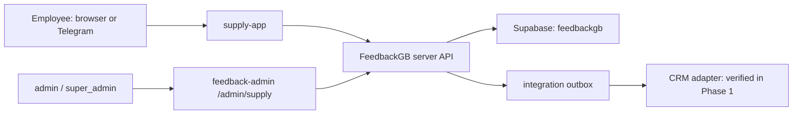
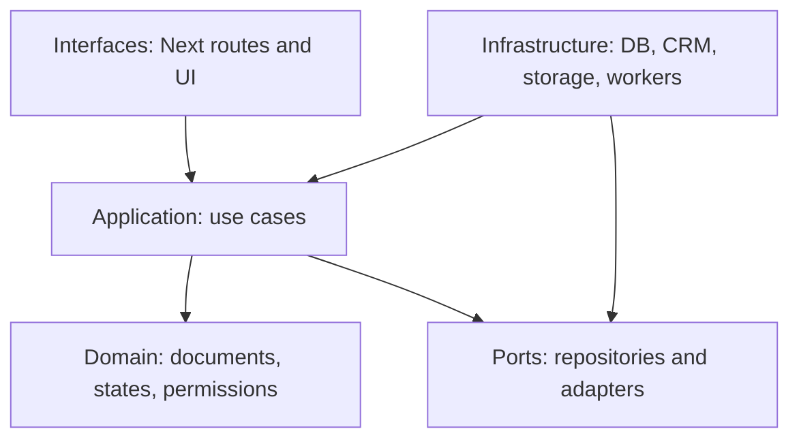

# Supply App architecture

`supply-app` is a separate root application with its own deployment, cookie
and signing secret. Browsers never receive CRM or Supabase service-role keys.
Only `admin` and `super_admin` access the admin application.

Domain code does not import Next.js, Supabase, Telegram or CRM clients.
