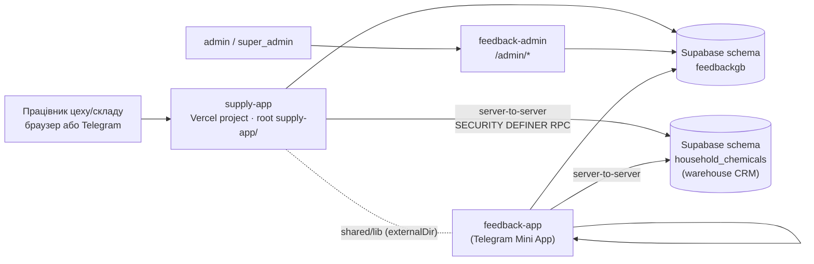
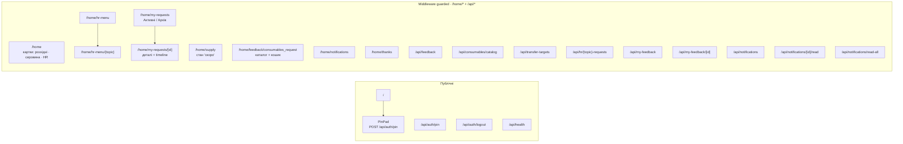
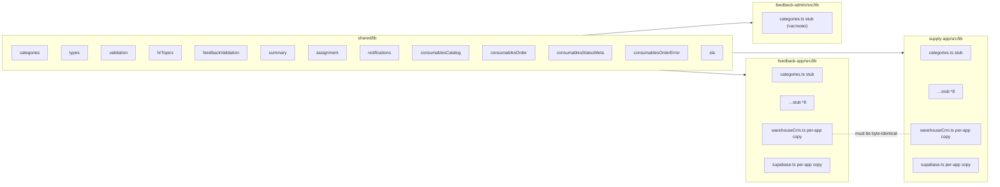
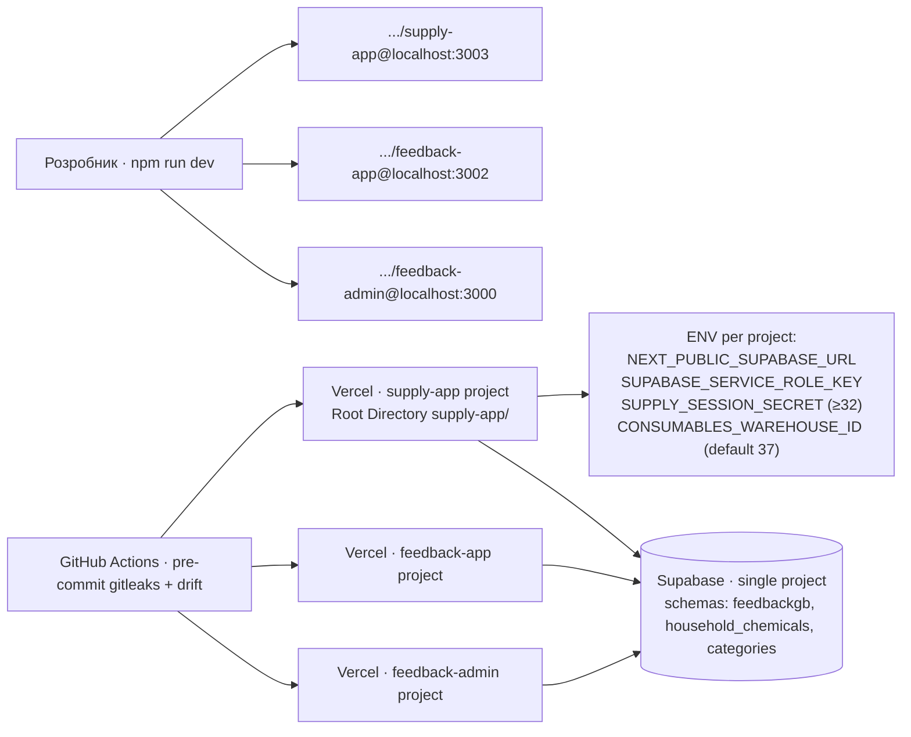

# Supply App — архитектура

Документ отражает **фактическое** состояние приложения после закрытия
эпиков A–D моста HR + розхідні матеріали (коммиты `028344d` … `dd7ce47`).
Диаграммы синхронизированы с кодом; изменения кода обязаны сопровождаться
правкой этого файла.

Соседние документы:
[DATA_MODEL.md](./DATA_MODEL.md) · [WORKFLOWS.md](./WORKFLOWS.md) ·
[SECURITY.md](./SECURITY.md) · [INTEGRATIONS.md](./INTEGRATIONS.md) ·
[API.openapi.yaml](./API.openapi.yaml) ·
[IMPLEMENTATION_STATUS.md](./IMPLEMENTATION_STATUS.md).

---

## 1. Границы приложения

**Что закреплено:**

- Отдельный Vercel-проект, отдельный signing secret (`SUPPLY_SESSION_SECRET`),
  отдельная cookie (`supply_session`). Cookie seller/admin приложения
  supply-app не принимает.
- Браузер клиента никогда не получает `SUPABASE_SERVICE_ROLE_KEY` и никаких
  прямых CRM-ключей. Все интеграции — server-side.
- Shared-код (`shared/lib/*`) единый для всех трёх приложений; supply-app
  тянет его через `experimental.externalDir` Next.js (см. §4).
- Все миграции применяются super_admin вручную; репозиторий их не накатывает.

---

## 2. Раскладка по Clean Architecture

```mermaid
flowchart TB
  subgraph Interfaces["Interfaces<br/>Next.js App Router · React"]
    UI["src/app/home/**/*.tsx<br/>src/components/**/*.tsx"]
    ROUTES["src/app/api/**/route.ts"]
    MW["src/middleware.ts"]
  end

  subgraph Application["Application (use cases)"]
    HR["shared/lib/feedbackValidation.ts<br/>(HR + консумейблс правила)"]
    CO["shared/lib/consumablesOrder.ts<br/>(підсумки, деталі, стадія)"]
    NT["shared/lib/notifications.ts"]
    AS["shared/lib/assignment.ts"]
    LS["supply-app/src/lib/hrList.ts"]
    SS["shared/lib/summary.ts"]
    CU["supply-app/src/lib/currentUser.ts<br/>(requireSupplyUser · getSupplyApiUser)"]
  end

  subgraph Domain["Domain (types + rules, no I/O)"]
    CAT["shared/lib/categories.ts"]
    HRTOP["shared/lib/hrTopics.ts"]
    CSM["shared/lib/consumablesStatusMeta.ts"]
    FSM["shared/lib/feedbackStatusMeta.ts"]
    VAL["shared/lib/validation.ts"]
    TYP["shared/lib/types.ts"]
    SESS["supply-app/src/lib/session.ts<br/>(HMAC · SupplySession · SupplyRole)"]
  end

  subgraph Infrastructure["Infrastructure (adapters)"]
    SB["supply-app/src/lib/supabase.ts<br/>(feedbackgb, service_role)"]
    WCRM["supply-app/src/lib/warehouseCrm.ts<br/>(household_chemicals, service_role)"]
    RL["supply-app/src/lib/loginRateLimit.ts<br/>(check_rate_limit RPC + fallback)"]
    AU["supply-app/src/lib/audit.ts"]
    SCH["supply-app/src/lib/supplySchema.ts<br/>(міграція готова?)"]
  end

  UI --> ROUTES
  ROUTES --> MW
  ROUTES --> HR
  ROUTES --> CO
  ROUTES --> NT
  ROUTES --> AS
  ROUTES --> LS
  ROUTES --> SS
  ROUTES --> CU
  HR --> CAT
  HR --> HRTOP
  HR --> VAL
  HR --> TYP
  CO --> CSM
  CO --> WCRM
  NT --> SB
  AS --> SB
  LS --> SB
  CU --> SB
  CU --> SESS
  CU --> SCH
  ROUTES --> SB
  ROUTES --> WCRM
  ROUTES --> AU
  ROUTES --> RL
  MW --> SESS
```

**Инварианты, за которыми следит drift-hook `scripts/check-shared-drift.sh`:**

- `shared/lib/*` — единственный источник для правил домена и use-case логики.
- `supply-app/src/lib/*.ts` для перечисленных модулей — только `export *` из
  `shared/lib` (стабы), никаких переизобретений.
- `warehouseCrm.ts` живёт per-app (импортирует `@supabase/supabase-js` из
  собственных `node_modules`), но копии в feedback-app и supply-app обязаны
  быть байт-идентичны.
- Domain-код (левый нижний блок) не импортирует Next.js, Supabase, Telegram,
  CRM или иные адаптеры.

---

## 3. Маршрутная карта

Полный API-контракт — [API.openapi.yaml](./API.openapi.yaml).

---

## 4. Reuse-контур

`scripts/check-shared-drift.sh` в pre-commit:

- `COPY_FILES` (feedback-app ↔ feedback-admin) — byte-cmp;
- `PURE_SHARED_FILES` (все 3 приложения) — локальная копия должна ссылаться
  на `shared/lib/…`;
- `warehouseCrm.ts` (feedback-app ↔ supply-app) — отдельный cmp.

---

## 5. Стек

| Слой | Технологии |
|---|---|
| Runtime | Next.js 14 App Router · Node runtime · TypeScript strict |
| UI | React 18 · Tailwind CSS · `next/font` (Inter + Manrope) |
| Auth | HMAC-подписанная httpOnly cookie · WebCrypto (edge-совместимо) |
| Persistence | Supabase (Postgres) через `service_role` на сервере |
| CRM | Supabase schema `household_chemicals` через SECURITY DEFINER RPC |
| Storage | Supabase Storage, private bucket `feedback-photos`, `sb:<path>` в БД, signed URL на рендер |
| Rate limit | RPC `feedbackgb.check_rate_limit` + in-memory fallback (только dev) |
| Тесты | Vitest node-env · 14 юнит-тестів у supply-app · 202 у feedback-app |
| Заголовки | HSTS · CSP c `frame-ancestors` для Telegram · Permissions-Policy |

---

## 6. Диаграмма развёртывания

Секреты трёх проектов **никогда не пересекаются** между собой (см.
[SECURITY.md](./SECURITY.md) §2). Прод-миграции применяет super_admin вручную
через Supabase SQL Editor (см. [RUNBOOK.md](./RUNBOOK.md)).
