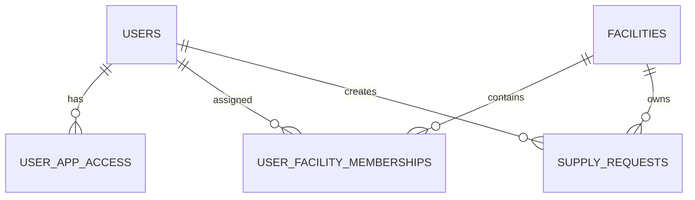

# Supply App data model

> Final schema is blocked until Phase 1 confirms live CRM contracts.

- `facilities`: production/warehouse location and CRM location ID.
- `user_app_access`: explicit `seller_app` or `supply_app` access.
- `user_facility_memberships`: active facility scope and supply permission.
- Documents: `supply_requests`, `raw_material_defects`, `incoming_documents`
  with their line-item tables.
- Shared support: `supply_status_history`, `supply_attachments`,
  `external_links`, `integration_outbox`, `integration_attempts`,
  `integration_dead_letters`, `webhook_inbox`.

Every document has an immutable UUID, author, facility, status, correlation ID
and idempotency key. RLS is enabled for every table; write RPCs are
service-only and API authorization still checks current activity, app access
and membership.
