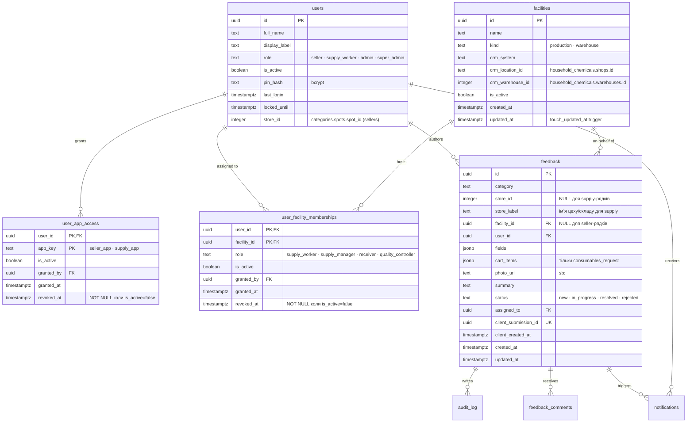
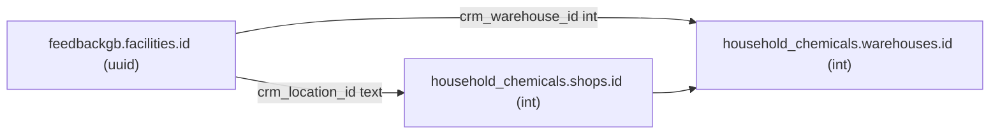
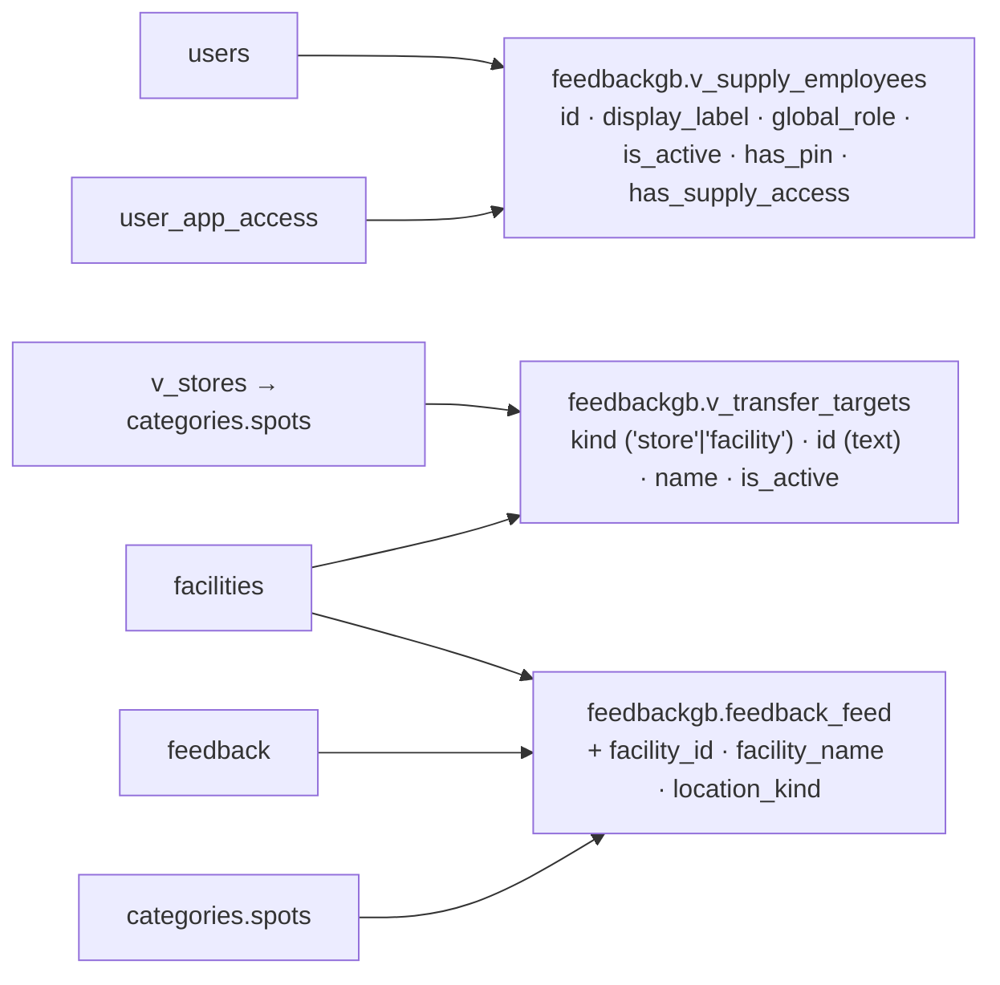
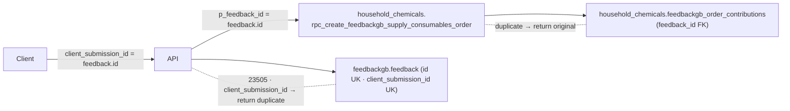

# Supply App — модель даних

Схема відображає **застосовані** міграції `20260723_001` … `20260723_005`
(див. [RUNBOOK.md](./RUNBOOK.md)). Розширення потребують нової міграції та
оновлення цього документа в тому ж PR.

Скорочення:
- `PK` — первинний ключ;
- `FK` — зовнішній ключ;
- `RLS-only` — таблиця має `ENABLE + FORCE ROW LEVEL SECURITY` і жодної
  політики; доступ виключно через `service_role`.

---

## 1. Ключові сутності



**Правила ідентичності для supply-рядків у `feedback`:**

- `category ∈ { 'hr_question', 'consumables_request' }` (див.
  [ADR 0004](./ADR/0004-hr-and-consumables-reuse-feedback.md));
- `store_id` завжди `NULL`;
- `facility_id` — не `NULL`, вказує на `facilities`;
- `store_label` = ім’я facility (щоб існуючий `feedback_feed.store_name =
  COALESCE(spot.name, store_label)` показував правильну точку);
- `client_submission_id` = `feedback.id` для consumables (ідемпотентний ключ,
  збігається з `household_chemicals.feedbackgb_order_contributions.feedback_id`).

---

## 2. Мапінг facility → CRM



Дійсний seed (12 рядків, застосований міграцією `20260723_002`):

| kind | shops.id | назва |
|---|---|---|
| production | 25 | ЦЕХ "2 поверх" |
| production | 26 | ЦЕХ "Піцерія ГРАВІТОН" |
| production | 27 | ЦЕХ "Бульвар-Автовокзал" |
| production | 28 | ЦЕХ НІЧНА ЗМІНА "САДОВА" |
| production | 29 | ЦЕХ "Флорида" |
| production | 30 | ЦЕХ "Піцерія МІКРОРАЙОН" |
| warehouse | 31 | Склад витратних матеріалів (== `CONSUMABLES_WAREHOUSE_ID = 37`) |
| warehouse | 32 | Склад "Крафтова пекарня" |
| warehouse | 33 | Склад сировини "Трембіта" |
| warehouse | 34 | Склад "Кондитерка" |
| warehouse | 35 | Склад № 2 |
| warehouse | 36 | Склад "Запаси Анатолійовича" |

Свідомо **не** включені: shops.id `37 Списання ХЛІБА` (облікова корзина),
`38 Замовник` (віртуальна локація), `39 Щербанюка` (`warehouses.type='shop'`).

---

## 3. View-шар



**Обмеження, зафіксоване у `20260723_004`:** нові колонки додаються винятково
в **кінець** SELECT — `CREATE OR REPLACE VIEW` заборонив
перейменування/пересортування існуючих колонок. Будь-яка правка порядку
потребує `DROP VIEW … CASCADE` + повторне надання ґрантів.

---

## 4. Ідемпотентність consumables



Ретрай тієї самої заявки з тим самим `client_submission_id`:

1. RPC знаходить існуючий вклад у `feedbackgb_order_contributions` →
   повертає `duplicate: true`, того самого `order_id`, **не** створює
   другий документ у CRM.
2. Або `feedback.insert` кидає `23505` на `client_submission_id` →
   supply-роут повертає `{ ok: true, duplicate: true }`.

Обидві гілки не потребують компенсацій.

---

## 5. Права доступу

Всі supply-таблиці — `RLS-only` (політик немає навмисно):

```sql
alter table feedbackgb.facilities                enable + force row level security;
alter table feedbackgb.user_app_access           enable + force row level security;
alter table feedbackgb.user_facility_memberships enable + force row level security;
revoke all on <supply tables>, v_supply_employees from anon, authenticated;
grant  select, insert, update, delete on <supply tables>       to service_role;
grant  select on v_supply_employees, v_transfer_targets, feedback_feed to service_role;
```

Функції з `SECURITY DEFINER`:

- `feedbackgb.verify_pin_for_app(p_pin text, p_app_key text)` — виконується від
  власника, повертає `jsonb` з `id · full_name · display_label · role ·
  facility_id · facility_name`; **`update last_login`** робиться **тільки**
  після успішних перевірок app_access + membership (не оракул для чужих
  seller-акаунтів).
- `feedbackgb.set_user_pin(uuid, text)` — незмінна перевірка колізії
  6-значних PIN, ексклюзивно `service_role`.
- `household_chemicals.rpc_create_feedbackgb_supply_consumables_order(...)` —
  ексклюзивно `service_role`.
- `feedbackgb.check_rate_limit(p_key, p_limit, p_window_seconds)` — RPC
  ковзного вікна для supply/pin бакетів входу.

Клієнтські ролі `anon`, `authenticated` **не мають жодних ґрантів** на
supply-таблиці — перевіряється SQL-guard'ом у CI (див. RUNBOOK).
