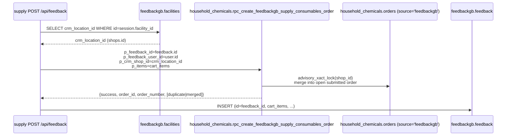

# Supply App — інтеграції з CRM

Документ описує **чинні** контракти та явно розділяє те, що вже працює, від
того, що заблоковано гейтом [ADR 0003](./ADR/0003-outbox-after-live-audit.md).

Джерело правди для CRM — Supabase schema `household_chemicals`. FeedbackGB
ніколи не тримає копію залишків, собівартості або даних постачальників.

---

## 1. Матриця процесів

| Процес | Джерело правди в CRM | Реалізація в supply | Ідемпотентність | Гейт |
|---|---|---|---|---|
| **Розхідні матеріали** — заявка від цеху/складу | `orders` + `order_items` + `feedbackgb_order_contributions` | ✅ **Ready** · `POST /api/feedback` `category=consumables_request` → `rpc_create_feedbackgb_supply_consumables_order` | ✅ по `feedback_id` через `feedbackgb_order_contributions` (get-or-create) | НЕ підпадає під ADR 0003 (див. §4) |
| **Каталог розхідних** | `products` + `product_categories` через `rpc_product_catalog` | ✅ Ready · `GET /api/consumables/catalog` | Read-only | — |
| Замовлення сировини | `orders` (source ≠ 'feedbackgb') | ⛔ Not implemented | — | ⛔ ADR 0003 — CRM без idempotency key |
| Брак сировини (write-off) | `write_offs` + `write_off_items` | ⛔ Not implemented | — | ⛔ ADR 0003 |
| Прихідна накладна | `receipts` + `receipt_items` | ⛔ Not implemented | — | ⛔ ADR 0003 |

---

## 2. RPC контракт: розхідні матеріали



### 2.1 Сигнатура

```
household_chemicals.rpc_create_feedbackgb_supply_consumables_order(
  p_feedback_id       uuid,     -- === feedbackgb.feedback.id === client_submission_id
  p_feedback_user_id  uuid,
  p_crm_shop_id       integer,  -- household_chemicals.shops.id (не warehouses, не poster_spot_id)
  p_notes             text default null,
  p_items             jsonb default '[]'::jsonb
) returns jsonb
```

`SECURITY DEFINER`, `search_path = 'household_chemicals', 'pg_temp'`, ґранти
тільки `service_role`.

### 2.2 Формат `p_items`

```json
[{"product_id": 172, "quantity": 3},
 {"product_id": 173, "quantity": 1}]
```

Валідація в RPC: `product_id` існує та `is_active`; `quantity > 0`. При
порушенні → `RAISE EXCEPTION 'Invalid FeedbackGB cart item'` (клієнт бачить
`500 · Помилка сервера`).

### 2.3 Формат відповіді

```json
{ "success": true,  "order_id": "<uuid>", "order_number": "ЗМ-000123",
  "merged": true }                                         // додано до існуючого заказу тієї ж точки

{ "success": true,  "order_id": "<uuid>", "order_number": "ЗМ-000123",
  "duplicate": true }                                      // повторний виклик з тим самим feedback_id

{ "success": false, "error": "CRM shop not found or inactive" }
{ "success": false, "error": "Cart is empty" }
{ "success": false, "error": "Missing supply request identity" }
```

Мапінг помилок на HTTP код — у `shared/lib/consumablesOrderError.ts`
(`classifyConsumablesCrmFailure`):

- «CRM shop not found or inactive» → `400` з людським текстом;
- будь-яка помилка Supabase (network/timeouts) → `503 · Складський модуль недоступний`;
- інші текстові помилки RPC → `500`.

### 2.4 Різниця з seller-функцією

`rpc_create_feedbackgb_consumables_order` (seller) резолвить точку так:

```sql
WHERE poster_spot_id = p_feedback_store_id
```

`shops.poster_spot_id` заповнений тільки для магазинів (id 1–24). Всі цехи та
склади (id 25–36) мають `poster_spot_id IS NULL` → seller-функція для supply
завжди повертає `FeedbackGB store is not mapped to a CRM shop`.

Тому supply-сестра приймає `p_crm_shop_id` **напряму**. Решта тіла — байт-в-байт
копія seller-функції.

---

## 3. Каталог

```
GET /api/consumables/catalog?page=1&page_size=50&search=<80 chars>
```

Проксі до `household_chemicals.rpc_product_catalog(p_category_id=null, p_search,
p_warehouse_id=CONSUMABLES_WAREHOUSE_ID, p_page, p_page_size)`.

`CONSUMABLES_WAREHOUSE_ID` — env-змінна, default `37` (== склад «Склад
витратних матеріалів», `shops.id = 31`). **Жодного хардкоду ID у коді** — це
пряма вимога з [READ_ONLY_AUDIT_2026-07-23.md](./READ_ONLY_AUDIT_2026-07-23.md).

Response — pass-through з ремапінгом полів на camelCase-adjacent:

```json
{ "items": [{"id":172,"name":"Бахіли","sku":"POSTER-1614","unit":"p",
             "photo_url":"https://…", "category_id":21, "category_name":"…"}],
  "total": 812, "page": 1, "page_size": 50, "total_pages": 17 }
```

---

## 4. Гейт ADR 0003 — точне охоплення

ADR 0003 закриває **сирьєві** документообіги (замовлення сировини, брак,
прихідні накладні), оскільки в їх RPC (`rpc_create_employee_order`,
`rpc_create_write_off_with_items`, `rpc_create_receipt_with_items`) **немає**
immutable idempotency key ані в аргументах, ані в цільових таблицях.

Розхідні матеріали **під гейт не підпадають**:

- `feedbackgb_order_contributions.feedback_id` — стабільний ідемпотентний ключ,
  який супроводжує заявку від клієнта (UUID) через API до RPC та до CRM.
- Get-or-create семантика реалізована в RPC (§2 sequence): подвійний виклик
  повертає той самий `order_id`, не створює другого документа.
- Merging «одна точка × одна відкрита submitted-накладна × N вкладів» — це
  бізнес-фіча, не конкурентний баг: `pg_advisory_xact_lock(shop_id)`
  забезпечує серіалізацію.

Це має бути явно вказано перед активацією розхідних у прод —
див. коментар-шапку у [`20260723_005_rpc_supply_consumables_order.sql`
](../../supabase/migrations/20260723_005_rpc_supply_consumables_order.sql).

---

## 5. Read-only audit — 2026-07-23

Оригінальні висновки live-аудиту зафіксовано в
[READ_ONLY_AUDIT_2026-07-23.md](./READ_ONLY_AUDIT_2026-07-23.md). Ключові
рішення, що з нього випливли й вже реалізовані:

- `feedbackgb.users.role` доповнено значенням `supply_worker` (міграція 001).
- Створено окремі таблиці `facilities · user_app_access ·
  user_facility_memberships` (не використовуємо `store_id` для supply).
- CRM залишається owner залишків і собівартості; FeedbackGB не тримає копій.
- Storage bucket `feedback-photos` перевикористовується (приватний), окремий
  для supply не заводиться.

---

## 6. Що поза supply-app контуру

- Telegram сповіщення (`telegram.ts`) працюють через shared-код seller-app,
  тільки як **похідні** повідомлення. Вони ніколи не змінюють accounting-статус
  документа.
- Google Drive міграція фотографій (`driveMirror.ts`) — cron у feedback-app,
  supply-app до неї не звертається. Фото HR-довідок потрапляють у mirror
  автоматично, бо лежать у тому ж bucket'і.
- `webhook_outbox`, `poster_sync_outbox` — CRM-owned, supply-app не пише ні
  в жодну з них.
