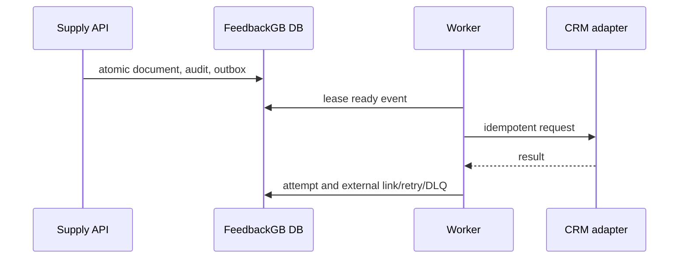

# Supply integrations

## Read-only audit — 2026-07-23

The audit was performed against the live `feedbackgb` and
`household_chemicals` schemas without any writes. Supply tables do not exist
in `feedbackgb`; they must be introduced by a reviewed migration.

| Process | CRM source of truth | Confirmed CRM RPC lifecycle | External ID | Idempotency | Owner | Status |
|---|---|---|---|---|---|---|
| Raw-material order | `household_chemicals.orders` + `order_items` | `rpc_create_employee_order` creates `submitted`; CRM then uses `confirmed`, `partially_shipped`, `shipped`, `cancelled` | CRM `orders.id` | **Missing**: no idempotency argument or unique external key | CRM team | Blocked |
| Raw-material defect | `write_offs` + `write_off_items` | `rpc_create_write_off_with_items` creates `draft`; `confirm_write_off` posts stock movements and sets `confirmed` | CRM `write_offs.id` | **Missing**: no idempotency argument or unique external key | CRM team | Blocked |
| Incoming invoice | `receipts` + `receipt_items` | `rpc_create_receipt_with_items` creates `draft`; `confirm_receipt` posts stock movements and sets `confirmed` | CRM `receipts.id` | **Missing**: `poster_supply_id` is unique but is not an input to the RPC and cannot be used as Supply idempotency key | CRM team | Blocked |

### Confirmed CRM boundaries

- Product catalogue: `products` / `product_categories`; `rpc_product_catalog`
  is read-only and takes warehouse context.
- Facilities: active `warehouses`. The live contour contains workshop and
  storage locations, including CRM warehouse IDs; Supply App must not hardcode
  these IDs and must map only approved facilities.
- Write-off reasons are constrained to `expired`, `damaged`, `lost`,
  `inventory_correction`, `other`; the Supply UI must map `Брак сировини` to
  an approved reason, initially `damaged`, or require an explicit admin choice.
- CRM confirmation changes stock. Supply App must never call
  `confirm_write_off` or `confirm_receipt` before its own required approval.
- Existing CRM `webhook_outbox` and `poster_sync_outbox` are CRM-owned.
  Supply uses its own transactional outbox and must not write into either.

### Mandatory CRM change before bridge implementation

Each create RPC needs an immutable `p_idempotency_key` (or an equivalent
`source_system` + `source_document_id` pair) with a database unique constraint
and get-or-create semantics. It must return the original CRM document after a
duplicate request. The same key is stored in `external_links` locally.

Without this change, a timeout after CRM commit can produce two accounting
documents. A local outbox and retry counter cannot solve that failure mode.

Telegram and messengers receive derived notifications only. They do not change
accounting status.
