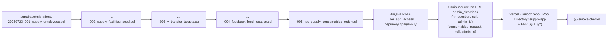

# Supply App — runbook

Оперативний документ. Описує **як** підняти, розкатати, перевірити та
відкатити. Що і **чому** — в [ARCHITECTURE.md](./ARCHITECTURE.md).

---

## 1. Розкатка з нуля (super_admin)



Всі 5 міграцій **застосовані вручну** у Supabase SQL Editor (service_role).
Репозиторій НЕ накатує — це навмисно. Якщо міграція падає — виправляти файл
міграції та повторно застосовувати.

Після застосування — sanity-запит з очікуваними значеннями:

```sql
select
  (select count(*) from pg_proc  p join pg_namespace n on n.oid=p.pronamespace where n.nspname='feedbackgb'          and p.proname='verify_pin_for_app')                            as m001_fn,
  (select count(*) from feedbackgb.facilities)                                                                                                                                     as m002_facilities,
  (select count(*) from pg_class c join pg_namespace n on n.oid=c.relnamespace where n.nspname='feedbackgb' and c.relname='v_transfer_targets' and c.relkind='v')                  as m003_view,
  (select count(*) from information_schema.columns where table_schema='feedbackgb' and table_name='feedback_feed' and column_name in ('facility_id','facility_name','location_kind')) as m004_cols,
  (select count(*) from pg_proc  p join pg_namespace n on n.oid=p.pronamespace where n.nspname='household_chemicals' and p.proname='rpc_create_feedbackgb_supply_consumables_order') as m005_rpc;
```

Очікувано: `{1, 12, 1, 3, 1}`.

---

## 2. Змінні оточення (Vercel project)

| Ключ | Обов’язковий | Значення |
|---|---|---|
| `NEXT_PUBLIC_SUPABASE_URL` | так | URL supabase-проєкту (загальний для всіх додатків) |
| `SUPABASE_SERVICE_ROLE_KEY` | так | service_role JWT; **ніколи** не потрапляє в client bundle (перевіряється grep’ом по `.next/static/`) |
| `SUPPLY_SESSION_SECRET` | так | ≥32 символи; **інший**, ніж seller/admin `SESSION_SECRET`; ротація => інвалідація всіх сесій |
| `CONSUMABLES_WAREHOUSE_ID` | ні (default 37) | `household_chemicals.warehouses.id` = склад витратних матеріалів |

Локально: `npm run bootstrap:local-env` створить `.env.local` з окремим
згенерованим секретом. Файл — у `.gitignore`.

---

## 3. Ручні кроки для нового працівника

```sql
-- 1) Створити рядок user (роль supply_worker для цехових; для адмінів — існуючий)
--    Якщо це вже існуючий admin/super_admin — цей крок пропускається.
insert into feedbackgb.users (full_name, display_label, role, is_active)
values ('Прізвище Ім\'я', 'Прізвище Ім\'я', 'supply_worker', true);

-- 2) Прив’язати до facility (для supply_worker — обов’язково; для admin — не потрібно)
insert into feedbackgb.user_facility_memberships (user_id, facility_id, role, is_active)
values ('<user_id>', '<facility_id>', 'supply_worker', true);

-- 3) Видати доступ до supply_app
insert into feedbackgb.user_app_access (user_id, app_key, is_active, revoked_at)
values ('<user_id>', 'supply_app', true, null)
on conflict (user_id, app_key) do update set is_active=true, revoked_at=null;

-- 4) Видати PIN (унікальний 6-цифровий; функція перевіряє колізії з активними users)
select feedbackgb.set_user_pin('<user_id>', '<6 digits>');
```

Відкликання доступу (PIN не міняється):

```sql
update feedbackgb.user_app_access
   set is_active=false, revoked_at=now()
 where user_id='<user_id>' and app_key='supply_app';
```

---

## 4. Health & readiness

- **Liveness/readiness endpoint:** `GET /api/health` (без сесії).
  Відповідь:
  ```json
  { "ok": true, "supabase_configured": true,
    "schema_ready": true, "session_secret_ok": true }
  ```
- `schema_ready=false` → міграція 001 ще не застосована.
- `session_secret_ok=false` → у prod будь-який запит на `/api/auth/pin`
  впаде з 503 → перевірити ENV.

---

## 5. Smoke-checks після деплою

| Крок | Очікування |
|---|---|
| `curl -sI https://<host>/` | 200 + CSP + HSTS + Permissions-Policy · **без** X-Frame-Options |
| `curl https://<host>/api/health` | `schema_ready:true`, `session_secret_ok:true` |
| `curl -sI https://<host>/home` (без cookie) | 307 → `/?next=%2Fhome` + `Set-Cookie: supply_session=; Max-Age=0` |
| `curl https://<host>/api/consumables/catalog` (без cookie) | `401 · {"error":"unauthenticated"}` |
| Ручний логін тестовим PIN → `/home` | Перекидає на головну зі списком карток; шапка показує ім’я facility |
| `POST /api/auth/logout` через фейкове submit-form | 303 → `/`, cookie видалено |

---

## 6. Моніторинг

Метрики зі свіжого prod-логу (Vercel · Supabase):

- **Логіни:** `feedbackgb.audit_log WHERE action LIKE 'auth.login.%'`.
- **Помилки на POST /api/feedback:** grep у Vercel logs
  `"[supply] feedback insert"` та `"[supply] consumables CRM failed"`.
- **Rate-limit trips:** `SELECT key, hits FROM feedbackgb.rate_limits
  WHERE key LIKE 'supply:%' ORDER BY expire_at DESC`.
- **Розхідні orders:** `household_chemicals.orders WHERE source='feedbackgb'
  AND warehouse_id=37 GROUP BY status`.
- **Consumables без feedback:** `orders LEFT JOIN
  feedbackgb_order_contributions` — 0 очікувано.

Алерт-тригери:

- `auth.login.failure` rate > 10/хв з одного IP > 15 хв (можлива атака).
- Будь-який запит до `/api/feedback` з response 500 (`Помилка збереження`).
- `orders WHERE source='feedbackgb' AND status='submitted' AND created_at <
  now() - interval '48 hours'` — застоялі невиконані заявки.

---

## 7. Відкат

| Що | Як |
|---|---|
| Один сегмент коду | `git revert <commit>` + `git push` — Vercel сам передеплоїть |
| Vercel deploy | «Promote previous deployment» в Vercel UI |
| Міграція структурна | новою міграцією (ніколи не `DROP`-ом «в лоб»); дані переливати ETL-скриптом, а не in-place |
| Міграція 005 (RPC) | `DROP FUNCTION household_chemicals.rpc_create_feedbackgb_supply_consumables_order(...)` — розхідні заблокуються, HR продовжить працювати |
| Всі сесії | ротація `SUPPLY_SESSION_SECRET` в Vercel + redeploy — всі cookie інвалідуються |
| Один користувач | `UPDATE user_app_access SET is_active=false, revoked_at=now()` — миттєво |

**Що не робити:**

- Не видаляти рядки з `feedbackgb_order_contributions` — розломить
  ідемпотентність (наступний ретрай створить дубль).
- Не змінювати `feedback.client_submission_id` існуючих записів.
- Не рестартувати worker/крон на пів-виконанні міграції.

---

## 8. Аварійна зупинка

Треба **швидко припинити** прийом нових заявок (без деплою):

```sql
-- 1) Заборонити вхід усім supply-працівникам
update feedbackgb.user_app_access
   set is_active=false, revoked_at=now()
 where app_key='supply_app' and is_active;

-- 2) Ротація секрету (у Vercel UI) → всі активні cookie перестають підписуватися
```

Після усунення причини:

```sql
-- Відновити доступ конкретним особам
update feedbackgb.user_app_access
   set is_active=true, revoked_at=null
 where user_id in ('<uuid>', '<uuid>') and app_key='supply_app';
```
