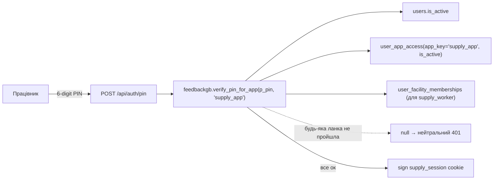
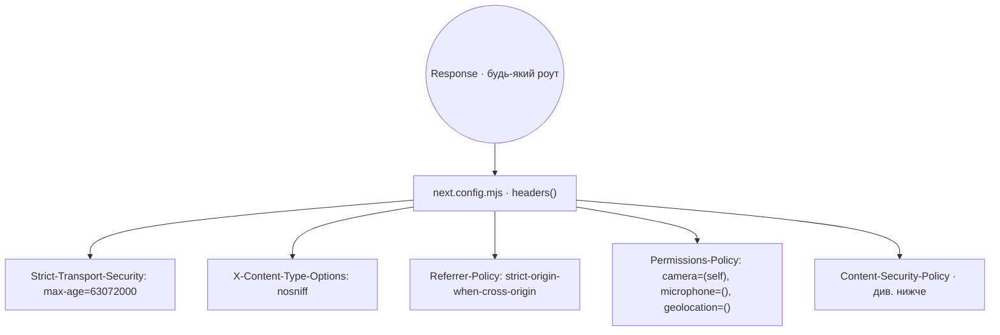

# Supply App — безпека

Актуально станом на коммит `dd7ce47`. Порушення будь-якої з вимог нижче
блокує merge.

---

## 1. Ідентичність та доступ



- **App-scoped вхід.** Той самий PIN, який працює в feedback-app для
  seller/admin, у supply-app **не** пускає, якщо в БД немає активного рядка
  `user_app_access('supply_app')`.
- **Ідемпотентні update тільки після перевірки доступу.** `last_login`,
  `failed_attempts`, `locked_until` оновлюються тільки після успішного
  проходу через access + membership. Це закриває оракул скидання блокування
  чужого seller-акаунта через supply-app.
- **Нейтральна помилка.** 401 відповідь однакова для 4 сценаріїв: PIN не
  існує, користувач неактивний, немає app_access, немає facility membership.
  Клієнт не може відрізнити (a) що акаунт існує, (b) що PIN правильний.
- **Роль `admin`/`super_admin` не отримує особливого шляху.** Для них теж
  потрібен `user_app_access('supply_app')`; facility membership не потрібен.
- **Managing доступи — тільки super_admin.** Ручні операції: додавання
  facility, `set_user_pin`, видача `user_app_access` та memberships.

---

## 2. Сесія

| Параметр | Значення |
|---|---|
| Cookie name | `supply_session` (**не** `fbgb_session`) |
| Flags | `HttpOnly`, `SameSite=Lax`, `Secure` в prod |
| TTL | 12 годин (`SUPPLY_SESSION_MAX_AGE`) |
| Signature | HMAC-SHA-256 через WebCrypto |
| Signing secret | `SUPPLY_SESSION_SECRET`, **різний** від seller/admin, ≥32 символів |
| Payload | `{uid, full_name, role, facility_id, iat}` |
| iat guard | `session.iat > now + 60s` → відхиляється; `now − iat > TTL` → відхиляється |

Той самий секрет використовується як HMAC-ключ для rate-limit бакетів PIN
(`shared` контракт `getSessionSecret()`), тому PIN у plain-text ніколи не
з’являється в `rate_limits.key`.

---

## 3. Захист граничних відповідей



CSP збирається динамічно з `NEXT_PUBLIC_SUPABASE_URL`:

```
default-src 'self';
img-src 'self' data: blob: https:;
script-src 'self' 'unsafe-inline' https://telegram.org [+ 'unsafe-eval' у dev];
style-src 'self' 'unsafe-inline';
connect-src 'self' https://*.supabase.co wss://*.supabase.co
            <SUPABASE_URL> wss://<SUPABASE_HOST> https://telegram.org;
frame-ancestors 'self' https://web.telegram.org https://*.telegram.org;
base-uri 'self';
form-action 'self';
object-src 'none';
```

- **`X-Frame-Options` свідомо відсутній.** DENY/SAMEORIGIN зламав би
  Telegram Mini App у `iframe` з `web.telegram.org`. Захист від clickjacking
  зашитий у `frame-ancestors` — політика точніша.
- **`unsafe-eval`** з’являється лише в dev (`NODE_ENV !== 'production'`) —
  Next.js react-refresh цього вимагає.

---

## 4. Rate limit та bruteforce

Двоє незалежних бакетів у `feedbackgb.check_rate_limit`, обидва 10/10хв:

- `supply:ip:<x-forwarded-for-first-hop>` — одне джерело хамарить різними
  PIN.
- `supply:pin:<hmac_sha256(pin, SUPPLY_SESSION_SECRET)>` — розподілена атака
  ротацією IP на конкретний PIN. Не зберігає PIN у plain-text.

429 → `Retry-After` дорівнює `max(reset(ip), reset(pin))`. Клієнт не може
відрізнити, який бакет стрельнув.

`users.failed_attempts` + `locked_until` — legacy для seller-flow, у supply
lifecycle-у не використовуються (глобальний PIN не ідентифікує user'а до
успішного match, а після — це не той бакет).

---

## 5. Storage

| Правило | Реалізація |
|---|---|
| Приватний bucket | `feedback-photos` · private · тільки `service_role` |
| Формат посилання | `sb:<YYYY-MM-DD>/<uuid>.<ext>` у `feedback.photo_url` |
| Довільні URL не приймаються | базові http(s)/data/js: → відхиляються валідатором |
| Дозволені MIME | `image/jpeg · image/png · image/webp` |
| Максимум | 5 МБ · 5 фото на заявку |
| Рендер в адмінці | короткий (10 хв) signed URL, генерується на server-side |

Легасі-рядки з прямим URL приймаються тільки якщо URL починається з
`${NEXT_PUBLIC_SUPABASE_URL}/storage/v1/object/public/feedback-photos/`.

---

## 6. Аудит

Всі авторизаційні події → `feedbackgb.audit_log`:

| action | Коли | actor |
|---|---|---|
| `auth.login.success` | успішний PIN | `<user.id>` |
| `auth.login.failure` | 401 (будь-яка причина) | `service_role` |
| `auth.logout` | явний logout | `<user.id>` |
| trigger `feedback.*` | INSERT/UPDATE в feedback | стемпимо `actor=user.id` пост-фактум |

Записи в `audit_log`:

- ніколи не блокують основну дію (`audit failure → console.error`, main path
  проходить);
- `ip` пропускається через `clientIp()` — валідний IPv4/IPv6 або `NULL`
  (у стовбець `inet`), сирий header зберігається в `meta.raw_forwarded_for`
  при невалідності;
- `user_agent` обрізається до 500 символів.

---

## 7. Заборонено логувати

У `console.*`, telemetry, аудиті, exception messages:

- сам PIN або будь-який його дериват (в rate-limit бакеті — тільки HMAC);
- значення cookie;
- `SUPABASE_SERVICE_ROLE_KEY` та інші секрети;
- повне ім’я або особисті дані клієнта;
- вміст фотографій, вкладень, raw webhook payload;
- дані інших ролей, якщо запит належить не тому користувачу.

Помилки Supabase логуються лише як `{ code: error.code }` (жодних
`error.message`).

---

## 8. Prod deployment

- Окремий Vercel-проект (`supply-app` як Root Directory).
- Секрети **ніколи** не переносяться між проектами `supply-app`,
  `feedback-app`, `feedback-admin`.
- Міграції завжди застосовує super_admin вручну через Supabase SQL Editor;
  репозиторій не накатує (див. [RUNBOOK.md](./RUNBOOK.md)).
- Rotation після підозрілого витоку: змінити `SUPPLY_SESSION_SECRET` → всі
  cookie інвалідуються автоматично.

---

## 9. Що перевіряється в CI

- `.husky/pre-commit` → `gitleaks protect --staged` для секретних патернів.
- `scripts/check-shared-drift.sh` для розсинхрону shared-коду.
- Юніт-тести `session` (7 сценаріїв підпису/експірації/чужого секрету) та
  `clientIp` (валідні/невалідні заголовки) у `supply-app/src/lib/__tests__/`.

Не покривається CI (потребує ручного review): CSP-регресії, зміна TTL,
додавання нового source в `connect-src`.
