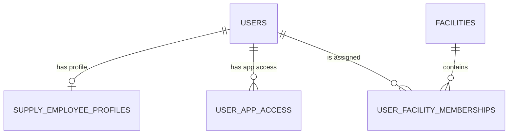

# Supabase passport — Галя: Цех і склад

## Назначение

Этот паспорт фиксирует Supabase-контур отдельного Supply App. Он является
контрактом для migration, server API, `feedback-admin` и rollout.

Статус на 2026-07-23: migration подготовлена локально, **не применена** к live
Supabase. Нельзя считать новые таблицы или роль доступными, пока migration не
пройдёт staging и live checklist.

## Контур

| Поле | Значение |
|---|---|
| Supabase schema | `feedbackgb` |
| Новая migration | `supabase/migrations/20260723_001_supply_employees.sql` |
| Приложение | отдельный root `supply-app/` |
| Админ-интерфейс | `feedback-admin`, `/admin/supply` |
| Browser DB access | запрещён для Supply business tables |
| Server DB access | только через `SUPABASE_SERVICE_ROLE_KEY` |
| CRM | только server-side bridge после idempotency gate |

## Существующие live-объекты

| Объект | Подтверждённый статус | Использование Supply |
|---|---|---|
| `feedbackgb.users` | существует | глобальная identity, `is_active`, `pin_hash`, роль |
| `feedbackgb.set_user_pin` | существует, security definer | единственный путь выдачи/reset PIN |
| `feedbackgb.verify_pin_global` | существует | не использовать для Supply без app-scoped проверки |
| `feedbackgb.audit_log` | существует | будущий business audit Supply действий |
| existing storage buckets | существуют, не Supply | не использовать для Supply вложений |

Текущий live `users_role_check` не содержит `supply_worker`; это меняет только
новая migration.

## Новые таблицы migration

| Таблица | Назначение | Ключи и инварианты |
|---|---|---|
| `facilities` | production или warehouse | UUID PK; `kind in (production, warehouse)`; unique CRM location when provided |
| `user_app_access` | доступ к app surface | PK `(user_id, app_key)`; app key `seller_app` / `supply_app` |
| `user_facility_memberships` | facility scope | PK `(user_id, facility_id)`; operational role и active flag |
| `v_supply_employees` | безопасная проекция для admin | возвращает `has_pin`; не возвращает hash или PIN |

Глобальные роли после migration: `seller`, `supply_worker`, `admin`,
`super_admin`. Операционная роль Supply отделена от глобальной роли: она не
даёт доступа к `/admin/*`.

## PIN и аутентификация

- PIN ровно 6 цифр, совместимый с текущим FeedbackGB.
- Открытый PIN не хранится ни в одной таблице, log, audit payload или view.
- Единственное credential поле — существующий `feedbackgb.users.pin_hash`
  (bcrypt).
- Выдача/reset выполняется существующим `feedbackgb.set_user_pin` только из
  server-side super-admin use case.
- Будущий `verify_supply_pin` должен проверять одновременно: valid PIN,
  `users.is_active`, active `supply_app`
  access и минимум одно active facility membership.
- Успех выдаёт отдельную `supply_session`; `fbgb_session` не принимается
  Supply App.
- Текущий локальный bootstrap уже реализован: `POST /api/auth/pin` проверяет
  существующий PIN, выдаёт 12-часовую `supply_session`, применяет два rate-limit
  bucket и пишет login audit. Пока migration не применена, endpoint допускает
  **только** глобальные `admin` и `super_admin`; `supply_worker` не допускается.
  Это не заменяет будущий `verify_supply_pin` и не является разрешением на
  production rollout работников без `user_app_access` и membership checks.

## RLS и grants

Каждая новая таблица имеет `ENABLE ROW LEVEL SECURITY` и `FORCE ROW LEVEL
SECURITY`. В migration нет permissive policy для `anon` или `authenticated`.

| Role | Read/Write новых Supply таблиц |
|---|---|
| `anon` | нет |
| `authenticated` | нет |
| browser client | нет |
| `service_role` | server-side CRUD |

Даже service-role route обязан повторно проверить session role, app access,
membership, facility и допустимость transition. Service role не является
авторизацией пользователя.

## Storage

Новая private bucket создаётся отдельной reviewed migration перед вложениями.
Требования:

- private bucket, без public URL;
- MIME allowlist и лимит размера в server API;
- malware scan до выдачи другому пользователю;
- signed URL короткой жизни только после server-side role/facility check;
- путь не содержит PIN, ФИО или прогнозируемый публичный capability token.

## Документы и интеграции

Эта migration покрывает только identity/access/facility. Она не создаёт
`supply_requests`, defects, incoming documents, outbox или CRM bridge.
Их migration запрещена до подтверждённого CRM idempotency contract из
`INTEGRATIONS.md`.

## Environment variables

| Variable | Где | Правило |
|---|---|---|
| `NEXT_PUBLIC_SUPABASE_URL` | Supply server/client config | URL допустим публично |
| `SUPABASE_SERVICE_ROLE_KEY` | только Supply server/Vercel | никогда не `NEXT_PUBLIC_*`, не логировать |
| `SUPPLY_SESSION_SECRET` | только Supply server/Vercel | отдельный от `SESSION_SECRET`, минимум 32 random bytes |

## Staging → production checklist

1. Read-only проверить live `users_role_check`, functions и grants.
2. Применить migration только к staging.
3. Проверить таблицы, PK/FK/check constraints и `v_supply_employees`.
4. Проверить RLS-negative: anon/authenticated и чужая facility получают denial.
5. Проверить, что `v_supply_employees` показывает `has_pin`, но не `pin_hash`.
6. Проверить, что `supply_worker` получает 403 на `/admin/*` и `/api/admin/*`.
7. Проверить super-admin-only mutation API после его реализации.
8. Зафиксировать результаты, затем отдельно согласовать live application и
   rollback/forward-fix в `RUNBOOK.md`.

## Rollback

После production application не удалять users или access history. При incident:

1. выключить Supply feature flag / deployment;
2. деактивировать `user_app_access(app_key='supply_app')`;
3. не удалять `user_app_access` и memberships;
4. применить reviewed forward migration, если обнаружен schema defect;
5. записать incident и проверку RLS/audit в runbook.
