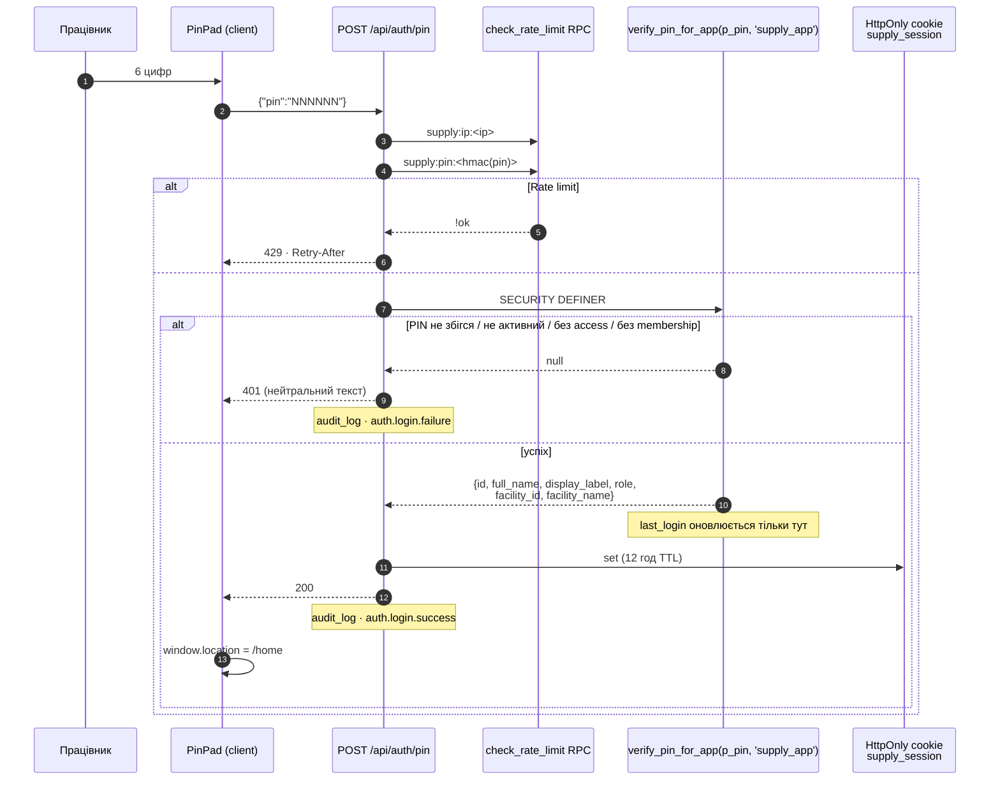
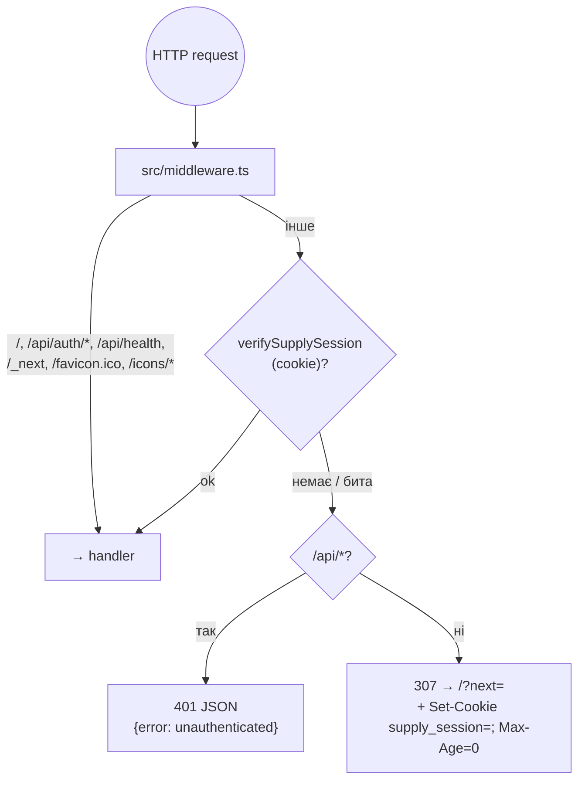
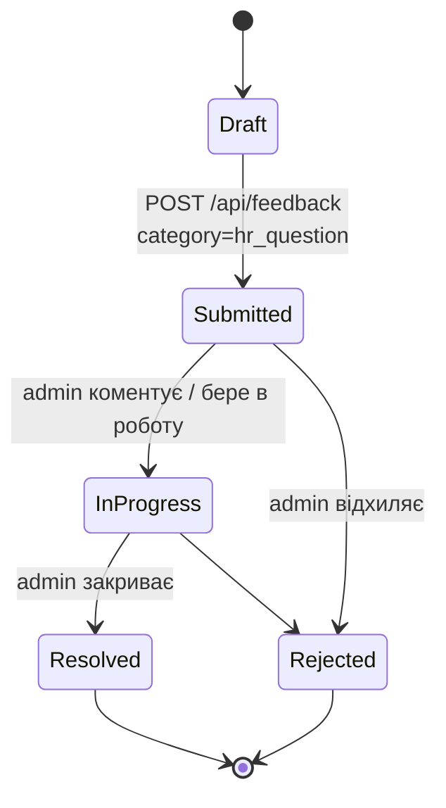
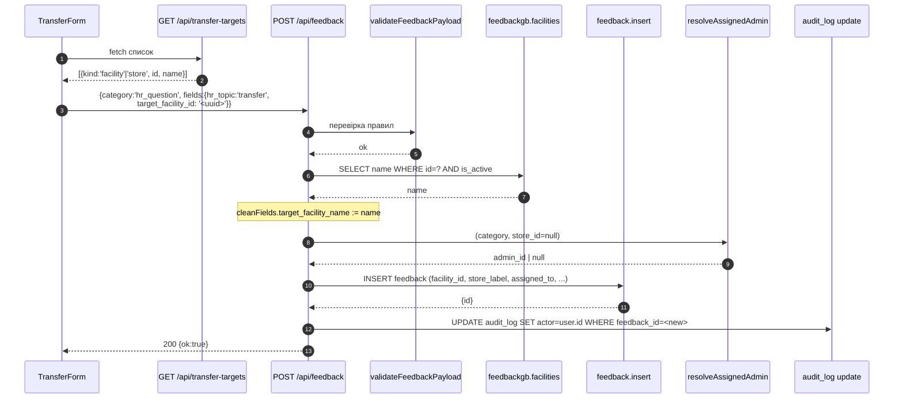
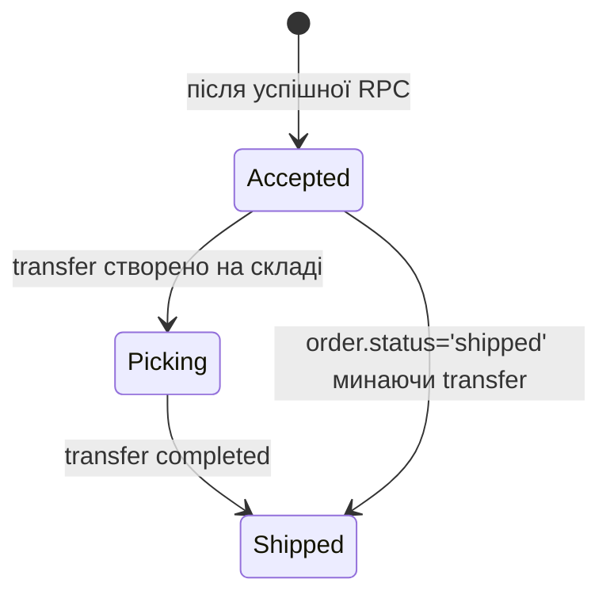
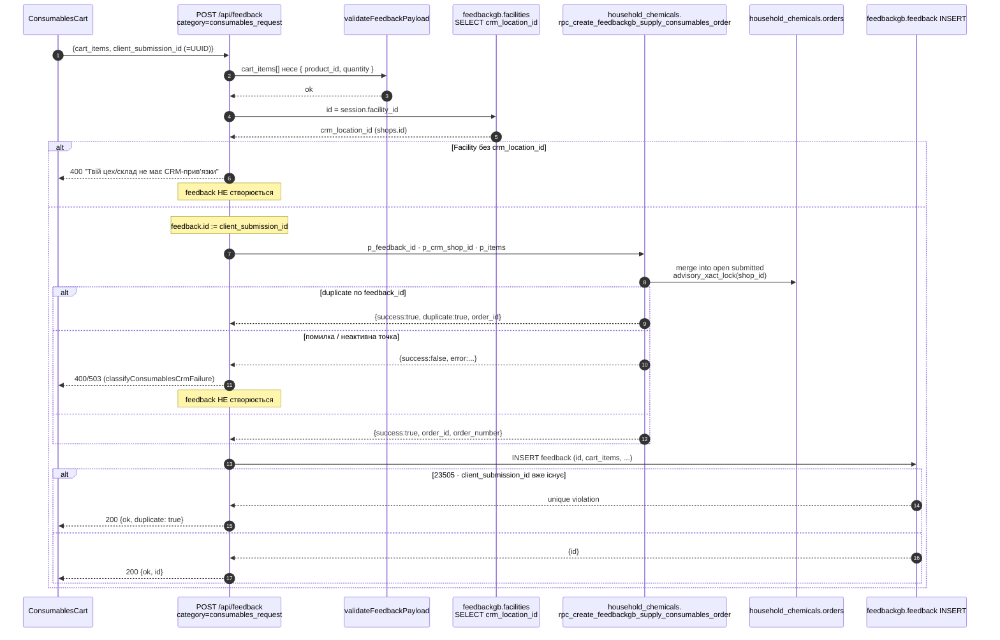
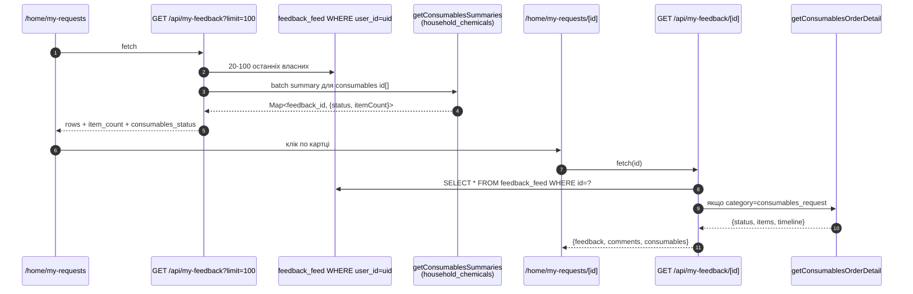
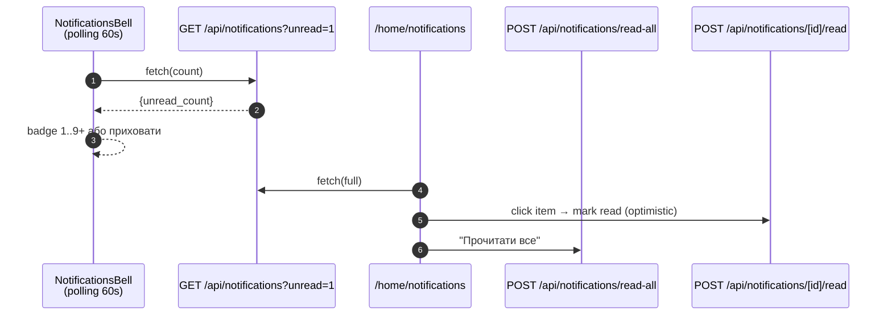
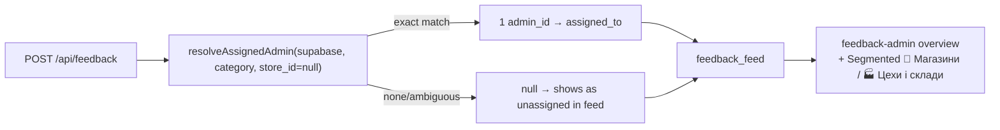

# Supply App — робочі процеси

Всі діаграми в цьому документі відповідають **фактично реалізованим** flow
(епіки A–D моста, коммит `dd7ce47`). Стан-машини для контуру сировини
(замовлення сировини, брак, прихідні накладні) поки не імплементовані — див.
[ADR 0004](./ADR/0004-hr-and-consumables-reuse-feedback.md); коли вони
з’являться, буде розділ §7.

---

## 1. Вхід (app-scoped auth)

**Гарантії, зафіксовані [SECURITY.md](./SECURITY.md):**

- Введення PIN продавця в supply-app **не міняє** `last_login`,
  `failed_attempts`, `locked_until` жертви — `verify_pin_for_app` виконує ці
  update тільки після перевірки `user_app_access` + `user_facility_memberships`.
- Відповідь 401 не відрізняється між «немає користувача», «немає доступу», «PIN
  неправильний» — щоб не витікала інформація про існування облікового запису.

---

## 2. Middleware guard

Роут-рівень захисту: **всі** `page.tsx` під `/home/*` викликають
`requireSupplyUser()`; всі API-роути — `getSupplyApiUser()`. Ці два хелпери
перечитують `is_active + user_app_access + memberships` з БД, а не довіряють
cookie на слово (cookie — лише підказка).

---

## 3. HR-заявка (5 тем)

### 3.1 Загальний lifecycle

Значення `status` ідентичне seller-фідбеку (`new · in_progress · resolved ·
rejected`). Всі переходи виконує адмін через `feedback-admin`; supply-працівник
тільки створює й читає власні заявки.

### 3.2 Валідація по темах (shared/lib/feedbackValidation.ts)

| topic | обов’язкові поля | правила |
|---|---|---|
| `vacation` | `date_from`, `date_to` | `date_to ≥ date_from`; `date_from ≥ сьогодні + 7 днів` |
| `day-off` | `date_from`, `date_to` | те саме, що vacation |
| `sick-leave` | `date_from` | `date_to` необов’язковий; якщо є — `≥ date_from`; фото довідки в приватний bucket |
| `resignation` | `date_from` | `date_from ≥ сьогодні` (правило 2 тижнів — м'яке, тільки UI) |
| `transfer` | одне з `target_store_id` (int) **АБО** `target_facility_id` (uuid) | сервер резолвить `target_*_name` з БД; клієнтський label ігнорується |

Помилка → `400` з людським текстом, ніякої записи в `feedback`.

### 3.3 Sequence — переведення (гілка з facility)

---

## 4. Замовлення розхідних матеріалів

### 4.1 Стан на боці CRM (для працівника)

Джерело — `shared/lib/consumablesStatusMeta.ts` + `deriveStatus` у
`shared/lib/consumablesOrder.ts`. Labels: `Заявка прийнята → Збирається на
складі → Сформоване та відправлене`. Для працівника ці статуси відображаються
на `/home/my-requests/[id]` як 3-крокова timeline.

### 4.2 Створення заявки (з ідемпотентністю)

**Гарантії:** порядок «CRM → feedback» означає, що користувач ніколи не бачить
успіх заявки, яку склад не прийняв. Ретрай з тим же `client_submission_id` не
створить другий документ ні в CRM, ні в journal.

---

## 5. Кабінет та сповіщення

Уведомлення (`shared/lib/notifications.ts`):

---

## 6. Auto-assignment та адмін-фід

Правила `admin_directions` для supply — рядки з `store_id IS NULL`. Якщо їх
немає, всі supply-заявки залишаються `assigned_to = null` (видно в фіді, але
не в «Моя черга» жодного адміна) — це поточна поведінка seller-flow.

---

## 7. Контур сировини (не реалізовано)

Плановані flow (замовлення сировини, брак, прихідні накладні) описані на
рівні state-машин у [SUPPLY_APP_IMPLEMENTATION_PLAN.md](../SUPPLY_APP_IMPLEMENTATION_PLAN.md).
Вони живуть **поза** таблицею `feedback` (за ADR 0004), у окремих
document-таблицях зі status_history, outbox та workers. Гейт по ADR 0003
(відсутність idempotency у CRM RPC) блокує імплементацію.

Схеми з’являться в цьому розділі одночасно з першою міграцією
`supply_requests` та її worker'ом.
