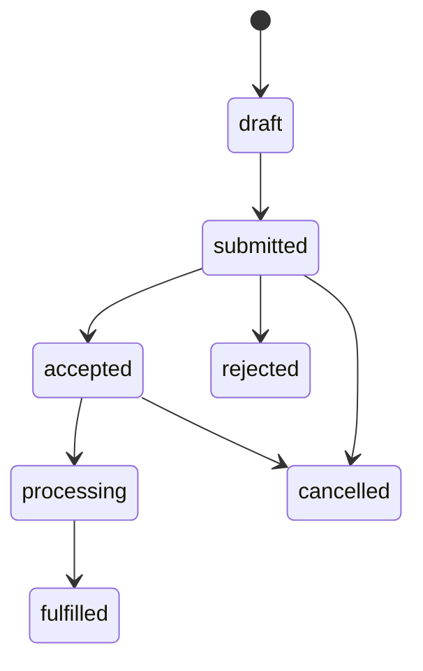
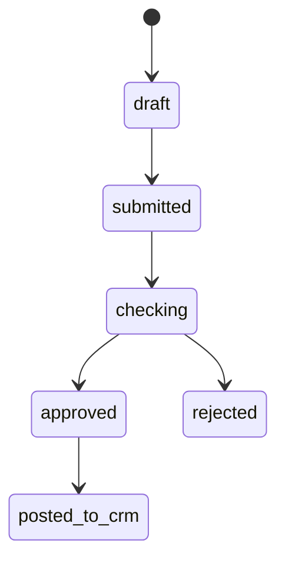

# Supply workflows

The preceding state flow is for raw-material orders.

The second flow is for raw-material defects and incoming documents. A server
use case writes status history, business audit and outbox event atomically.
