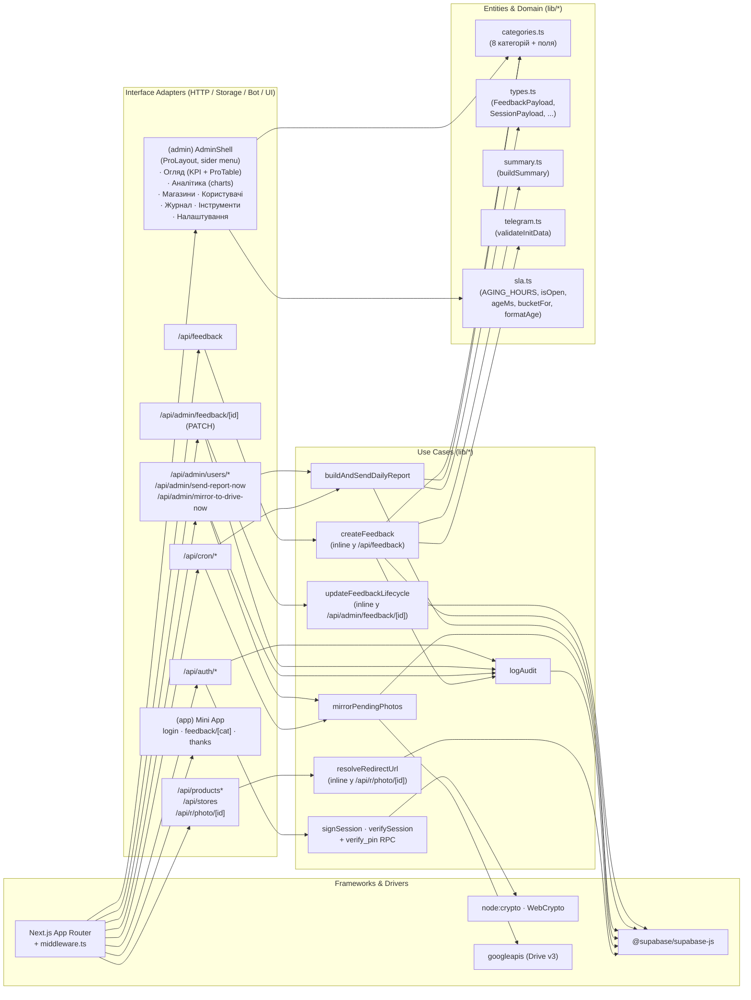
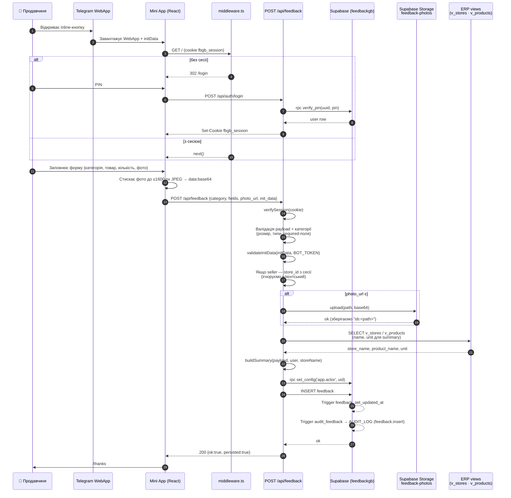
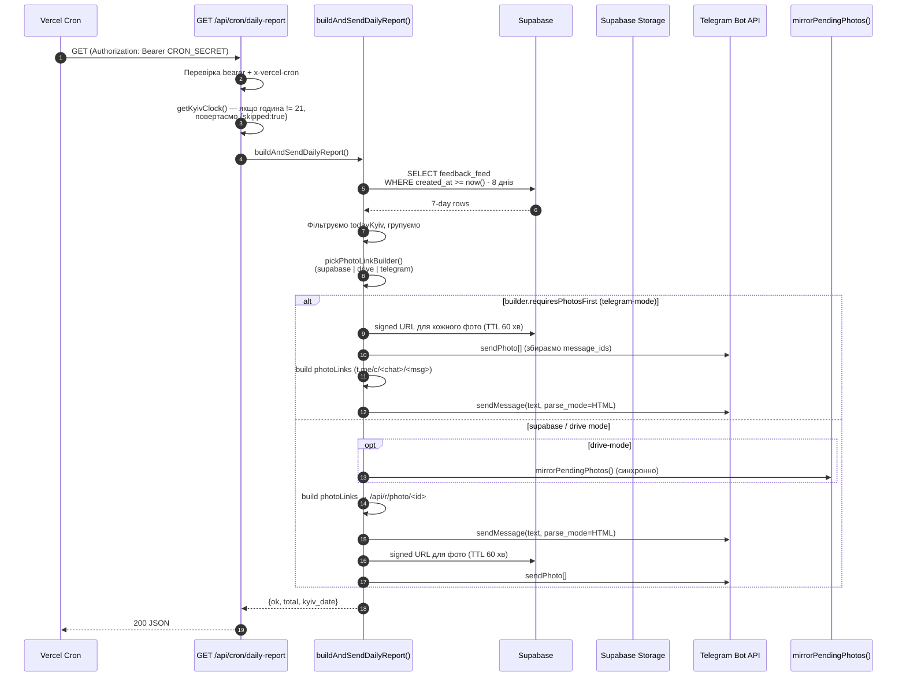
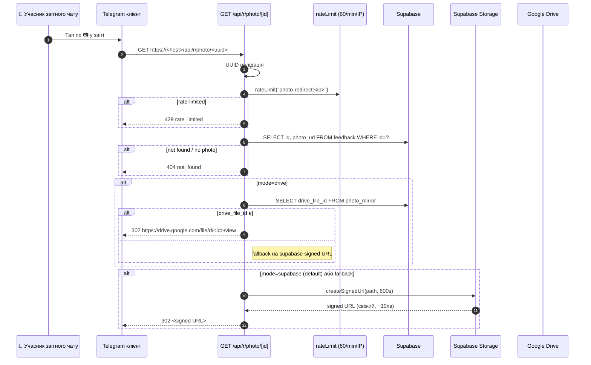
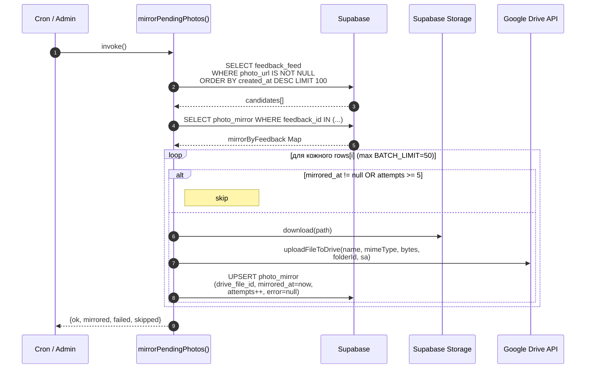
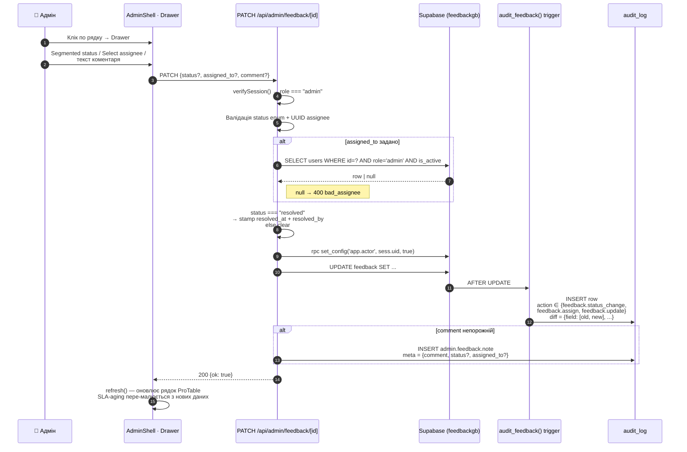

# Архітектура FeedbackGB

> **TL;DR.** Telegram Mini App для збору фідбеку від продавчинь.
> Один Next.js 14 (App Router) на Vercel, один Postgres у Supabase
> (схема `feedbackgb`), один Telegram-бот для звітів. Усі шари
> (домен → use-cases → adapters → frameworks) живуть у `src/` —
> цей документ показує, де саме.

Зміст:

1. [System Context (C4 L1)](#1-system-context)
2. [Containers (C4 L2)](#2-containers)
3. [Components / Clean Architecture (C4 L3)](#3-components--clean-architecture)
4. [Ключові потоки (sequence diagrams)](#4-ключові-потоки)
5. [Не-функціональні вимоги](#5-не-функціональні-вимоги)
6. [Точки розширення / куди вкладати нову функціональність](#6-куди-вкладати-нову-функціональність)
7. [Боргова частина](#7-боргова-частина-tech-debt)

Сусідні документи:

- [`DATA_MODEL.md`](./DATA_MODEL.md) — таблиці, view, RPC у Supabase.
- [`RUNBOOK.md`](./RUNBOOK.md) — запуск, деплой, ротація секретів, типові інциденти.
- [`api/openapi.yaml`](./api/openapi.yaml) — повна OpenAPI 3.0.3 специфікація `/api/*`.
- [`api/README.md`](./api/README.md) — як підняти Swagger UI локально.
- [`FEATURES.md`](./FEATURES.md) — каталог фіч + roadmap.

---

## 1. System Context

```mermaid
flowchart LR
    subgraph users["Користувачі"]
        seller["👩 Продавчиня<br/>(Telegram Mini App)"]
        admin["👤 Адмін<br/>(/admin у браузері)"]
    end

    subgraph fb["💖 FeedbackGB"]
        app["Next.js 14 App Router<br/>+ API routes<br/>+ Vercel Cron"]
    end

    subgraph ext["Зовнішні системи"]
        tg["📨 Telegram Bot API<br/>(initData HMAC, sendPhoto,<br/>sendMessage у звітний чат)"]
        sb["🗄 Supabase<br/>Postgres (схема feedbackgb)<br/>+ Storage (feedback-photos)"]
        erp["🏪 ERP / POS<br/>(схеми categories.spots,<br/>categories.products)"]
        gd["☁️ Google Drive<br/>(резервне дзеркало фото)"]
        ph["📊 PostHog (опц.)<br/>аналітика подій"]
    end

    seller -->|відкриває Mini App, заповнює форму| app
    admin -->|/login → /admin| app
    app <-->|JSON / RPC<br/>service_role| sb
    app <-->|HTTPS<br/>(анонім)| tg
    tg -.->|initData при старті Mini App| seller
    sb -.->|FK / VIEWs| erp
    app -->|service-account upload| gd
    app -->|optional capture| ph
```

(Джерело: [`diagrams/01-c4-context.mmd`](./diagrams/01-c4-context.mmd).)

**Ролі.** Лише дві:

- `seller` — продавчиня магазину. Бачить тільки форму фідбеку. У сесії
  жорстко зашитий `store_id`, який сервер ігнорує-ловить, навіть якщо клієнт
  спробує надіслати інший. (Див. <code>route.ts:181</code> у
  `src/app/api/feedback/route.ts`.)
- `admin` — Галя/менеджмент. Має доступ до `/admin`, експорту CSV, перегляду
  audit-log, ручного пуску cron-ів і скидання PIN-ів інших користувачів.
  Middleware блокує не-адмінів від `/admin` і `/api/admin/*`.

PIN валідується серверним RPC `feedbackgb.verify_pin(uuid, pin)` —
client-side хеш не використовується, PIN ніколи не залишає сервер.

**Зовнішні системи.**

| Система | Призначення | Авторизація | Деградація |
|---|---|---|---|
| Supabase Postgres | source of truth | `SUPABASE_SERVICE_ROLE_KEY` (server-only, BYPASSRLS) | API віддає 503, форма падає у локальний preview |
| Supabase Storage | приватний бакет `feedback-photos` (5 MB/файл, jpeg/png/webp) | service role | без неї фото не зберігаються, але рядок фідбеку — пише |
| Telegram Bot API | (а) валідація `initData` через HMAC бот-токену; (б) щоденний звіт у `TELEGRAM_REPORT_CHAT_ID`; (в) `sendPhoto` для прев'ю звіту | `TELEGRAM_BOT_TOKEN` | без нього UI працює, але `tg_*` поля в БД лишаються `null`, а звіт не йде |
| ERP (схеми `categories.spots`, `categories.products`) | каталог магазинів/товарів | той самий Postgres-роль; ми тільки SELECT | без них fallback-список магазинів зашитий у код |
| Google Drive | резервне дзеркало фото | service-account JSON у `GOOGLE_DRIVE_SA_KEY` | без нього `mirrorPendingPhotos` повертає `drive_env_missing`, фото лишаються тільки в Supabase |
| PostHog | продуктова аналітика | `NEXT_PUBLIC_POSTHOG_KEY` (project key, public) | без нього клієнт нічого не шле |

---

## 2. Containers

```mermaid
flowchart TB
    subgraph client["📱 Браузер / Telegram WebView"]
        webapp["Next.js клієнт<br/>(React, Tailwind, Telegram WebApp SDK)"]
    end

    subgraph vercel["▲ Vercel"]
        edge["middleware.ts<br/>(Edge runtime)<br/>· /login gate<br/>· /admin role check"]
        api["API routes<br/>(Node.js runtime)<br/>· /api/feedback (POST + GET)<br/>· /api/auth/*<br/>· /api/admin/*<br/>· /api/admin/feedback/[id] (PATCH)<br/>· /api/products*<br/>· /api/stores<br/>· /api/r/photo/[id]"]
        cron["Vercel Cron<br/>· /api/cron/daily-report (18:30 і 19:30 UTC)<br/>· /api/cron/mirror-to-drive (on-demand)"]
        lib["lib/*<br/>· session.ts (HMAC cookie)<br/>· supabase.ts (service_role клієнт)<br/>· dailyReport.ts<br/>· driveMirror.ts<br/>· googleDrive.ts<br/>· audit.ts<br/>· rateLimit.ts<br/>· sla.ts (aging buckets)<br/>· admin/menu.tsx · admin/theme.ts<br/>· categories.ts / summary.ts / telegram.ts"]
    end

    subgraph supabase["🗄 Supabase"]
        pg["Postgres<br/>schema feedbackgb<br/>+ FK у categories.*"]
        storage["Storage<br/>bucket feedback-photos (private)"]
    end

    subgraph external["Зовнішні API"]
        tgapi["Telegram Bot API<br/>api.telegram.org"]
        gdapi["Google Drive API<br/>googleapis.com/drive/v3"]
    end

    webapp -->|fetch /api/*| edge
    edge -->|next()| api
    edge -->|/login redirect| webapp
    api --> lib
    cron --> lib
    lib -->|JSON RPC<br/>service_role| pg
    lib -->|signed URL / upload / download| storage
    lib -->|sendPhoto<br/>sendMessage| tgapi
    lib -->|files.create / multipart| gdapi
```

(Джерело: [`diagrams/02-c4-container.mmd`](./diagrams/02-c4-container.mmd).)

### 2.1 Runtime-режими Next.js

| Файл/маршрут | Runtime | Чому саме так |
|---|---|---|
| `src/middleware.ts` | **Edge** (default) | має запускатись на кожному запиті — використовує WebCrypto API (та сама `verifySession`, що й у Node) щоб не тягнути Node-залежності. |
| `src/app/api/**/route.ts` | **Node.js** (`export const runtime = "nodejs"`) | потрібні `node:crypto`, `@supabase/supabase-js` server-side, `googleapis`. |
| Cron-ендпоінти `/api/cron/*` | Node.js | важкі (Drive upload, Supabase storage download, Telegram fetch). |
| `/api/r/photo/[id]` | Node.js + `dynamic = "force-dynamic"` | редірект НЕ кешується; SignedURL мінтиться на кожен запит. |
| `src/app/(app)/**/page.tsx` (Mini App) | Server Components | клієнтський JS — лише компоненти з `"use client"`. Tailwind, без `antd`. |
| `src/app/(admin)/**/page.tsx` | Server Components + `(admin)` route group | окремий `layout.tsx` робить boundary, де живуть `antd 5` + `@ant-design/pro-components` (ProLayout / ProTable / ProForm). Mini App не вантажить antd. |

### 2.2 Cron конфігурація

`vercel.json`:

```jsonc
{
  "crons": [
    { "path": "/api/cron/daily-report", "schedule": "30 18 * * *" },
    { "path": "/api/cron/daily-report", "schedule": "30 19 * * *" }
  ]
}
```

Дві сесії — одна під літній час Києва (EEST = UTC+3), одна під зимовий
(EET = UTC+2). Сам handler перевіряє `getKyivClock().hour === 21` і
повертає `skipped:true`, якщо година не та — таким чином de-dupe без
зовнішнього стейту. (Див. <code>route.ts:42</code> у
`src/app/api/cron/daily-report/route.ts`.)

`/api/cron/mirror-to-drive` як `cron` не зареєстрований — викликається
вручну (адмінкою, або тим самим cron-ендпоінтом мірорінгу) і
безпосередньо `buildAndSendDailyReport` в drive-mode.

### 2.3 Авторизація на кордонах

| Шар | Хто пускає? | Як перевіряє? |
|---|---|---|
| `middleware.ts` | користувачі сторінок + більшість `/api/*` | cookie `fbgb_session` + role check для `/admin*` |
| `/api/cron/*` | Vercel Cron | `Authorization: Bearer $CRON_SECRET` або заголовок `x-vercel-cron: 1` |
| `/api/feedback` POST | будь-який залогінений `seller`/`admin` | сесія + при потребі додаткова HMAC `initData` для запису TG-ідентичності |
| `/api/admin/*` | тільки `admin` | дублює middleware (`sess.role !== "admin"` → 403) |
| `/api/r/photo/[id]` | анонім | UUID (capability) + rate-limit 60/хв/IP |
| Supabase Storage | server only | бакет приватний, signed URL з TTL |

---

## 3. Components / Clean Architecture

Проєкт не використовує канонічний Onion / Clean (немає окремого `domain/`,
`application/`, `infrastructure/`), але код фактично організований по тих
самих чотирьох шарах. Нижче — мепінг "де живе кожен шар у поточному коді"
+ короткі рекомендації, куди вкладати нове.



(Джерело: [`diagrams/03-c4-component.mmd`](./diagrams/03-c4-component.mmd).)

### 3.1 Шар 1 — Entities (домен)

Незалежні від інфраструктури типи й чисті функції:

| Файл | Що тримає | Чисті? |
|---|---|---|
| `src/lib/categories.ts` | 8 категорій фідбеку (`CategoryId`), для кожної — заголовок, emoji, поля форми, прапорці `requiresProduct`/`requiresQuantity`/`priority`. Це **єдине джерело правди** для UI-форм і серверних guard-ів. | ✅ |
| `src/lib/types.ts` | `FeedbackPayload`, `FeedbackRecord`, `TelegramUser`. | ✅ |
| `src/lib/session.ts` | `SessionPayload` тип + `signSession` / `verifySession` (стейтлес HMAC cookie). | майже — залежить від WebCrypto, але без I/O. |
| `src/lib/summary.ts` | `buildSummary(payload, user, storeName)` → читабельний рядок для аналітики/AI. | ✅ |
| `src/lib/telegram.ts` | `validateInitData(initData, botToken)` — HMAC валідація Telegram WebApp init-data. | ✅ |
| `src/lib/sla.ts` | SLA / aging-домен: пороги (`AGING_HOURS = {warm:4, stale:24, overdue:72}`), функції `isOpen(status)`, `ageMs(createdAt)`, `bucketFor(ms)`, `formatAge(ms)` із укр-плюралізацією днів. Чисті функції, без I/O і без залежності від `Date.now` (приймають `now` параметром). Споживачі: `DashboardKPI` (картка «Прострочено»), `admin-client.tsx` (колонка «Висить» у ProTable). | ✅ |

**Інваріант домену:** структура `feedback` повинна збігатися між
`categories.ts`, `supabase/schema.sql:categories` (seed) і
`supabase/schema.sql:v_feedback_*` view-ами. Якщо додаємо категорію —
оновлюємо обидва.

### 3.2 Шар 2 — Use Cases (бізнес-операції)

Лежать у `src/lib/*` як named exports або як inline-функції в роут-handler-ах.

| Use case | Де живе | Тригер | Що робить |
|---|---|---|---|
| `signIn(userId, pin)` | inline у `src/app/api/auth/login/route.ts` | POST `/api/auth/login` | rate-limit → `verify_pin` RPC → `signSession` → cookie. Audit-log `auth.login.success/failure`. |
| `signOut()` | inline у `src/app/api/auth/logout/route.ts` | POST `/api/auth/logout` | стирає cookie, audit-log `auth.logout`. |
| `createFeedback(payload, session)` | inline у `src/app/api/feedback/route.ts` | POST `/api/feedback` | валідація → upload фото в Storage → resolve store/product із ERP → `buildSummary` → INSERT у `feedbackgb.feedback`. Audit пише тригер БД. |
| `updateFeedbackLifecycle({status?, assigned_to?, comment?})` | inline у `src/app/api/admin/feedback/[id]/route.ts` | PATCH `/api/admin/feedback/[id]` | role-check → валідація enum-у статусу і assignee (admin + active) → set `app.actor` → UPDATE `feedback`. При переході у `resolved` — стампить `resolved_at/by`; назад — обнуляє. Якщо `comment` непорожній — пише `admin.feedback.note` у audit_log. Структурний diff (`feedback.status_change` / `feedback.assign`) пише тригер БД. |
| `buildAndSendDailyReport()` | `src/lib/dailyReport.ts` (named export) | cron + `POST /api/admin/send-report-now` | тягне 8 днів історії → формує heatmap + сигнали → `pickPhotoLinkBuilder()` → надсилає `sendMessage(parse_mode=HTML)` + `sendPhoto[]`. |
| `mirrorPendingPhotos()` | `src/lib/driveMirror.ts` (named export) | cron + admin-trigger + drive-mode звіту | вибирає фідбеки з `photo_url`, у яких в `photo_mirror` нема `mirrored_at`, скачує з Storage, заливає в Drive. Журналить помилки в `photo_mirror.error`. |
| `resolveRedirectUrl(feedbackId, mode)` | inline у `src/app/api/r/photo/[id]/route.ts` | GET `/api/r/photo/:id` | UUID-валідація → rate-limit 60/хв/IP → SELECT `feedback` → mode-dispatch (supabase signed URL / drive deep-link / telegram t.me/c). |
| `logAudit(action, opts)` | `src/lib/audit.ts` | викликається з усіх вище | INSERT в `feedbackgb.audit_log` поза-транзакційно (fire-and-forget; ніколи не блокує бізнес-операцію). |

### 3.3 Шар 3 — Interface Adapters

Перетворюють зовнішні протоколи на use-case-виклики.

#### HTTP (REST + Form-Action)

Усі під `src/app/api/**/route.ts` (Next.js App Router). Кожен route:

1. Робить парсинг + валідацію вхідних даних (зазвичай вручну, без Zod).
2. Перевіряє auth (cookie сесії, або CRON_SECRET, або open + rate-limit).
3. Викликає одну use-case-функцію або робить SQL-запит безпосередньо.
4. Повертає JSON/CSV/302/text.

Перелік — у `api/openapi.yaml`. Категорії:

| Префікс | Призначення | Auth |
|---|---|---|
| `/api/auth/*` | login / logout / users picker / "хто я" | cookie (`me`/`logout`) або відкритий для login |
| `/api/feedback` | POST — створити; GET — списком (admin only) | session, role-залежний |
| `/api/admin/*` | список/керування користувачами; ручні тригери звіту й мірору | admin |
| `/api/cron/*` | щоденний звіт + мірорінг | CRON_SECRET (або x-vercel-cron) |
| `/api/products*`, `/api/stores` | каталог для UI Mini App | session (через middleware) |
| `/api/r/photo/[id]` | редірект на фото | open, capability-token (UUID) + rate-limit |

#### Storage adapter

`src/lib/supabase.ts` — фабрика `getServerSupabase()`. Повертає `null`,
якщо env не налаштовано (graceful degrade у dev). Завжди `db.schema =
"feedbackgb"`, тобто всі `.from("feedback")` пишуть у `feedbackgb.feedback`.

`src/lib/googleDrive.ts` — обгортка над `googleapis`. Має
`getServiceAccount()` (парсить `GOOGLE_DRIVE_SA_KEY`) і
`uploadFileToDrive(...)`. Більш нічого — не оперує метаданими нашого
домену.

#### Bot adapter

`src/lib/telegram.ts` — тільки HMAC-перевірка `initData`.
Sending у Telegram (`sendMessage`, `sendPhoto`) — внутрішні helpers
`sendTelegramHtml`, `sendTelegramPhoto` всередині `dailyReport.ts`,
бо вони використовуються тільки звітом. Якщо колись з'явиться webhook
або інший use-case — варто винести в окремий `src/lib/telegramApi.ts`.

#### UI adapter

`src/app/**` — App Router сторінки. Розділені на дві route-групи з
окремими `layout.tsx`-ами, тому Mini App не вантажить antd, а адмінка
не тягне Telegram WebApp SDK у роботу:

| Group | Маршрути | Стек | Live |
|---|---|---|---|
| `(app)` | `/`, `/login`, `/feedback/[category]`, `/thanks` | React + TailwindCSS + `<Script src="telegram-web-app.js">` (`beforeInteractive`) у root | відкривається у Telegram WebView |
| `(admin)` | `/admin`, `/admin/analytics`, `/admin/stores`, `/admin/users`, `/admin/audit`, `/admin/tools`, `/admin/settings` | antd 5 + `@ant-design/pro-components` (ProLayout, ProTable, ProForm, StatisticCard, Drawer) + `@ant-design/plots` для charts; brand-tokens у `src/lib/admin/theme.ts`; sidebar у `src/lib/admin/menu.tsx`; shell — `src/components/admin/AdminShell.tsx` | відкривається у браузері адміна |

Domain-логіка в UI не дублюється:

- Mini App-форма читає `categories.ts` і динамічно рендерить поля.
- Адмін-таблиця і `DashboardKPI` тягнуть aging-логіку з `lib/sla.ts`,
  щоб порогові значення (4 / 24 / 72 год) і кольори були єдині для KPI
  і колонки «Висить».
- Lifecycle-Drawer в адмінці робить `fetch("/api/admin/feedback/<id>",
  {method:"PATCH"})` — UI ніколи не пише напряму у Supabase.

### 3.4 Шар 4 — Frameworks & Drivers

- **Next.js 14** (`next` 14.2.35) — runtime, роутинг, middleware.
- **React 18** + **TailwindCSS 3.4** + **Telegram WebApp SDK** (через `<Script>` у `layout.tsx`).
- **`@supabase/supabase-js` 2.45+** — DB-клієнт.
- **`googleapis`** (peer-dep, lazy-imported у `googleDrive.ts`) — Drive upload.
- **`posthog-js`** — продуктова аналітика, опційно.
- **WebCrypto / `node:crypto`** — HMAC-сесія, валідація `initData`.

**Жодних ORM / Repository-абстракцій:** Supabase-клієнт викликається
напряму. Це усвідомлений вибір — на цьому розмірі (≈3000 LoC) додатковий
шар repository тільки роздуває код.

### 3.5 Залежності між шарами

✅ Дозволено:

- adapters → use cases → entities
- frameworks → adapters
- use cases → adapters лише через інтерфейси, які належать use-case (наприклад, `PhotoLinkBuilder` живе у `dailyReport.ts` і реалізації — теж там)

🚫 Заборонено:

- entities → use cases / adapters
- entities → frameworks (включно з `@supabase/supabase-js`, `next/server`, `next/headers`)
- imports з `src/app/...` всередину `src/lib/...`

Як перевірити: `grep -RE "from \"@/app|next/server|@supabase" src/lib/categories.ts src/lib/types.ts src/lib/summary.ts src/lib/telegram.ts` — має повернути порожньо. (`session.ts` залежить від WebCrypto, що ок.)

---

## 4. Ключові потоки

### 4.1 Створення фідбеку



(Джерело: [`diagrams/05-seq-feedback-create.mmd`](./diagrams/05-seq-feedback-create.mmd).)

### 4.2 Щоденний звіт



(Джерело: [`diagrams/06-seq-daily-report.mmd`](./diagrams/06-seq-daily-report.mmd).)

**Чому два розклади cron-у?** Vercel Cron не знає таймзон. Запуск у
18:30 UTC дає 21:30 EEST (літо), у 19:30 UTC — 21:30 EET (зима).
Handler виходить рано, якщо локальна година Києва не 21 — детектиться
через `Intl.DateTimeFormat("...", {timeZone: "Europe/Kyiv"})`, без
зовнішніх tz-бібліотек.

### 4.3 Клік по 📷 у звіті



(Джерело: [`diagrams/07-seq-photo-redirect.mmd`](./diagrams/07-seq-photo-redirect.mmd).)

### 4.4 Дзеркалення фото у Google Drive



(Джерело: [`diagrams/08-seq-drive-mirror.mmd`](./diagrams/08-seq-drive-mirror.mmd).)

### 4.5 Lifecycle-апдейт фідбеку (status / assignee / коментар)



(Джерело: [`diagrams/09-seq-feedback-lifecycle.mmd`](./diagrams/09-seq-feedback-lifecycle.mmd).)

**Чому два рядки в `audit_log` на одну зміну (з коментарем).** Структурний
diff пише тригер БД, він не знає про текстовий коментар адміна. Текст —
це підпис до зміни, тому пишеться окремим рядком `admin.feedback.note`,
що звʼязаний з `feedback_id`. У UI `/admin/audit` обидва рядки видно
поряд із сортуванням за `occurred_at`.

---

## 5. Не-функціональні вимоги

### 5.1 Безпека

- **PIN-и** — bcrypt (`pgcrypto.crypt`) у `users.pin_hash`. Жодного plain-text. Lockout після 10 невдалих спроб (`failed_attempts`, `locked_until`), розблокування через `/api/admin/users/<id>/unlock`.
- **Сесія** — HMAC-cookie `fbgb_session`, ключ `SESSION_SECRET` (32+ байти). У production refuses-to-start якщо ключ не заданий. Не reuse `SUPABASE_SERVICE_ROLE_KEY`.
- **Service-role доступ до БД** — тільки на сервері (`getServerSupabase()` ніколи не імпортується з `src/components/`). Клієнт ходить тільки в `/api/*`.
- **RLS** — увімкнено на всіх `feedbackgb.*` таблицях. Жодного політика для `anon`/`authenticated`. Сервер ходить як `service_role` (BYPASSRLS).
- **Storage** — бакет `feedback-photos` приватний, signed URL з коротким TTL.
- **Rate-limits** — `clientIp` із `x-forwarded-for`, in-memory bucket per-IP (`src/lib/rateLimit.ts`):
  - login: 10 спроб / 10 хв / IP, 30 спроб / год / (IP+user_id)
  - `/api/r/photo/*`: 60 / хв / IP
- **Audit log** — всі privileged actions пишуться в `feedbackgb.audit_log` через `logAudit()`. БД-тригер `audit_feedback` додатково логує INSERT/UPDATE/DELETE по `feedback`.
- **Заборонене у формі** — фото приймається тільки як `data:image/{jpeg,png,webp};base64,...`, інші схеми (зокрема довільні `https://...`, `javascript:`, дискордові data-URL з не-image MIME) — відкидаються.
- **CSV injection** — `csvCell` префіксує `=`/`+`/`-`/`@` одинарною лапкою.
- **HTML у звіті** — escape через `escapeHtml`/`escapeAttr` (див. `dailyReport.ts`); URL у `<a href="...">` — через `escapeAttr`.

### 5.2 Надійність

- **Audit fire-and-forget** — будь-яка помилка `audit_log` пишеться у stderr, але не зупиняє основну операцію.
- **Cron-de-dupe** — по `kyivNow.hour === 21`, без зовнішнього стейту.
- **Drive mirror** — ідемпотентний (PK = `feedback_id`). До 5 повторів, після цього `attempts >= MAX_ATTEMPTS` → `skipped`.
- **`isSupabaseConfigured()` check** — у локальному dev без env-ів API не падає, лише warn-ить і повертає `{persisted:false}`.

### 5.3 Продуктивність

- API тримається у "одному round-trip до Postgres" де можливо. Звіт за 7 днів — один SELECT із `feedback_feed`.
- Індекси (див. `DATA_MODEL.md`): `feedback (created_at desc)`, `(category)`, `(store_id)`, `(status)`, `(user_id)`, `(product_id)`, `(store_id, product_id, created_at)`, GIN trigram на `summary`, IVFFlat на `embedding`.
- Кеш — `revalidate = 60` на `/api/auth/users`, `/api/products/categories`, `/api/stores` (лінкається в Mini App, рідко змінюється).

### 5.4 Спостережуваність

- **Logs** — `console.error/warn` із кодом помилки (не повним повідомленням, щоб не палити PII).
- **Audit log** — як explicit-метрика "хто щось зробив".
- **PostHog** (опц.) — продуктові події з клієнта.
- **Vercel** logs — серверні `console.*` агрегуються автоматично.
- Окремого APM (Datadog/Sentry) поки що нема.

### 5.5 Офлайн-режим (MVP 1)

Для забезпечення надійної роботи Mini App в умовах слабкого покриття стільникового зв'язку реалізовано локальне накопичення відгуків з фоновою синхронізацією.

- **Локальне сховище (IndexedDB)** — реалізовано через нативну обертку `offlineDb.ts`. Має вбудовані ліміти безпеки: максимум 20 записів в черзі або сумарний обсяг 40 МБ (для захисту від витоку пам'яті через Base64 фотографії).
- **Ідемпотентність (client_submission_id)** — при створенні відгуку до першої спроби надсилання генерується клієнтський UUID та ISO-таймштамп `client_created_at`. Вони зберігаються в IndexedDB разом із корисним навантаженням.
- **Захист від дублікатів (Idempotency Key)** — при відновленні мережі клієнт може повторно надіслати той самий відгук. База даних накладає унікальний частичний індекс на `client_submission_id`. При помилці `23505` (duplicate key):
  - Сервер перевіряє власника запису (`user_id === sess.uid`).
  - Якщо власник збігається — повертає `200 OK` (ідемпотентний успіх).
  - Якщо власник інший (колізія UUID) — повертає `409 Conflict` (захист від несанкціонованого перезапису).
- **Захист від перехресної відправки при зміні продавця** — у точках продажу один пристрій часто використовують різні продавці. Фонова синхронізація перед кожним надсиланням робить запит `/api/auth/me`:
  - Синхронізуються лише ті записи, чий локальний `submitter_uid` збігається з поточним авторизованим `uid` у сесії.
  - Записи інших продавців тимчасово блокуються і маркуються статусом `failed_auth` («Необхідно увійти як [Ім'я] для синхронізації»), доки користувач не увійде під відповідним PIN-кодом.
- **Клієнтська логіка та таймаути** — кожне надсилання виконується з таймаутом 12 секунд за допомогою `AbortController`. При таймауті або помилці мережі (TypeError) запис потрапляє в IndexedDB, а форма закривається з локальним успішним повідомленням про офлайн-збереження.
- **Інтерфейс черги** — плаваючий баннер `OfflineQueueBanner` на головному екрані Mini App показує стан черги, помилки синхронізації та дозволяє користувачеві вручну ініціювати надсилання або видалити помилкові записи.

---

## 6. Куди вкладати нову функціональність

| Що додаєш | Куди | Приклад |
|---|---|---|
| Нова категорія фідбеку | 1) `src/lib/categories.ts` (entity) → 2) Seed у `supabase/schema.sql` `feedbackgb.categories` → 3) View `v_feedback_<id>` (опц., якщо потрібен per-category dashboard) | `customer_voice` була додана так: PR `003_v1_priority_flow.sql` + `005_per_category_views.sql` |
| Нова бізнес-операція з кількома кроками | named export у `src/lib/<name>.ts` (use case), тонкий wrapper у `src/app/api/<group>/<name>/route.ts` | `mirrorPendingPhotos`, `buildAndSendDailyReport` |
| Новий read-only ендпоінт під клієнт | `src/app/api/<scope>/route.ts`. Якщо це `SELECT` — краще створити VIEW у схемі `feedbackgb` + PostgREST-фільтри, ніж писати SQL у TS | `/api/products`, `/api/stores`, `/api/products/categories` |
| Адмін-дія (одиничний рядок) | `src/app/api/admin/<scope>/route.ts` + role-check + `logAudit("admin.<verb>", ...)` | `/api/admin/users/[id]/pin`, `/api/admin/users/[id]/unlock` |
| Lifecycle-зміна на feedback (status / assignee / нотатка) | вже є PATCH `src/app/api/admin/feedback/[id]/route.ts` — додавай нові поля сюди, не вигадуй ще один ендпоінт. БД-тригер сам напише `feedback.<verb>` у `audit_log`. | додати поле, наприклад `priority`: розширити `STATUSES`/новий enum + UI-компонент у Drawer |
| Новий cron-handler | додати у `vercel.json` `crons` + ендпоінт `/api/cron/<name>` із bearer-перевіркою | `/api/cron/daily-report`, `/api/cron/mirror-to-drive` |
| Нова інтеграція з зовнішнім API | `src/lib/<vendor>.ts` як Storage adapter, потім use case у `src/lib/<feature>.ts` | `googleDrive.ts` + `driveMirror.ts` |
| Нова сторінка адмінки | `src/app/(admin)/admin/<route>/page.tsx` (Server Component, тягне дані з Supabase) + `<route>-client.tsx` (`"use client"`, antd / pro-components). Додати пункт у sidebar — `src/lib/admin/menu.tsx` + breadcrumb-name. Захист — middleware (auto). | `/admin/analytics`, `/admin/stores`, `/admin/settings` |
| Новий aging-поріг або колір | `src/lib/sla.ts` — додати константу в `AGING_HOURS`, новий випадок у `bucketFor()`. Споживачі (`DashboardKPI`, `admin-client.tsx`) автоматично підхоплять. | KPI «Прострочено»: поріг `OVERDUE_HOURS`; колонка «Висить»: `AGING_TAG` мапа |
| Подія для аудиту | додати літерал у `AuditAction` (`src/lib/audit.ts`) і викликати `logAudit("section.verb", ...)` | `auth.login.success`, `admin.send_report` |

### 6.1 Нова категорія — повний чек-лист

1. **Entity** — додати у `CATEGORIES` в `src/lib/categories.ts`. Описати поля
   форми (`fields: CategoryField[]`).
2. **Seed** — додати рядок у `feedbackgb.categories` (`supabase/schema.sql`).
3. **View** — за бажанням додати `feedbackgb.v_feedback_<id>` для зручного
   per-category адмін-перегляду (див. `005_per_category_views.sql` як приклад).
4. **Daily report** — переконатись, що нова категорія потрапляє куди треба
   у `dailyReport.ts` (там є роздільник "operational" vs "soft" — див.
   `CATEGORY_ORDER`/`OPERATIONAL_DETAIL_CATEGORIES`).
5. **OpenAPI** — додати ID у enum `CategoryId` у `docs/api/openapi.yaml`.

---

## 7. Боргова частина (tech debt)

> Коротка зведена таблиця "де код навмисно змішує шари або відкладає
> рефакторинг". Не вмикати panic-режим — це робочі компроміси, але для
> навігації корисно знати, де вони.

| Місце | Що змішано | Чому навмисно | Коли рефакторити |
|---|---|---|---|
| `src/app/api/feedback/route.ts` | Use case `createFeedback` живе як inline-функція в адаптері | На цьому розмірі окремий файл — оверкіл; route і use case 1:1 | Коли з'явиться другий вхід (наприклад, webhook бота) для того самого use case |
| `src/app/api/admin/feedback/[id]/route.ts` | Use case `updateFeedbackLifecycle` теж inline; константа `STATUSES` дублюється з міграцією 007 (CHECK у БД) і з `FeedbackStatus` enum-ом у OpenAPI | Один callsite, swap-у нема. Дубль масиву явний і малий — компроміс кращий за shared module із cycle-залежністю | Коли з'явиться bulk-update (вибір кількох рядків у ProTable і одразу change status) — винести у `src/lib/feedback/lifecycle.ts` |
| `src/lib/dailyReport.ts` (~1080 рядків) | Use case + telegram-adapter (`sendTelegramHtml`, `sendTelegramPhoto`) + форматер | Звіт — єдиний споживач Telegram-API; outflowing helpers | Коли з'явиться webhook бот (planned, патч `aiAgent.ts`/`telegramApi.ts` лежить поруч) |
| `src/lib/supabase.ts` | `LooseClient = SupabaseClient<any, any, any>` | Немає codegen типів зі схеми `feedbackgb` | Додати `supabase gen types` у CI; замінити `any` на згенерований `Database` |
| `src/middleware.ts` | Route-list зашитий у код (`/login`, `/api/auth/`, `/api/cron/`) | Маленький список, додавати один-два рази на квартал | Коли з'явиться 5+ публічних шляхів — винести у конфіг |
| Photo path у Storage | плоский `YYYY-MM-DD/<uuid>.<ext>` | UI-вимога знайти "брак за травень" поки що відсутня | Окремий issue: per-category prefix `defect/2026-05/<uuid>.jpg` (див. розмову у попередніх PR) |
| `feedback.photo_url` | Один photo на рядок | YAGNI на момент v1 | Коли продавчиня попросить кілька фото — окрема таблиця `feedback_photos` (skeleton у `ARCHITECTURE.md` старіший раунд) |
| `sendTelegramHtml` fallback | character-split при `paragraph.length > 3800` може порвати HTML-теги | Майже неможлива умова з поточним форматом, але формально баг (Devin Review #16) | Окремий fix-PR: split по `\n` рядках, як останній resort — drop + warn |
| SLA-aging — клієнтське | `bucketFor(ageMs(...))` рахується у браузері адміна на основі `Date.now()` | Без real-time push достатньо: ProTable перерахує при наступному рефреші | Коли додамо realtime-push (Feature #3 у [`FEATURES.md`](./FEATURES.md)) — winner буде серверне `now()`, тригер на staleness, або просто опитування `/api/admin/feedback?older_than=24h` |

---

## Дотичні документи у репо

- [`README.md`](../README.md) — high-level огляд, як запустити локально, як деплоїти.
- [`supabase/schema.sql`](../supabase/schema.sql) — повна схема БД.
- [`supabase/00*.sql`](../supabase/) — інкрементальні міграції.
- [`vercel.json`](../vercel.json) — cron-конфігурація.
