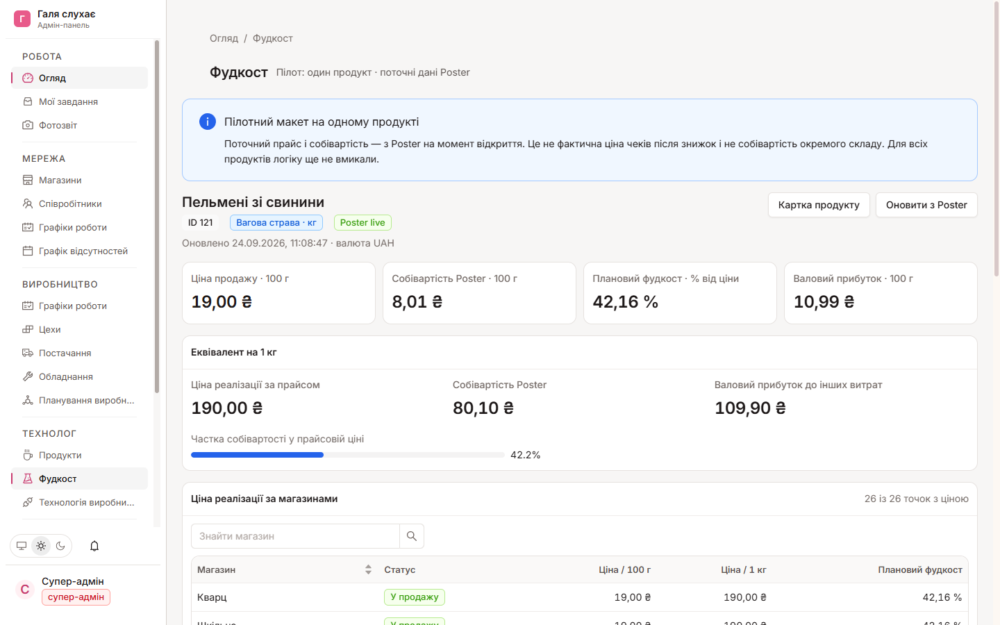

# Фудкост — перевірка одного продукту й макет вкладки

Дата знімка Poster: **2026-09-24 07:40 UTC**. Продукт: **ID 121, «Пельмені зі свинини»**. Це read-only перевірка; у Poster і Supabase нічого не записувалося. Токен та повні URL запитів не зберігалися.

## Джерела й фактичні відповіді

| Виклик Poster | Що перевірено | Результат |
|---|---|---|
| `menu.getProducts` | точна назва та ID | один точний збіг — 121; чотири інші збіги за підрядком не використано |
| `menu.getProduct?product_id=121` | тип, одиниця, ваговий прапорець, собівартість, ціни/прибуток по точках, техкарта | `type=2`, `unit=kg`, `weight_flag=1`, `out=1000`, `cost=801`, 9 рядків складу; 26 записів `spots` |
| `access.getSpots` | імена та IDs точок | 26 магазинів; кожен ID ціни співставлено з іменем |
| `settings.getAllSettings` | валюта облікового запису | `UAH`, символ `₴` |
| `menu.getIngredients` | складські одиниці й первинні вартості звичайних інгредієнтів | одиниці `kg`/`p`; не використовуються як готовий фудкост продукту |
| `menu.getPrepack?product_id=37` | вкладений напівфабрикат «Тісто для вареників і пельменів н/ф» | повернуто 4 компоненти; ID напівфабрикату **не** співставляється з `menu.getIngredients.ingredient_id=37` (це інший об'єкт) |

Серед 26 записів `spots` усі `visible=1`, усі мають `price=1900`, `profit=1099`. Для кожної точки `1900 − 801 = 1099`; поточні прайсові ціни однакові. Поля `price`, `cost` і `profit` — у копійках. У Poster вагова страва має прайсову ціну за **100 г** (див. офіційну [довідку Poster](https://knowledge-base.joinposter.com/en/how-to-add-a-dish) і [API menu.getProduct](https://github.com/joinposter/docs/blob/master/en/web/menu/getProduct.md)). Те, що `cost` у цьому продукті має ту саму базу, підтверджено зв'язком `price − cost = profit` у всіх 26 точках.

| Показник | За 100 г | Еквівалент за 1 кг |
|---|---:|---:|
| Поточна ціна продажу за прайсом | 19,00 ₴ | 190,00 ₴ |
| Поточна собівартість Poster (мережева) | 8,01 ₴ | 80,10 ₴ |
| Валовий прибуток до інших витрат | 10,99 ₴ | 109,90 ₴ |
| Плановий фудкост = `cost / price × 100%` | 42,16% | 42,16% |

Собівартість — грошова сума, а плановий фудкост — її частка у прайсовій ціні у відсотках; це різні показники. Це **не** фактична ціна з чеків: знижки, повернення й період продажів не запитувалися. `menu.getProduct.cost` — поточна собівартість меню, не собівартість конкретного магазину/складу; Poster пояснює різницю між собівартістю меню та складу в [довідці про оновлення собівартості](https://knowledge-base.joinposter.com/en/how-to-update-cost-in-poster). Плановий фудкост по магазинах у макеті змінюватиметься від їхньої прайсової ціни, але чисельник наразі мережевий. Фактичний фудкост за чеками цим пілотом не розраховується.

Сума дев'яти `structure_selfprice` у техкарті — **77,68 ₴**, тоді як еквівалент `cost` на 1 кг — **80,10 ₴**. `out=1000` не має позначеної одиниці в цьому API-відповіді. Тому не прирівнюємо ці суми та не підміняємо `cost` сумою рядків; причина різниці цим знімком **не встановлена**. Напівфабрикат у складі раховано один раз — вартістю його рядка, без повторного додавання вкладених компонентів.

## Що зроблено в адмінці

`Технолог → Фудкост` тепер показує **пілотний макет тільки для ID 121**: чотири KPI за 100 г, еквівалент за 1 кг, пошук і таблицю цін 26 магазинів, розкладку техкарти, часову мітку та кнопку оновлення. Дані читаються сервером напряму з Poster при кожному відкритті/оновленні; токен не передається клієнту. Якщо Poster недоступний, показується помилка, не старе число. Інші продукти залишаються поза пілотом.

Фактичний локальний макет: .

## Перевірки

- `posterFoodCost.test.ts`: 7 unit-тестів — арифметика, відсутня/нульова ціна, розбіжність і від'ємний `profit`, невідповідний тип продукту, три live-запити без кешування.
- Повний прогін адмінки: 42 тестові файли / 327 тестів; `typecheck` і production `build` пройшли. Build має три попередження lint у вже наявних файлах графіків/відсутностей, не у фудкості.
- Локальна авторизована E2E-перевірка `http://localhost:3210/admin/technologist/food-cost`: 26 магазинів, числа 19,00 / 8,01 / 42,16%, пошук «Шкільна» → один рядок, очищення пошуку → повний список, «Оновити з Poster» → нова часова мітка та ті самі live-значення. Світла й темна теми перевірені в браузері; мобільний viewport 390×844 переглянуто візуально.
- У консолі браузера залишився один 404 для `/favicon.ico`; він не належить до цієї вкладки. Інших помилок під час локальної E2E-перевірки не виявлено.
- Preview/Production і фактичні чеки/знижки **не перевірялися**. Не називати цю ціну фактичною ціною реалізації.
