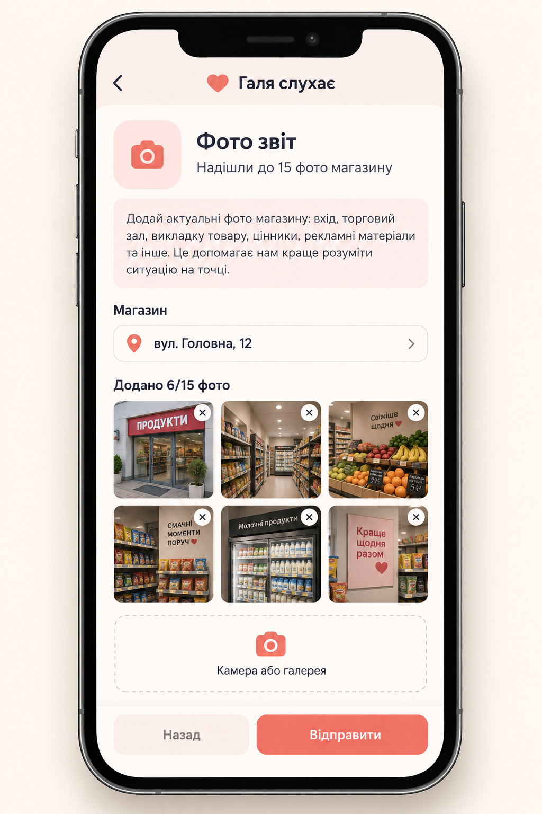
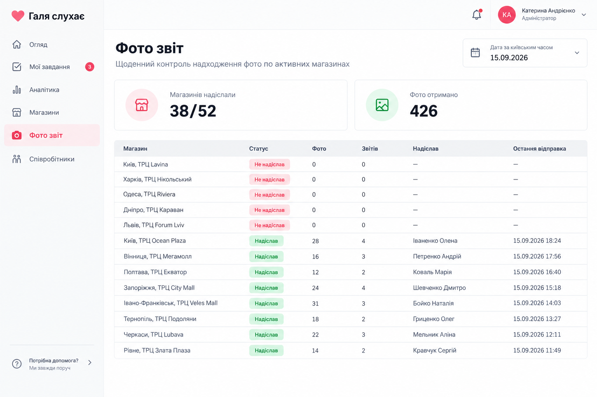

# Макети розділу «Фото звіт»

## Статус макетів

Це **концептуальні візуальні макети**, а не скріншоти запущеної гілки. Вони показують погоджуваний склад та ієрархію нового розділу. Реальна верстка повинна використовувати наявні компоненти і правила проєкту, описані в [PHOTO_REPORT_IMPLEMENTATION_PLAN.md](./PHOTO_REPORT_IMPLEMENTATION_PLAN.md).

Макети спираються на поточну структуру застосунків:

- seller app: `CategoryGrid`, `FeedbackForm`, `PhotoInput`, Tailwind-стилі;
- admin panel: `AdminShell`, `adminRoute`, `AdminPageContainer`, Ant Design `Table`, `DatePicker`, `Statistic`.

Не переносити з растрових макетів вигадані дані про магазини, персонал або фактичні показники — вони демонстраційні.

## 1. Застосунок продавчині

### Що має бути в реальному екрані

1. На головному екрані — окрема велика картка `📸 Фото звіт`.
2. Картка веде на `/feedback/photo_report`.
3. У заголовку форми: назва категорії та коротке пояснення «Надішли до 15 фото магазину».
4. Магазин продавчині показується як заблокований chip з даних серверної сесії.
5. Блок фото має показувати лічильник `Додано N/15 фото`, мініатюри та дію видалення кожної мініатюри.
6. Селектор використовує камеру або галерею через наявний `PhotoInput`.
7. Внизу — `Назад` і `Відправити`. Без щонайменше одного фото відправка блокується з поясненням.

### Не є обов'язковою точністю макета

- рамка конкретної моделі iPhone;
- фотографії усередині мініатюр;
- конкретна адреса магазину;
- точні піксельні відступи, шрифт та іконка камери.

## 2. Адмін-панель

### Що має бути в реальному екрані

1. У лівому `AdminShell` є окремий пункт `Фото звіт` з маршрутом `/admin/photo-report`.
2. У header сторінки — заголовок «Фото звіт» і пояснення про щоденний контроль активних магазинів.
3. Є вибір дати; інтерпретація дня завжди відбувається за `Europe/Kyiv`.
4. Два підсумки: `магазинів надіслали / усі активні магазини` та `фото отримано`.
5. Таблиця має колонки: `Магазин`, `Статус`, `Фото`, `Звітів`, `Надіслав`, `Остання відправка`.
6. Відсутній звіт не ховається: активний магазин відображається з червоним статусом `Не надіслав` і нульовими лічильниками.
7. Магазини без звіту розміщуються перед магазинами зі звітом.

### Не є обов'язковою точністю макета

- число `38/52`, число `426`, назви магазинів, ПІБ та часи — тестові дані;
- конкретні іконки sidebar;
- розмір таблиці та кількість рядків на екрані.

## 3. Перевірка відповідності після реалізації

Перед тим як вважати інтерфейс відповідним макетам, перевірити:

- seller app на iOS Telegram WebView, Android Telegram WebView і мобільному браузері;
- додавання, видалення та ліміт 15 фото;
- admin panel на ширині 1440 px та 1024 px;
- відображення магазину без звіту і магазину з кількома звітами за день;
- відсутність горизонтального overflow у таблиці;
- контрастність зеленого `Надіслав` і червоного `Не надіслав`;
- фактичні дані лише після застосування SQL-міграції та контрольної відправки.

Повний технічний та навантажувальний порядок приймання — у [PHOTO_REPORT_IMPLEMENTATION_PLAN.md](./PHOTO_REPORT_IMPLEMENTATION_PLAN.md).
