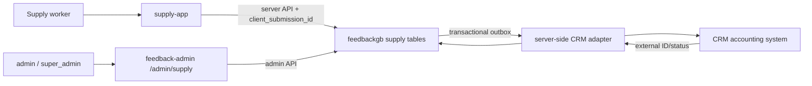

# План: «Постачання» в Feedback Admin

## Статус и границы

Целевая админка — `D:\feedback_gb\feedbackGB\feedback-admin`, route
`/admin/supply`, отдельный Vercel project в том же монорепозитории.

Проверено в текущей ветке `feature/hr-questions-menu`:

- `feedback-admin/src/middleware.ts` закрывает `/admin/*` и `/api/admin/*`
  для всех ролей, кроме `admin` и `super_admin`;
- server layout повторяет эту проверку через `isAdminTier`;
- route handlers используют `requireAdminSession()`;
- sidebar построен на `adminRoute` в `src/lib/admin/menu.tsx`;
- текущая БД ещё не имеет supply tables и роли `supply_worker`;
- действующая ветка не является подтверждённым production branch: по
  `IN_APP_NOTIFICATIONS_PLAN.md` оба Vercel projects разворачиваются от
  `devin/1777397957-feedback-mini-app`; Vercel metadata в checkout отсутствует.

До проверки Git/Vercel integration нельзя утверждать, что любой push в
`feature/hr-questions-menu` создаёт Preview Deployment. Это нужно проверить
после первой безопасной preview-сборки в Vercel UI или CLI.

## Назначение вкладки

`/admin/supply` — рабочее место админов FeedbackGB для документов, созданных
в отдельном `supply-app` сотрудниками цехов и складов:

1. `Замовлення сировини`;
2. `Брак сировини`;
3. `Прихідні накладні`.

Это не вкладка внешнего CRM и не прямой browser-доступ к CRM. До подтверждённой
интеграции CRM она работает с документами Supply в `feedbackgb`. После
подтверждения adapter показывает ссылку на CRM document и состояние sync.

## Целевая архитектура

Clean Architecture boundary:

- **domain:** supply document types, status transitions, facility scope;
- **application:** list, view, assign, accept, reject, request rework,
  enqueue integration;
- **ports:** Supply repository, audit writer, attachment authorizer, outbox;
- **infrastructure:** Supabase service-role repository, private storage,
  CRM adapter and worker;
- **interfaces:** Next route handlers and Ant Design Pro UI.

Admin UI calls only its own `/api/admin/supply/*`. Browser code never receives
`SUPABASE_SERVICE_ROLE_KEY`, CRM credentials or a private attachment URL.

## Role matrix

| Action | supply_worker | admin | super_admin |
|---|---:|---:|---:|
| Login to Supply App | own access only | optional app access only | optional app access only |
| Access `/admin/*`, `/api/admin/*` | denied | allowed | allowed |
| Read supply documents within permitted facility | own only in Supply App | allowed by admin policy | allowed |
| Accept, reject, return for rework, assign | denied | allowed | allowed |
| Manage supply users, PIN, app access, facilities, memberships | denied | denied | allowed |
| Requeue integration / override DLQ | denied | denied | allowed |

Important: existing `/api/admin/users/:id/pin` currently lets an ordinary
`admin` reset a seller PIN. It must **not** become the Supply management API.
Supply PIN/access/facility mutations use separate routes with
`requireAdminSession("super_admin")` and independent tests.

## Data contract used by the admin tab

The migration must introduce separate Supply tables, not reuse `feedback` or
`consumables_request`:

- `facilities`, `user_facility_memberships`, `user_app_access`;
- `supply_requests`, `supply_request_items`;
- `raw_material_defects`, `raw_material_defect_items`;
- `incoming_documents`, `incoming_document_items`;
- `supply_status_history`, `supply_attachments`, `external_links`;
- `integration_outbox`, `integration_attempts`, `integration_dead_letters`.

New migrations belong in the root `supabase/migrations/` registry. A migration
must enable and force RLS on each Supply table, revoke direct browser writes,
and grant service-only access required by the server use cases.

All status changes use one service-only transaction/RPC that writes the
document change, status history, business audit and outbox event together.
`logAudit` alone is insufficient because it is not an atomic business
transaction.

## UI design and routes

### Sidebar and page

Add to `feedback-admin/src/lib/admin/menu.tsx`:

- route `/admin/supply`;
- label `Постачання`;
- `InboxOutlined` icon;
- breadcrumb entry `/admin/supply` → `Постачання`.

Add `feedback-admin/src/app/(admin)/admin/supply/page.tsx` as a dynamic server
component. It validates `isAdminTier`, loads only allowed summary data and
passes it to a client component. Do not copy the seller mobile layout: this is
an Ant Design Pro desktop/admin interface.

Add `feedback-admin/src/app/(admin)/admin/supply/supply-client.tsx` using
Ant Design `Tabs`, `ProTable`, `Drawer`, `Tag`, `Alert` and `Modal`.

### Three tabs

| Tab | Data | Statuses | Admin actions |
|---|---|---|---|
| Замовлення сировини | requests + items | `draft`, `submitted`, `accepted`, `processing`, `fulfilled`, `rejected`, `cancelled` | accept, reject, assign, return for rework |
| Брак сировини | defects + items | `draft`, `submitted`, `checking`, `approved`, `rejected`, `posted_to_crm` | start checking, approve, reject, return for rework |
| Прихідні накладні | incoming documents + items | `draft`, `submitted`, `checking`, `accepted`, `rejected`, `posted_to_crm` | start checking, accept, reject, return for rework |

No status string is shared with seller feedback (`new`, `in_progress`, etc.).
State transition validation runs in the server use case, never only in UI.

### List and detail drawer

Common ProTable columns: Supply number, created time, facility, author display
label, item count, status, assignee, CRM state, last update. Filters: period,
facility, author, status, assignee, CRM state. Do not expose PIN hashes, full
attachment paths, session metadata or raw integration payloads.

Detail drawer: items, status history, audit summary, assignee, external CRM
link/ID, integration attempts and authorized attachments. A signed attachment
URL is requested only after server-side role and facility checks; it expires
quickly and is never stored in React state or logs.

## API contract

All endpoints live in `feedback-admin/src/app/api/admin/supply/` and must
re-check authentication, role, facility scope, document type and state.

| Endpoint | Minimum role | Purpose |
|---|---|---|
| `GET /api/admin/supply/orders` | admin | paginated/filterable list |
| `GET /api/admin/supply/orders/:id` | admin | detail |
| `PATCH /api/admin/supply/orders/:id` | admin | allowed transition / assignment |
| `GET/PATCH /api/admin/supply/defects/:id` | admin | detail / transition |
| `GET/PATCH /api/admin/supply/incoming-documents/:id` | admin | detail / transition |
| `POST /api/admin/supply/:type/:id/approve` | admin | explicit approval use case |
| `POST /api/admin/supply/:type/:id/reject` | admin | explicit rejection use case |
| `GET /api/admin/supply/integrations` | admin | health summary without secrets |
| `POST /api/admin/supply/:type/:id/retry-integration` | super_admin | manual retry |
| `GET/POST/PATCH /api/admin/supply/users/*` | super_admin | Supply access/PIN management |
| `GET/POST/PATCH /api/admin/supply/facilities/*` | super_admin | facilities and memberships |

`approve` and `reject` must not be duplicated with a generic unrestricted
PATCH. The server maps an action to an allowed state transition, validates the
current version/state and records `before`/`after`, actor and correlation ID.

OpenAPI is updated in both `docs/supply-app/API.openapi.yaml` and, when the
endpoint is implemented, `feedback-admin/docs/api/openapi.yaml`.

## Implementation order and gates

Do not start the next item until the listed check passes.

1. **Preview baseline.** Confirm which Vercel project maps to
   `feedback-admin`, whether `feature/hr-questions-menu` creates Preview, and
   record Preview URL. Check: an unchanged preview build is green and `/admin`
   works for admin but is forbidden for seller.
2. **Schema and RLS migration.** Add Supply tables/RPCs to root migrations;
   apply only to staging. Check: RLS negative tests reject foreign facility and
   direct browser write; migration rollback is documented.
3. **Server use cases and APIs.** Implement read/list/detail and transitions.
   Check: `seller`/`supply_worker` receive 403; admin receives 403 on Supply
   user/PIN/membership routes; super-admin succeeds.
4. **Admin UI.** Add menu/page/tables/drawers. Check: tab counts, filters,
   empty/loading/error states and forbidden actions are correct; API remains
   secure when invoked without UI.
5. **Attachments and audit.** Add private authorization and atomic business
   audit. Check: other facility cannot obtain signed URL; audit/history contain
   actor, facility, before/after and correlation ID.
6. **CRM bridge.** Only after confirmed CRM idempotency contract. Check:
   duplicate delivery and lost response create at most one CRM accounting
   document; timeout goes to retry/DLQ without deleting Supply document.
7. **Preview UAT.** Deploy this branch to the admin Vercel Preview. Check all
   three documents with admin and super-admin accounts, plus 403 tests for a
   seller/supply-worker account. No production migration or CRM write occurs.
8. **Production rollout.** After UAT, merge to the configured deployment
   branch, apply approved migration, enable feature flag for pilot facilities,
   monitor audit/outbox/DLQ and retain rollback by disabling feature/worker.

## Required tests

- Unit: status transition matrix, facility filtering, user-role predicates.
- Route: no cookie → 403/401; seller and supply-worker → 403 on every
  `/api/admin/supply/*`; normal admin → 403 on all Supply management/retry
  routes; super-admin → permitted.
- Database: duplicate `client_submission_id`, atomic history/audit/outbox,
  cross-facility RLS denial, revoked membership on subsequent request.
- UI: each tab renders legal actions only; drawer hides protected data;
  unauthorized attachment fails.
- Contract: OpenAPI validates, Mermaid renders, database model and diagrams
  match migration; `npm test`, `npm run typecheck`, `npm run lint` and
  `npm run build` pass in `feedback-admin`.

## Non-goals for the admin tab

- It does not replace the separate Supply App.
- It does not authenticate staff with the admin cookie.
- It does not create CRM accounting documents directly from the browser.
- It does not bypass the CRM idempotency gate.
